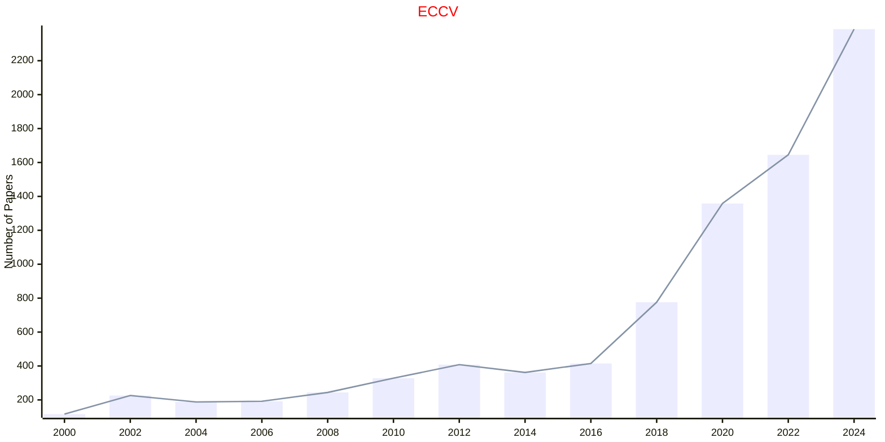
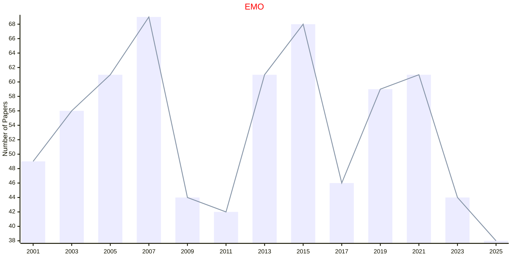
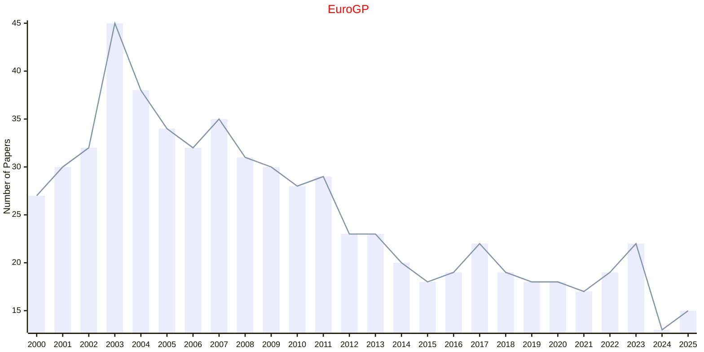
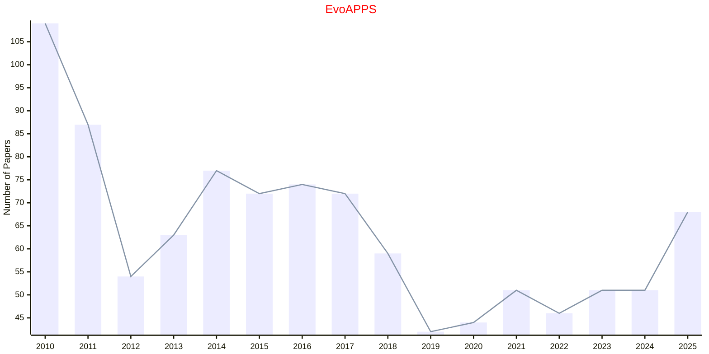
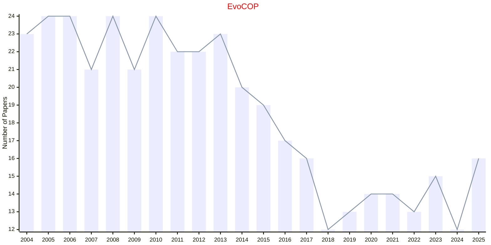
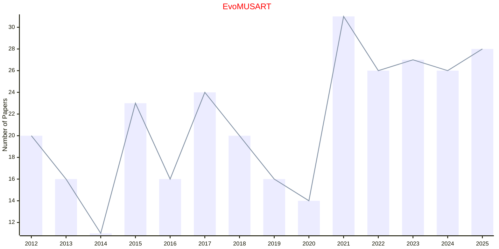
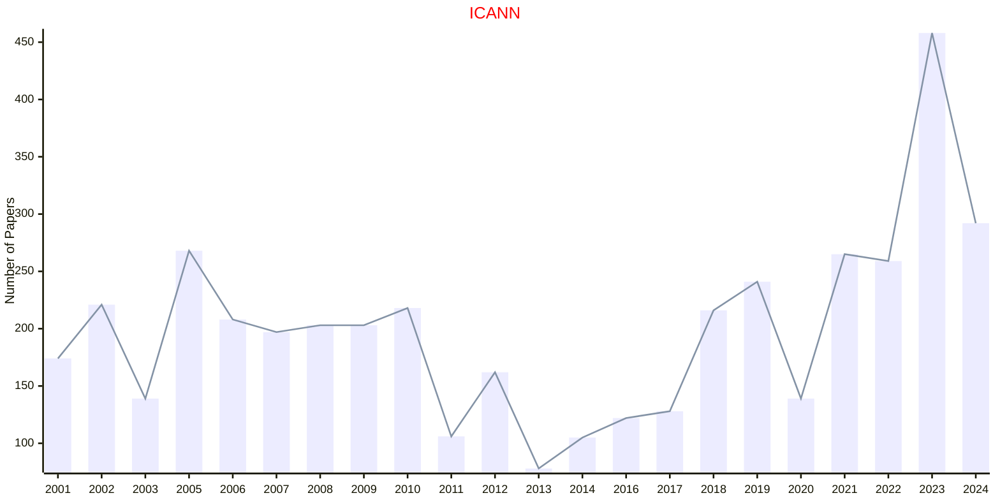
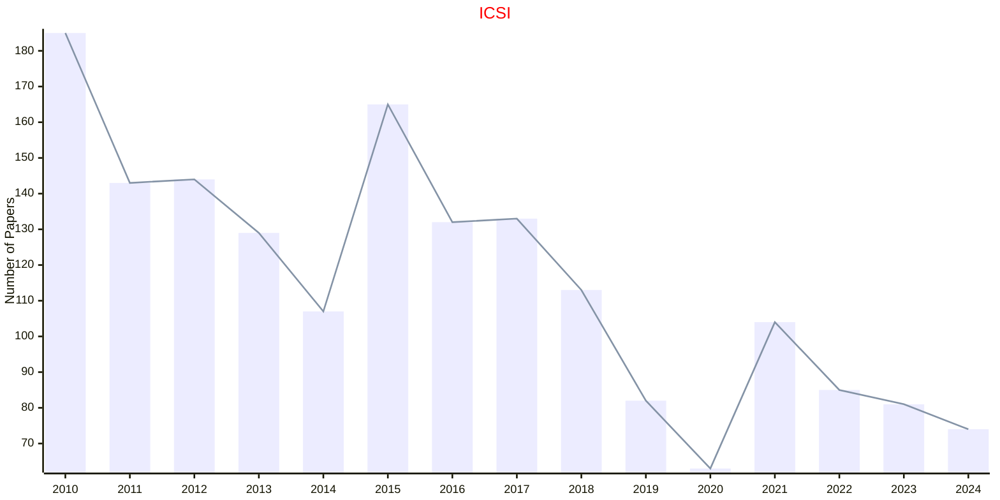
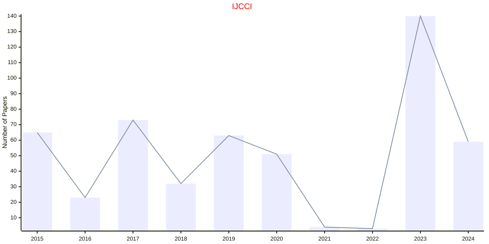
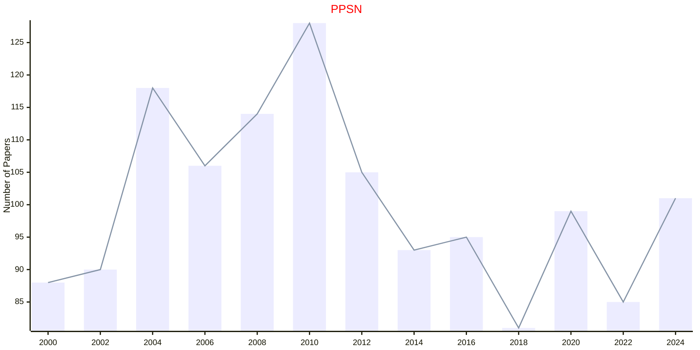

# SPRINGER

- The data for TOP, CCF, CAS, JCR, and IF are sourced from [easyScholar](https://www.easyscholar.cc/).

## ECCV

|Publishers|Full/Homepage|Abbr/About|Acronym/Archive|Period/DBLP|Top|CCF|Submission|Days Left|Main Conf.|Days Left|Location|Keywords/Google|
|-         |-            |-         |-              |-          |-  |-  |-         |-        |          |-        |-       |-              |
|[SPRINGER](https://www.springer.com/)|[European Conference on Computer Vision](https://eccv.ecva.net/)|Proc. Eur. Conf. Comput. Vis.|[ECCV](https://link.springer.com/conference/eccv)|[1990 -](https://dblp.org/db/conf/eccv/index.html)|False|B|06/03/2026|**{{ diffDate('2026-03-06') }}**|[08/09/2026](https://eccv.ecva.net/)|**{{ diffDate('2026-09-08') }}**|Malmö, Sweden|[Computer Vision](https://www.google.com/search?q=Computer+Vision)|

## EMO

|Publishers|Full/Homepage|Abbr/About|Acronym/Archive|Period/DBLP|Top|CCF|Submission|Days Left|Main Conf.|Days Left|Location|Keywords/Google|
|-         |-            |-         |-              |-          |-  |-  |-         |-        |          |-        |-       |-              |
|[SPRINGER](https://www.springer.com/)|International Conference on Evolutionary Multi-Criterion Optimization|Proc. Int. Conf. Evol. Multi-Criterion Optim.|[EMO](https://link.springer.com/conference/emo)|[2001 -](https://dblp.org/db/conf/emo/index.html)|False|||||||[Evolutionary Computation](https://www.google.com/search?q=Evolutionary+Computation)|

## EuroGP

|Publishers|Full/Homepage|Abbr/About|Acronym/Archive|Period/DBLP|Top|CCF|Submission|Days Left|Main Conf.|Days Left|Location|Keywords/Google|
|-         |-            |-         |-              |-          |-  |-  |-         |-        |          |-        |-       |-              |
|[SPRINGER](https://www.springer.com/)|[European Conference on Genetic Programming](https://www.evostar.org/)|Proc. Eur. Conf. Genet. Program.|[EuroGP](https://link.springer.com/conference/eurogp)|[1998 -](https://dblp.org/db/conf/eurogp/index.html)|False||01/11/2025|**{{ diffDate('2025-11-01') }}**|[08/04/2026](https://www.evostar.org/2026/eurogp/)|**{{ diffDate('2026-04-08') }}**|Toulouse, France|[Evolutionary Computation](https://www.google.com/search?q=Evolutionary+Computation)|

### Remarks

part of EvoStar

## EvoAPPS

|Publishers|Full/Homepage|Abbr/About|Acronym/Archive|Period/DBLP|Top|CCF|Submission|Days Left|Main Conf.|Days Left|Location|Keywords/Google|
|-         |-            |-         |-              |-          |-  |-  |-         |-        |          |-        |-       |-              |
|[SPRINGER](https://www.springer.com/)|[International Conference on Applications of Evolutionary Computation](https://www.evostar.org/)|Proc. Int. Conf. Appl. Evol. Comput.|[EvoAPPS](https://link.springer.com/conference/evoapplications)|[2010 -](https://dblp.org/db/conf/evoapps/index.html)|False||01/11/2025|**{{ diffDate('2025-11-01') }}**|[08/04/2026](https://www.evostar.org/2026/evoapps/)|**{{ diffDate('2026-04-08') }}**|Toulouse, France|[Evolutionary Computation](https://www.google.com/search?q=Evolutionary+Computation)|

### Remarks

part of EvoStar

## EvoCOP

|Publishers|Full/Homepage|Abbr/About|Acronym/Archive|Period/DBLP|Top|CCF|Submission|Days Left|Main Conf.|Days Left|Location|Keywords/Google|
|-         |-            |-         |-              |-          |-  |-  |-         |-        |          |-        |-       |-              |
|[SPRINGER](https://www.springer.com/)|[Evolutionary Computation in Combinatorial Optimisation](https://www.evostar.org/)|Proc. Eur. Conf. Evol. Comput. Comb. Optim.|[EvoCOP](https://link.springer.com/conference/evocop)|[2004 -](https://dblp.org/db/conf/evocop/index.html)|False||01/11/2025|**{{ diffDate('2025-11-01') }}**|[08/04/2026](https://www.evostar.org/2026/evocop/)|**{{ diffDate('2026-04-08') }}**|Toulouse, France|[Evolutionary Computation](https://www.google.com/search?q=Evolutionary+Computation)|

### Remarks

part of EvoStar

## EvoMUSART

|Publishers|Full/Homepage|Abbr/About|Acronym/Archive|Period/DBLP|Top|CCF|Submission|Days Left|Main Conf.|Days Left|Location|Keywords/Google|
|-         |-            |-         |-              |-          |-  |-  |-         |-        |          |-        |-       |-              |
|[SPRINGER](https://www.springer.com/)|[Artificial Intelligence in Music, Sound, Art and Design](https://www.evostar.org/)|Proc. Int. Conf. Artif. Intell. Music, Sound, Art and Design|[EvoMUSART](https://link.springer.com/conference/evomusart)|[2012 -](https://dblp.org/db/conf/evomusart/index.html)|False||01/11/2025|**{{ diffDate('2025-11-01') }}**|[08/04/2026](https://www.evostar.org/2026/evomusart/)|**{{ diffDate('2026-04-08') }}**|Toulouse, France|[Evolutionary Computation](https://www.google.com/search?q=Evolutionary+Computation)|

### Remarks

part of EvoStar

## ICANN

|Publishers|Full/Homepage|Abbr/About|Acronym/Archive|Period/DBLP|Top|CCF|Submission|Days Left|Main Conf.|Days Left|Location|Keywords/Google|
|-         |-            |-         |-              |-          |-  |-  |-         |-        |          |-        |-       |-              |
|[SPRINGER](https://www.springer.com/)|[International Conference on Artificial Neural Networks](https://e-nns.org/)|[Proc. Int. Conf. Artif. Neural Netw. Mach. Learn.](https://e-nns.org/)|[ICANN](https://link.springer.com/conference/icann)|[1991 -](https://dblp.org/db/conf/icann/index.html)|False|C|15/03/2025|**{{ diffDate('2025-03-15') }}**|[09/09/2025](https://e-nns.org/icann2025/)|**{{ diffDate('2025-09-09') }}**|Kaunas, Lithuania|[Neural Networks](https://www.google.com/search?q=Neural+Networks)|

## ICSI

|Publishers|Full/Homepage|Abbr/About|Acronym/Archive|Period/DBLP|Top|CCF|Submission|Days Left|Main Conf.|Days Left|Location|Keywords/Google|
|-         |-            |-         |-              |-          |-  |-  |-         |-        |          |-        |-       |-              |
|[SPRINGER](https://www.springer.com/)|[International Conference on Swarm Intelligence](https://iasei.org/)|Proc. Int. Conf. Swarm Intell.|[ICSI](https://link.springer.com/conference/icsi)|[2010 -](https://dblp.org/db/conf/swarm/index.html)|False||18/04/2025|**{{ diffDate('2025-04-18') }}**|[11/07/2025](https://iasei.org/icsi2025/)|**{{ diffDate('2025-07-11') }}**|Yokohama, Japan|[Evolutionary Computation](https://www.google.com/search?q=Evolutionary+Computation); [Swarm Intelligence](https://www.google.com/search?q=Swarm+Intelligence)|

## IJCCI

|Publishers|Full/Homepage|Abbr/About|Acronym/Archive|Period/DBLP|Top|CCF|Submission|Days Left|Main Conf.|Days Left|Location|Keywords/Google|
|-         |-            |-         |-              |-          |-  |-  |-         |-        |          |-        |-       |-              |
|[SPRINGER](https://www.springer.com/)|[International Joint Conference on Computational Intelligence](https://ijcci.scitevents.org/)|Proc. Int. Joint Conf. Comput. Intell.|[IJCCI](https://link.springer.com/conference/ijcci)|[2009 -](https://dblp.org/db/conf/ijcci/index.html)|False||19/05/2025|**{{ diffDate('2025-05-19') }}**|[22/10/2025](https://ijcci.scitevents.org/)|**{{ diffDate('2025-10-22') }}**|Marbella, Spain|[Evolutionary Computation](https://www.google.com/search?q=Evolutionary+Computation)|

## PPSN

|Publishers|Full/Homepage|Abbr/About|Acronym/Archive|Period/DBLP|Top|CCF|Submission|Days Left|Main Conf.|Days Left|Location|Keywords/Google|
|-         |-            |-         |-              |-          |-  |-  |-         |-        |          |-        |-       |-              |
|[SPRINGER](https://www.springer.com/)|Parallel Problem Solving from Nature|Proc. Int. Conf. Parallel Probl. Solving Nat.|[PPSN](https://link.springer.com/conference/ppsn)|[1990 -](https://dblp.org/db/conf/ppsn/index.html)|False|B||||||[Evolutionary Computation](https://www.google.com/search?q=Evolutionary+Computation)|

