# Conferences

- The data for TOP, CCF, CAS, JCR, and IF are sourced from [easyScholar](https://www.easyscholar.cc/).

## AAAI

### AAAI

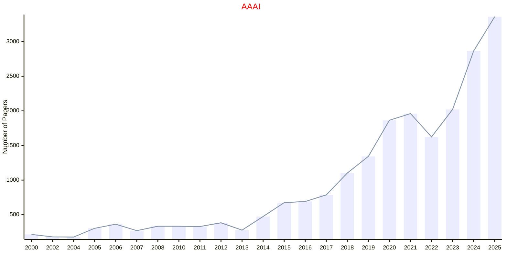

### ICAPS

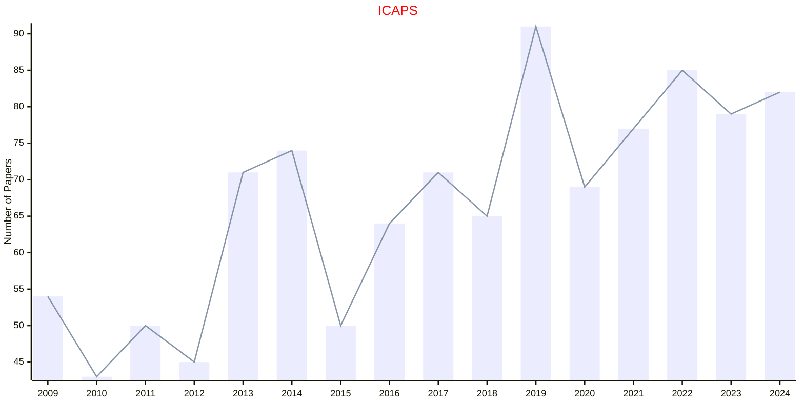

### SoCS

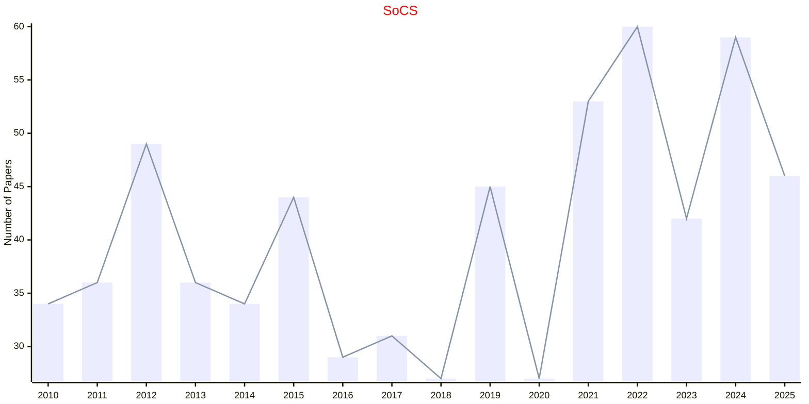

## ACL

## ACM

### AAMAS

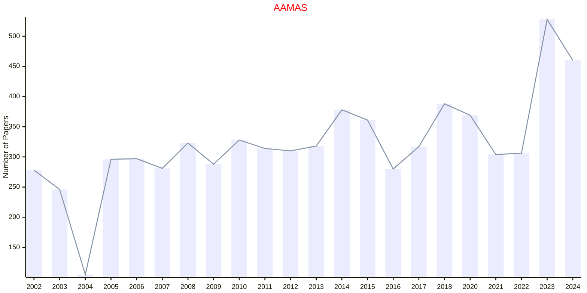

### GECCO

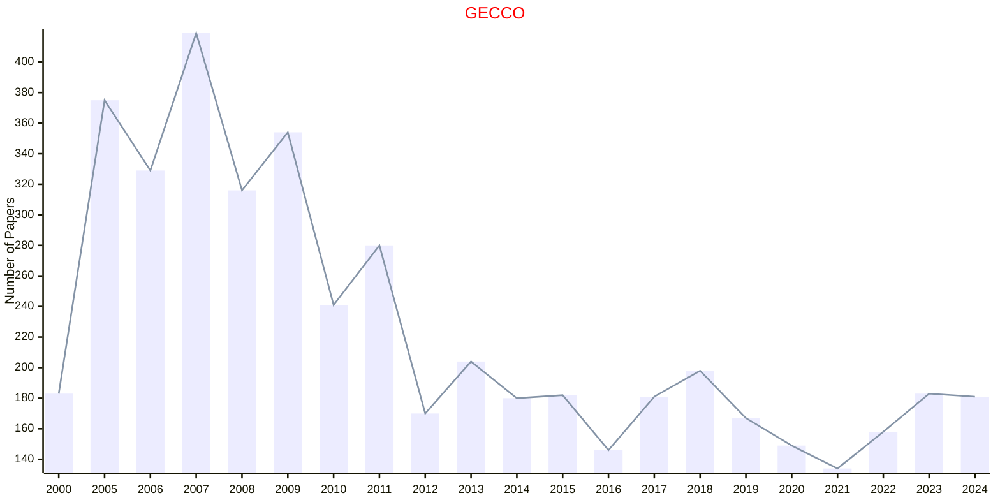

### GECCOC

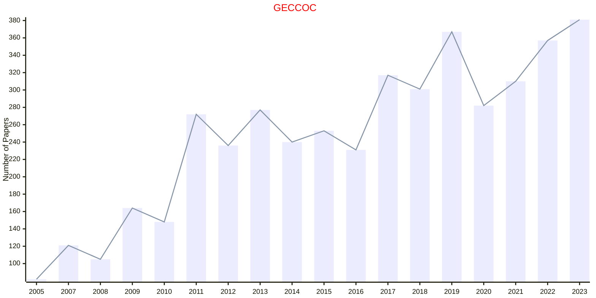

### KDD

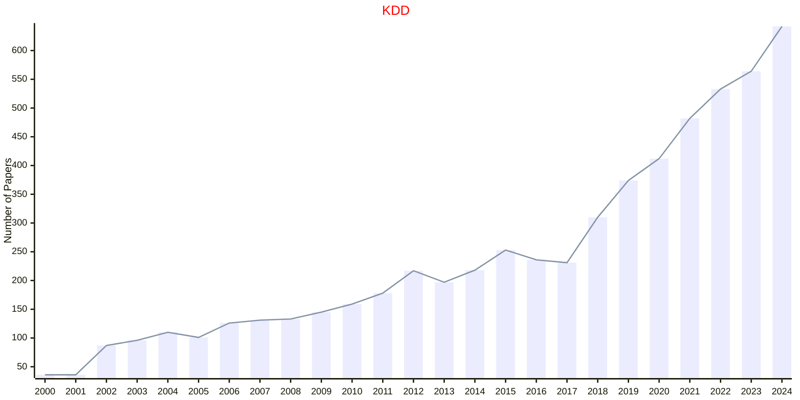

## IEEE

### CEC

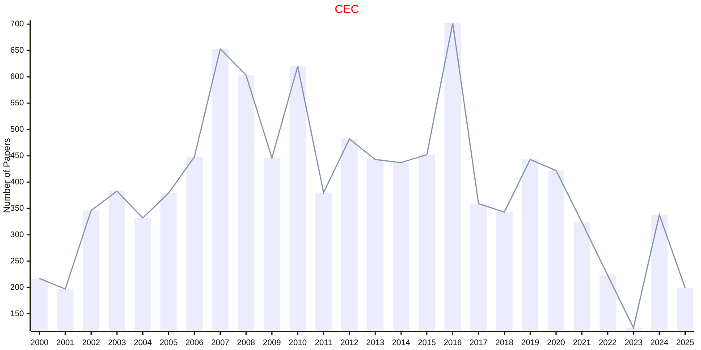

### CVPR

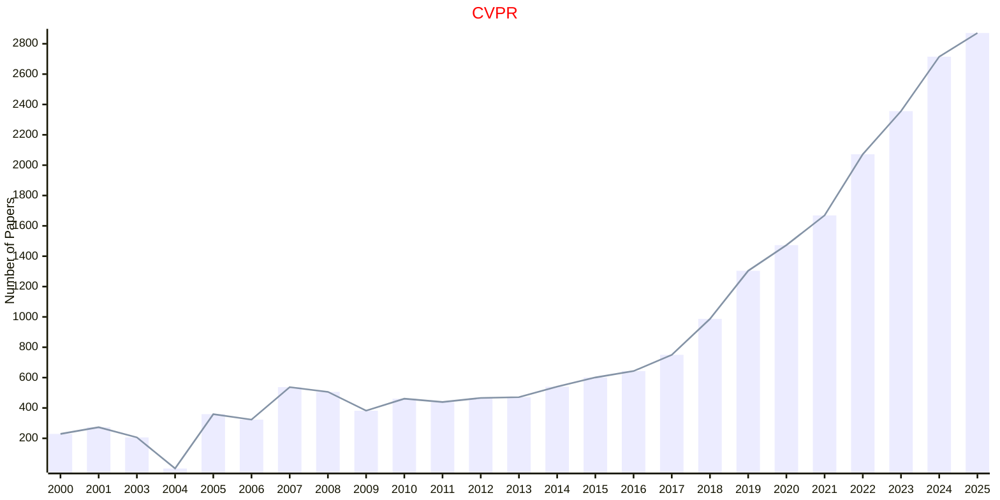

### EAIS

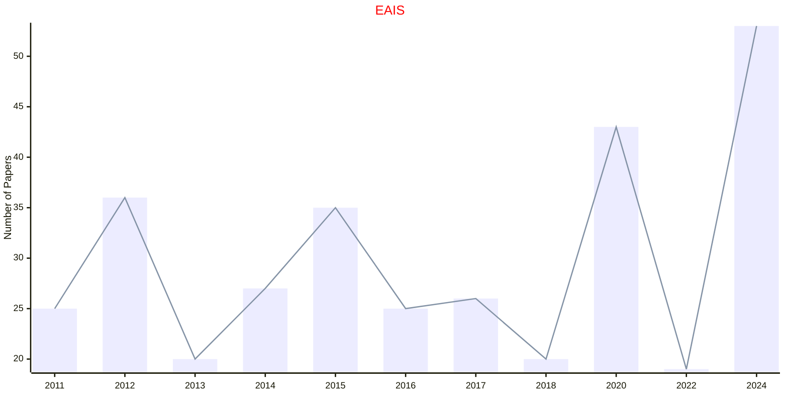

### FOCS

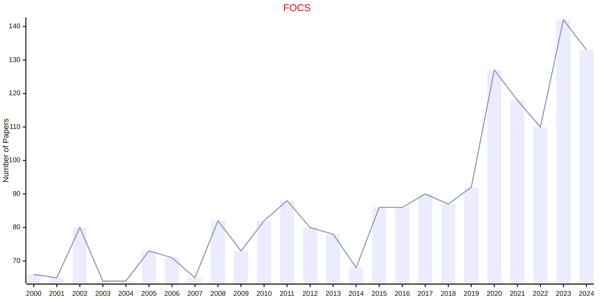

### ICCV

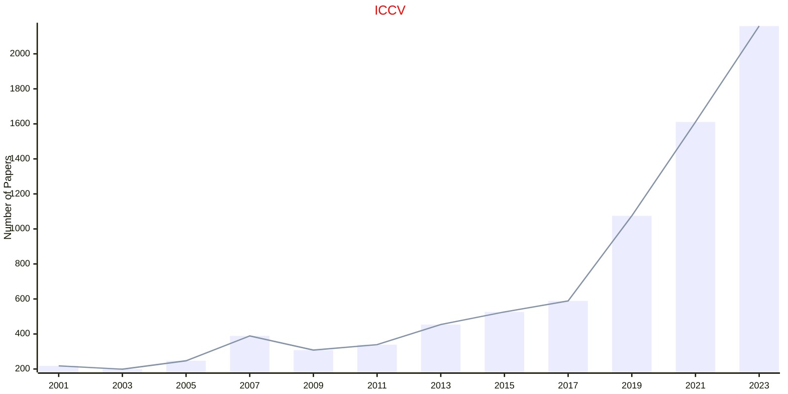

### ICDE

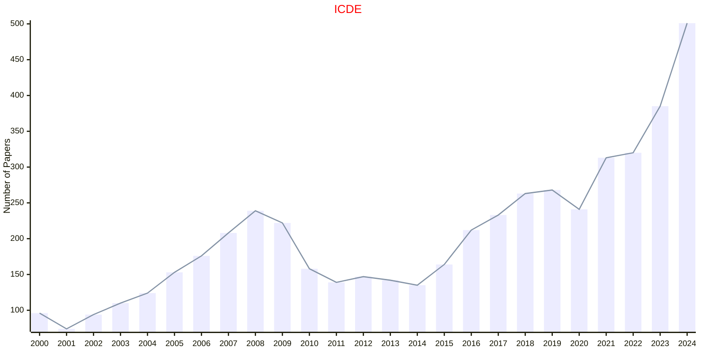

### ICMLC

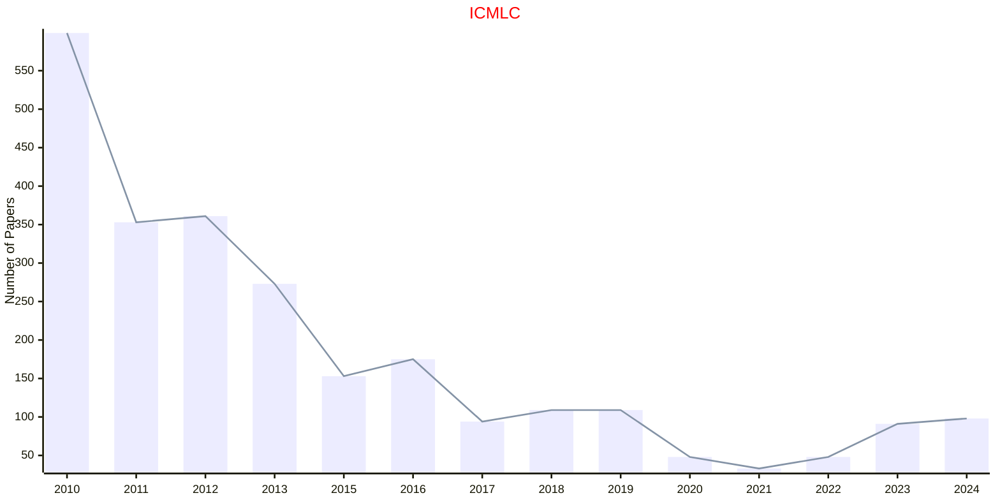

### ICRA

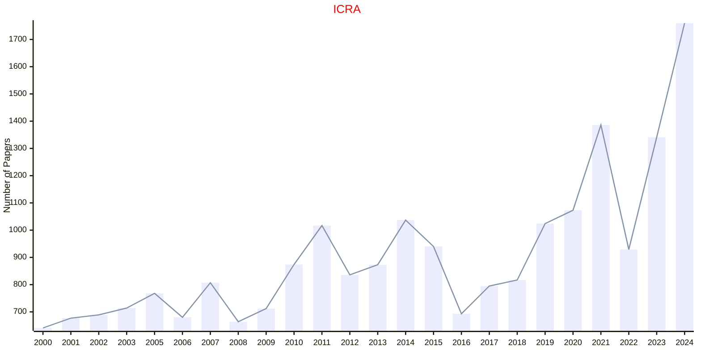

### IROS

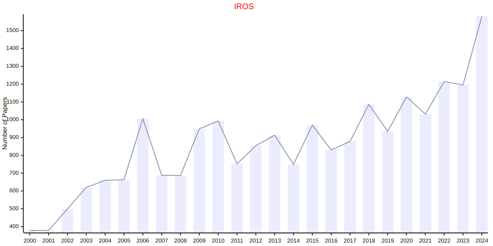

### SMC

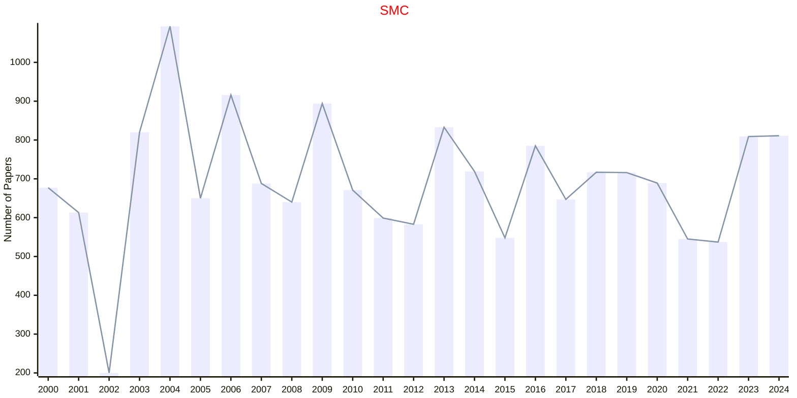

### SSCI

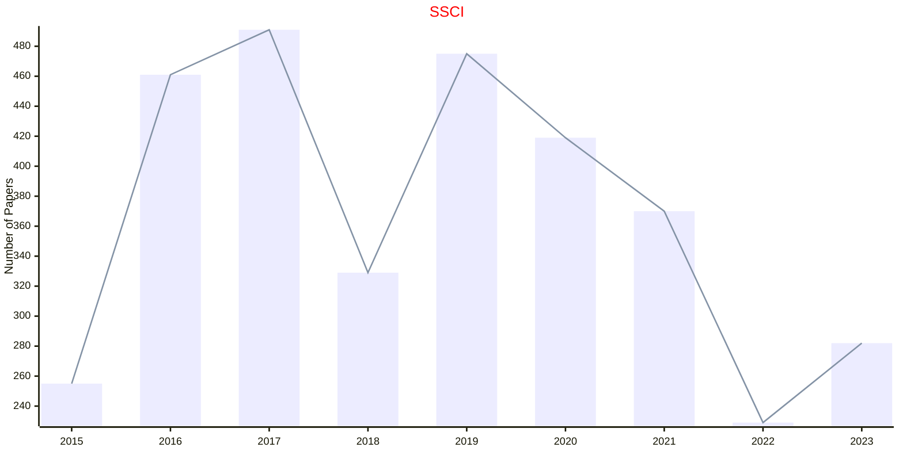

## MIT

## OPEN

### ICLR

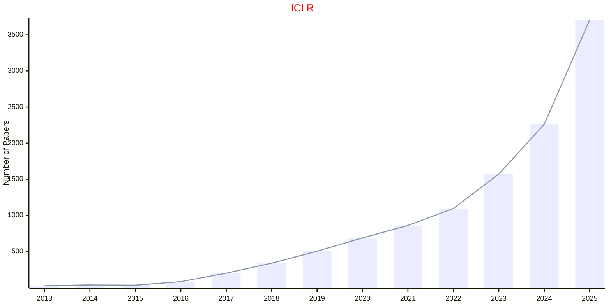

### ICML

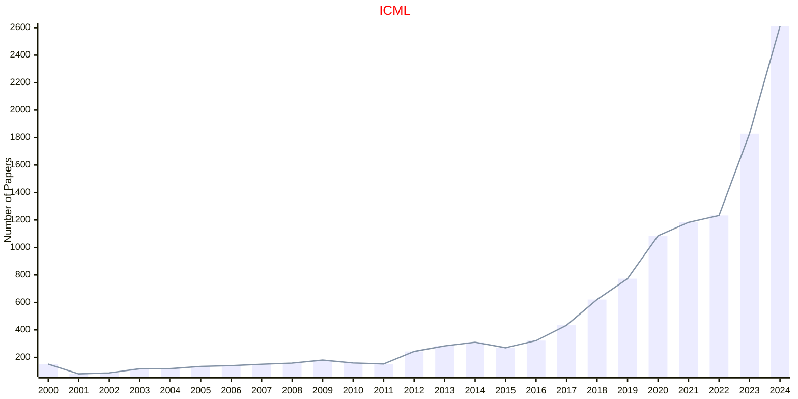

### IJCAI

```mermaid
---
config:
    xyChart:
        width: 1200
        height: 600
    themeVariables:
        xyChart:
            titleColor: "#ff0000"
---
xychart-beta
    title "IJCAI"
    x-axis [2001, 2003, 2005, 2007, 2009, 2011, 2013, 2015, 2016, 2017, 2018, 2019, 2020, 2021, 2022, 2023, 2024]
    y-axis "Number of Papers"
    bar [200, 295, 350, 472, 335, 482, 496, 649, 658, 781, 870, 964, 779, 722, 862, 851, 1048]
    line [200, 295, 350, 472, 335, 482, 496, 649, 658, 781, 870, 964, 779, 722, 862, 851, 1048]
```

### NeurIPS

```mermaid
---
config:
    xyChart:
        width: 1200
        height: 600
    themeVariables:
        xyChart:
            titleColor: "#ff0000"
---
xychart-beta
    title "NeurIPS"
    x-axis [2000, 2001, 2002, 2003, 2004, 2005, 2006, 2007, 2008, 2009, 2010, 2011, 2012, 2013, 2014, 2015, 2016, 2017, 2018, 2019, 2020, 2021, 2022, 2023, 2024]
    y-axis "Number of Papers"
    bar [152, 197, 207, 198, 207, 207, 204, 217, 250, 262, 292, 306, 370, 360, 411, 403, 569, 679, 1009, 1428, 1898, 2334, 2834, 3540, 4494]
    line [152, 197, 207, 198, 207, 207, 204, 217, 250, 262, 292, 306, 370, 360, 411, 403, 569, 679, 1009, 1428, 1898, 2334, 2834, 3540, 4494]
```

### RSS

```mermaid
---
config:
    xyChart:
        width: 1200
        height: 600
    themeVariables:
        xyChart:
            titleColor: "#ff0000"
---
xychart-beta
    title "RSS"
    x-axis [2005, 2006, 2007, 2008, 2009, 2010, 2011, 2012, 2013, 2014, 2015, 2016, 2017, 2018, 2019, 2020, 2021, 2022, 2023, 2024]
    y-axis "Number of Papers"
    bar [48, 39, 41, 40, 39, 40, 45, 60, 55, 57, 49, 47, 75, 71, 84, 103, 92, 74, 112, 134]
    line [48, 39, 41, 40, 39, 40, 45, 60, 55, 57, 49, 47, 75, 71, 84, 103, 92, 74, 112, 134]
```

## PMLR

### AISTATS

```mermaid
---
config:
    xyChart:
        width: 1200
        height: 600
    themeVariables:
        xyChart:
            titleColor: "#ff0000"
---
xychart-beta
    title "AISTATS"
    x-axis [2001, 2003, 2005, 2007, 2009, 2010, 2011, 2012, 2013, 2014, 2015, 2016, 2017, 2018, 2019, 2020, 2021, 2022, 2023, 2024]
    y-axis "Number of Papers"
    bar [46, 44, 58, 86, 84, 126, 107, 158, 71, 122, 125, 164, 167, 216, 360, 423, 455, 492, 496, 547]
    line [46, 44, 58, 86, 84, 126, 107, 158, 71, 122, 125, 164, 167, 216, 360, 423, 455, 492, 496, 547]
```

### ALT

```mermaid
---
config:
    xyChart:
        width: 1200
        height: 600
    themeVariables:
        xyChart:
            titleColor: "#ff0000"
---
xychart-beta
    title "ALT"
    x-axis [2016, 2017, 2019, 2020, 2021, 2022, 2023, 2024]
    y-axis "Number of Papers"
    bar [70, 34, 38, 39, 47, 43, 49, 45]
    line [70, 34, 38, 39, 47, 43, 49, 45]
```

### COLT

```mermaid
---
config:
    xyChart:
        width: 1200
        height: 600
    themeVariables:
        xyChart:
            titleColor: "#ff0000"
---
xychart-beta
    title "COLT"
    x-axis [2011, 2012, 2013, 2014, 2015, 2016, 2017, 2018, 2019, 2020, 2021, 2022, 2023, 2024]
    y-axis "Number of Papers"
    bar [43, 47, 51, 61, 77, 70, 76, 94, 127, 126, 140, 163, 170, 170]
    line [43, 47, 51, 61, 77, 70, 76, 94, 127, 126, 140, 163, 170, 170]
```

## SPRINGER

### ECCV

```mermaid
---
config:
    xyChart:
        width: 1200
        height: 600
    themeVariables:
        xyChart:
            titleColor: "#ff0000"
---
xychart-beta
    title "ECCV"
    x-axis [2000, 2002, 2004, 2006, 2008, 2010, 2012, 2014, 2016, 2018, 2020, 2022, 2024]
    y-axis "Number of Papers"
    bar [116, 226, 188, 192, 244, 328, 408, 362, 415, 776, 1358, 1645, 2386]
    line [116, 226, 188, 192, 244, 328, 408, 362, 415, 776, 1358, 1645, 2386]
```

### EMO

```mermaid
---
config:
    xyChart:
        width: 1200
        height: 600
    themeVariables:
        xyChart:
            titleColor: "#ff0000"
---
xychart-beta
    title "EMO"
    x-axis [2001, 2003, 2005, 2007, 2009, 2011, 2013, 2015, 2017, 2019, 2021, 2023, 2025]
    y-axis "Number of Papers"
    bar [49, 56, 61, 69, 44, 42, 61, 68, 46, 59, 61, 44, 38]
    line [49, 56, 61, 69, 44, 42, 61, 68, 46, 59, 61, 44, 38]
```

### EuroGP

```mermaid
---
config:
    xyChart:
        width: 1200
        height: 600
    themeVariables:
        xyChart:
            titleColor: "#ff0000"
---
xychart-beta
    title "EuroGP"
    x-axis [2000, 2001, 2002, 2003, 2004, 2005, 2006, 2007, 2008, 2009, 2010, 2011, 2012, 2013, 2014, 2015, 2016, 2017, 2018, 2019, 2020, 2021, 2022, 2023, 2024, 2025]
    y-axis "Number of Papers"
    bar [27, 30, 32, 45, 38, 34, 32, 35, 31, 30, 28, 29, 23, 23, 20, 18, 19, 22, 19, 18, 18, 17, 19, 22, 13, 15]
    line [27, 30, 32, 45, 38, 34, 32, 35, 31, 30, 28, 29, 23, 23, 20, 18, 19, 22, 19, 18, 18, 17, 19, 22, 13, 15]
```

### EvoAPPS

```mermaid
---
config:
    xyChart:
        width: 1200
        height: 600
    themeVariables:
        xyChart:
            titleColor: "#ff0000"
---
xychart-beta
    title "EvoAPPS"
    x-axis [2010, 2011, 2012, 2013, 2014, 2015, 2016, 2017, 2018, 2019, 2020, 2021, 2022, 2023, 2024, 2025]
    y-axis "Number of Papers"
    bar [109, 87, 54, 63, 77, 72, 74, 72, 59, 42, 44, 51, 46, 51, 51, 68]
    line [109, 87, 54, 63, 77, 72, 74, 72, 59, 42, 44, 51, 46, 51, 51, 68]
```

### EvoCOP

```mermaid
---
config:
    xyChart:
        width: 1200
        height: 600
    themeVariables:
        xyChart:
            titleColor: "#ff0000"
---
xychart-beta
    title "EvoCOP"
    x-axis [2004, 2005, 2006, 2007, 2008, 2009, 2010, 2011, 2012, 2013, 2014, 2015, 2016, 2017, 2018, 2019, 2020, 2021, 2022, 2023, 2024, 2025]
    y-axis "Number of Papers"
    bar [23, 24, 24, 21, 24, 21, 24, 22, 22, 23, 20, 19, 17, 16, 12, 13, 14, 14, 13, 15, 12, 16]
    line [23, 24, 24, 21, 24, 21, 24, 22, 22, 23, 20, 19, 17, 16, 12, 13, 14, 14, 13, 15, 12, 16]
```

### EvoMUSART

```mermaid
---
config:
    xyChart:
        width: 1200
        height: 600
    themeVariables:
        xyChart:
            titleColor: "#ff0000"
---
xychart-beta
    title "EvoMUSART"
    x-axis [2012, 2013, 2014, 2015, 2016, 2017, 2018, 2019, 2020, 2021, 2022, 2023, 2024, 2025]
    y-axis "Number of Papers"
    bar [20, 16, 11, 23, 16, 24, 20, 16, 14, 31, 26, 27, 26, 28]
    line [20, 16, 11, 23, 16, 24, 20, 16, 14, 31, 26, 27, 26, 28]
```

### ICANN

```mermaid
---
config:
    xyChart:
        width: 1200
        height: 600
    themeVariables:
        xyChart:
            titleColor: "#ff0000"
---
xychart-beta
    title "ICANN"
    x-axis [2001, 2002, 2003, 2005, 2006, 2007, 2008, 2009, 2010, 2011, 2012, 2013, 2014, 2016, 2017, 2018, 2019, 2020, 2021, 2022, 2023, 2024]
    y-axis "Number of Papers"
    bar [174, 221, 139, 268, 208, 197, 203, 203, 218, 106, 162, 78, 105, 122, 128, 216, 241, 139, 265, 259, 458, 292]
    line [174, 221, 139, 268, 208, 197, 203, 203, 218, 106, 162, 78, 105, 122, 128, 216, 241, 139, 265, 259, 458, 292]
```

### ICSI

```mermaid
---
config:
    xyChart:
        width: 1200
        height: 600
    themeVariables:
        xyChart:
            titleColor: "#ff0000"
---
xychart-beta
    title "ICSI"
    x-axis [2010, 2011, 2012, 2013, 2014, 2015, 2016, 2017, 2018, 2019, 2020, 2021, 2022, 2023, 2024]
    y-axis "Number of Papers"
    bar [185, 143, 144, 129, 107, 165, 132, 133, 113, 82, 63, 104, 85, 81, 74]
    line [185, 143, 144, 129, 107, 165, 132, 133, 113, 82, 63, 104, 85, 81, 74]
```

### IJCCI

```mermaid
---
config:
    xyChart:
        width: 1200
        height: 600
    themeVariables:
        xyChart:
            titleColor: "#ff0000"
---
xychart-beta
    title "IJCCI"
    x-axis [2015, 2016, 2017, 2018, 2019, 2020, 2021, 2022, 2023, 2024]
    y-axis "Number of Papers"
    bar [65, 23, 73, 32, 63, 51, 4, 3, 140, 59]
    line [65, 23, 73, 32, 63, 51, 4, 3, 140, 59]
```

### PPSN

```mermaid
---
config:
    xyChart:
        width: 1200
        height: 600
    themeVariables:
        xyChart:
            titleColor: "#ff0000"
---
xychart-beta
    title "PPSN"
    x-axis [2000, 2002, 2004, 2006, 2008, 2010, 2012, 2014, 2016, 2018, 2020, 2022, 2024]
    y-axis "Number of Papers"
    bar [88, 90, 118, 106, 114, 128, 105, 93, 95, 81, 99, 85, 101]
    line [88, 90, 118, 106, 114, 128, 105, 93, 95, 81, 99, 85, 101]
```

## USENIX

### OSDI

```mermaid
---
config:
    xyChart:
        width: 1200
        height: 600
    themeVariables:
        xyChart:
            titleColor: "#ff0000"
---
xychart-beta
    title "OSDI"
    x-axis [2012, 2014, 2016, 2018, 2020, 2021, 2022, 2023, 2024, 2025]
    y-axis "Number of Papers"
    bar [25, 42, 47, 46, 70, 31, 49, 55, 53, 53]
    line [25, 42, 47, 46, 70, 31, 49, 55, 53, 53]
```

