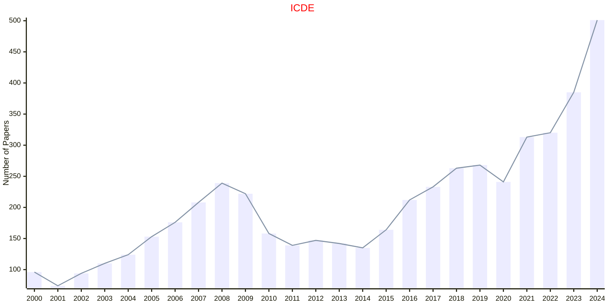

# Data Engineering

## ICDE

|Publishers|Full/Homepage|Abbr/About|Acronym/Archive|Period/DBLP|Top|CCF|Submission|Days Left|Main Conf.|Days Left|Location|Keywords/Google|
|-         |-            |-         |-              |-          |-  |-  |-         |-        |          |-        |-       |-              |
|[IEEE](https://ieeexplore.ieee.org/)|[IEEE International Conference on Data Engineering](https://ieee-icde.org/)|Proc. Int. Conf. Data. Eng.|[ICDE](https://ieeexplore.ieee.org/xpl/conhome/1000178/all-proceedings)|[1984 -](https://dblp.org/db/conf/icde/index.html)|True|A|25/11/2024|**{{ diffDate('2024-11-25') }}**|[19/05/2025](https://ieee-icde.org/2025/)|**{{ diffDate('2025-05-19') }}**|Hong Kong SAR, China|[Data Engineering](https://www.google.com/search?q=Data+Engineering)|

