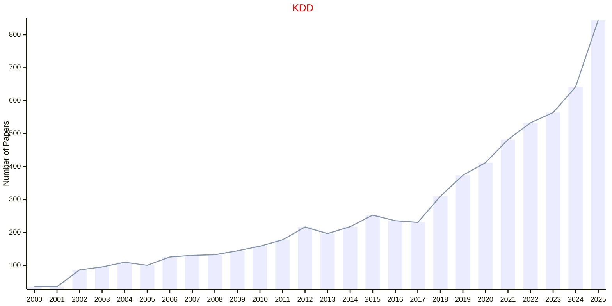
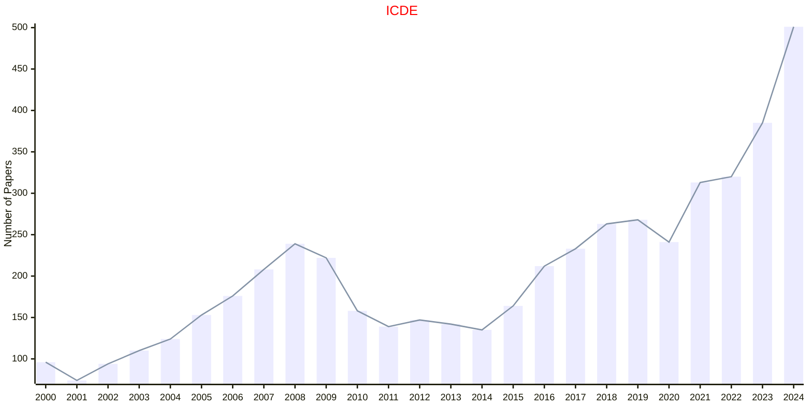

# Data and Knowledge

## KDD

|Publishers|Full/Homepage|Abbr/About|Acronym/Archive|Period/DBLP|Top|CCF|Submission|Days Left|Main Conf.|Days Left|Location|Keywords/Google|
|-         |-            |-         |-              |-          |-  |-  |-         |-        |          |-        |-       |-              |
|[ACM](https://www.acm.org/)|[ACM SIGKDD International Conference on Knowledge Discovery And Data Mining](https://kdd.org)|[Proc. ACM SIGKDD Int. Conf. Knowl. Discovery Data Mining](https://kdd.org/about)|[KDD](https://dlnext.acm.org/conference/kdd/proceedings)|1995 -|True|A|01/02/2026|**{{ diffDate('2026-02-01') }}**|[09/08/2026](https://kdd2026.kdd.org/)|**{{ diffDate('2026-08-09') }}**|Jeju, Korea|[Data Mining](https://www.google.com/search?q=Data+Mining)|

## SIGMOD

|Publishers|Full/Homepage|Abbr/About|Acronym/Archive|Period/DBLP|Top|CCF|Submission|Days Left|Main Conf.|Days Left|Location|Keywords/Google|
|-         |-            |-         |-              |-          |-  |-  |-         |-        |          |-        |-       |-              |
|[ACM](https://www.acm.org/)|[ACM SIGKDD International Conference on Management of Data](https://sigmod.org/)|[Proc. ACM SIGMOD Int. Conf. Manag. Data](https://sigmod.org/about-sigmod/)|[SIGMOD](https://dl.acm.org/conference/mod/proceedings)|1975 -|True|A|10/10/2025|**{{ diffDate('2025-10-10') }}**|[05/06/2026](https://2026.sigmod.org/)|**{{ diffDate('2026-06-05') }}**|Bengaluru, India|[Data Mining](https://www.google.com/search?q=Data+Mining)|

## ICDE

|Publishers|Full/Homepage|Abbr/About|Acronym/Archive|Period/DBLP|Top|CCF|Submission|Days Left|Main Conf.|Days Left|Location|Keywords/Google|
|-         |-            |-         |-              |-          |-  |-  |-         |-        |          |-        |-       |-              |
|[IEEE](https://ieeexplore.ieee.org/)|[IEEE International Conference on Data Engineering](https://ieee-icde.org/)|Proc. Int. Conf. Data. Eng.|[ICDE](https://ieeexplore.ieee.org/xpl/conhome/1000178/all-proceedings)|[1984 -](https://dblp.org/db/conf/icde/index.html)|True|A|25/11/2024|**{{ diffDate('2024-11-25') }}**|[19/05/2025](https://ieee-icde.org/2025/)|**{{ diffDate('2025-05-19') }}**|Hong Kong SAR, China|[Data Engineering](https://www.google.com/search?q=Data+Engineering)|

