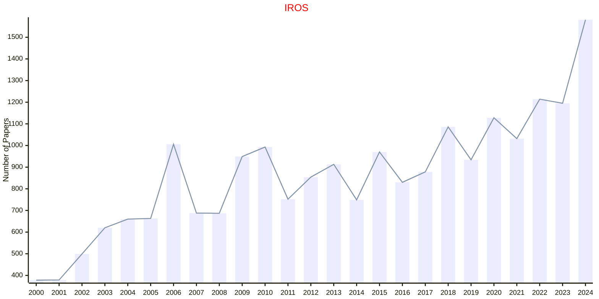

# Intelligent Robots

## IROS

|Publishers|Full/Homepage|Abbr/About|Acronym/Archive|Period/DBLP|Top|CCF|Submission|Days Left|Main Conf.|Days Left|Location|Keywords/Google|
|-         |-            |-         |-              |-          |-  |-  |-         |-        |          |-        |-       |-              |
|[IEEE](https://ieeexplore.ieee.org/)|[IEEE/RSJ International Conference on Intelligent Robots and Systems](https://www.ieee-ras.org/conferences-workshops/financially-co-sponsored/iros)|Proc. IEEE/RSJ Int. Conf. Intell. Robot. Syst.|[IROS](https://ieeexplore.ieee.org/xpl/conhome/1000393/all-proceedings)|[1988 -](https://dblp.org/db/conf/iros/index.html)|False|C|02/03/2025|**{{ diffDate('2025-03-02') }}**|[19/10/2025](http://www.iros25.org/)|**{{ diffDate('2025-10-19') }}**|Hangzhou, China|[Intelligent Robots](https://www.google.com/search?q=Intelligent+Robots)|

