# Journals

## AAAI

### JAIR

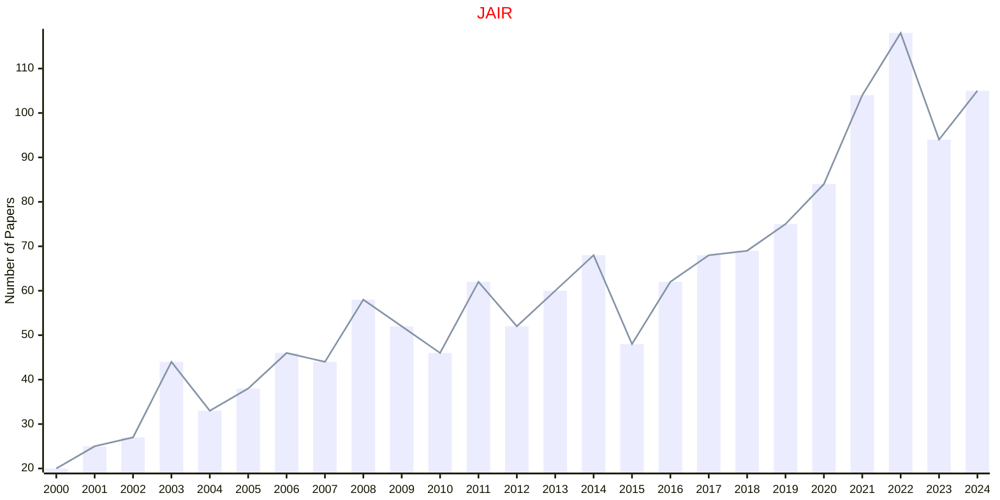

## AAAS

### ICOMPUT

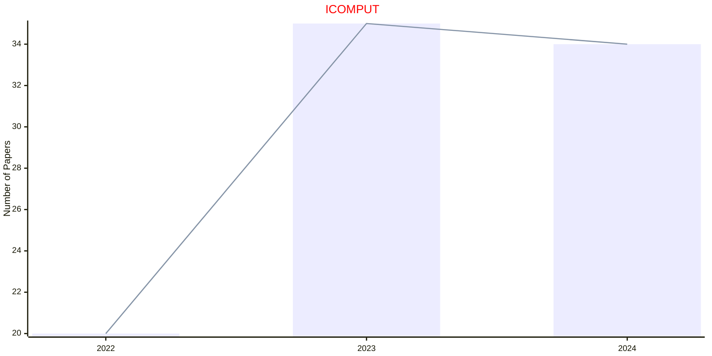

### SCIADV

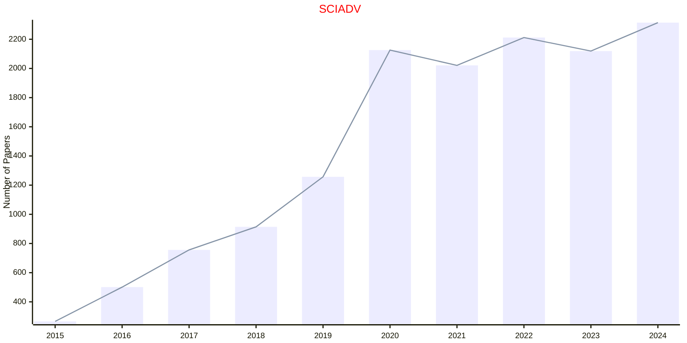

### SCIENCE

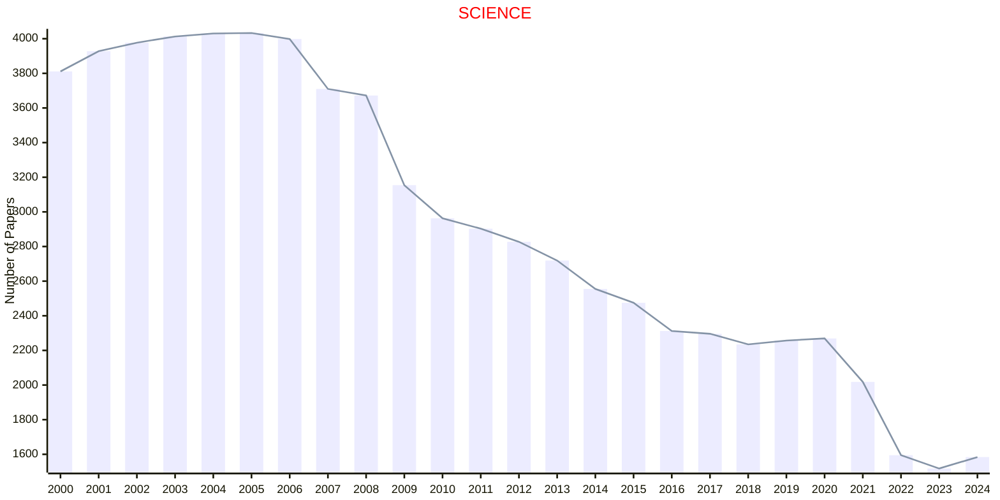

### SROB

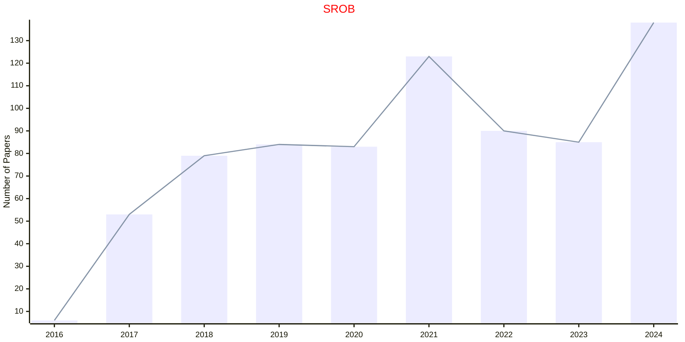

### SSIGNAL

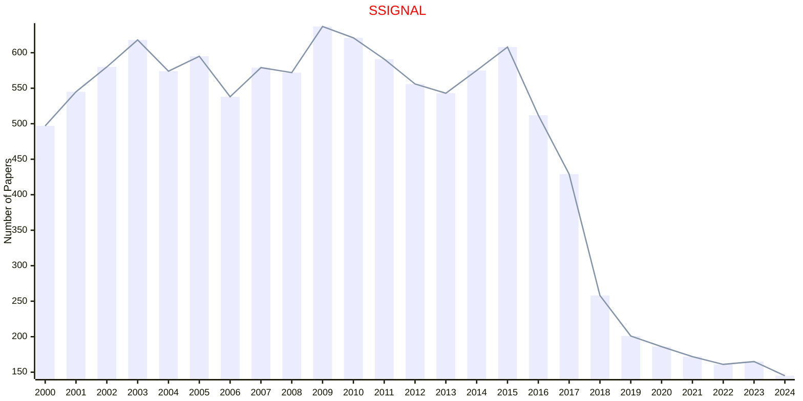

## ACM

### CACM

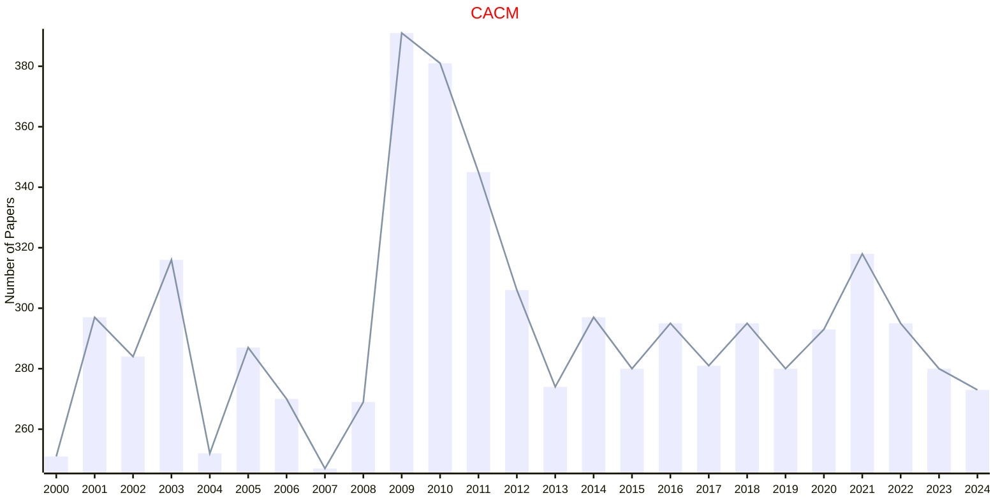

### CSUR

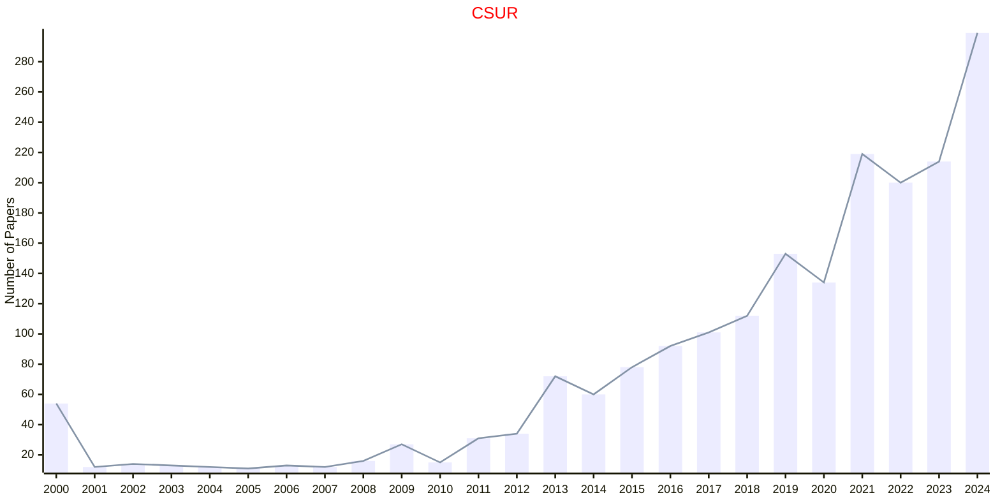

### JACM

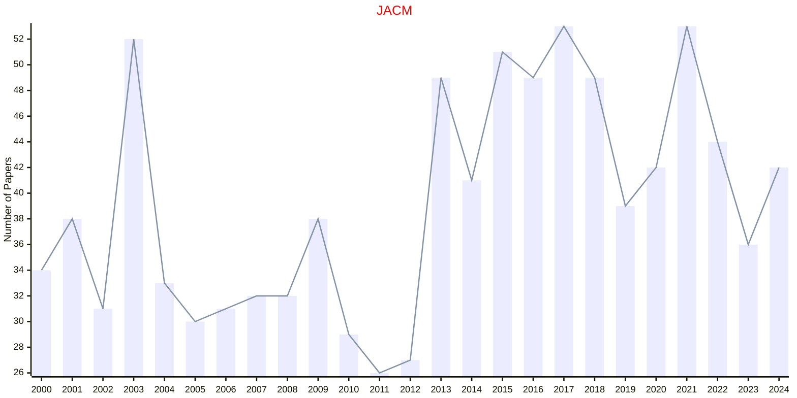

### TAAS

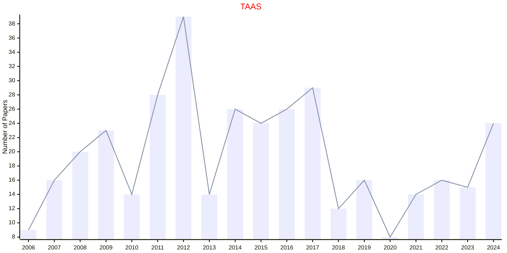

### TACO

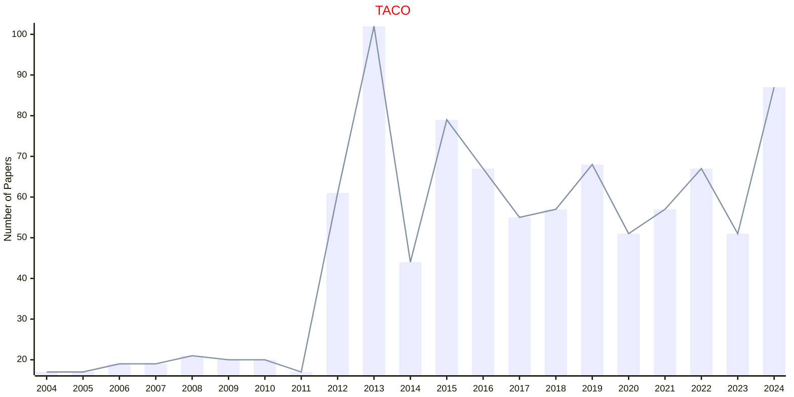

### TAP

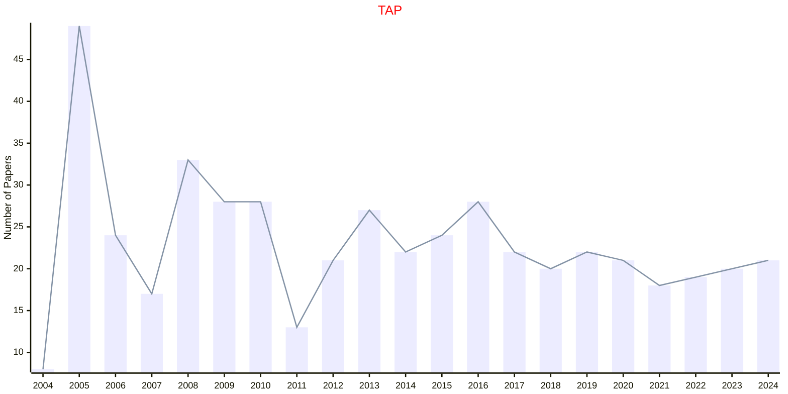

### TELO

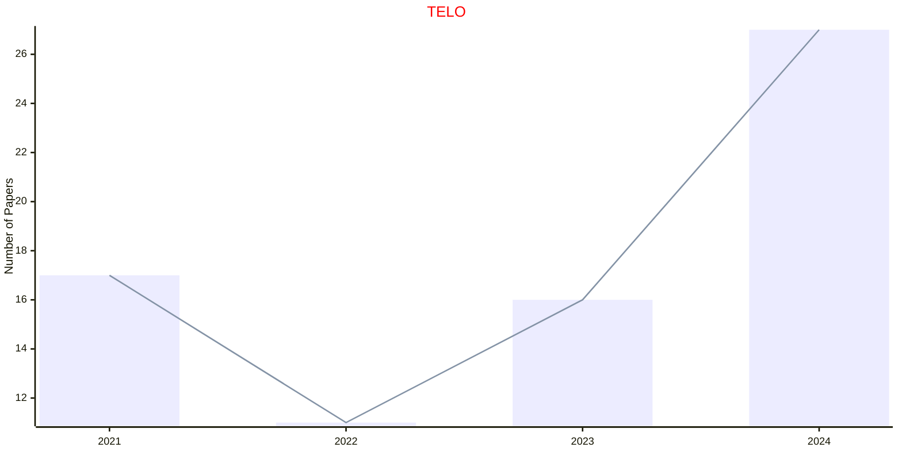

### TIIS

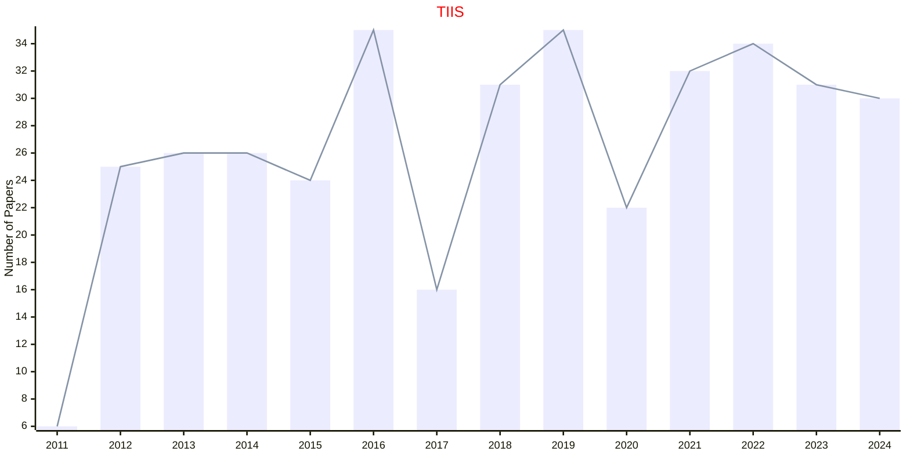

### TIST

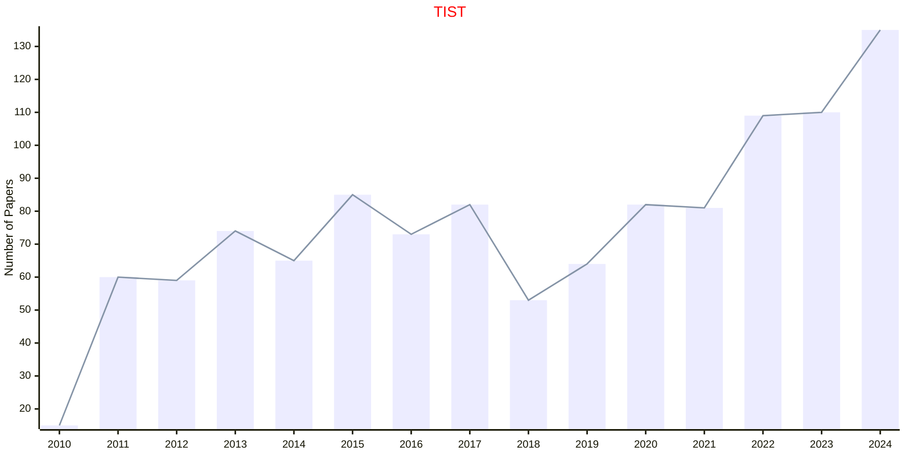

### TKDD

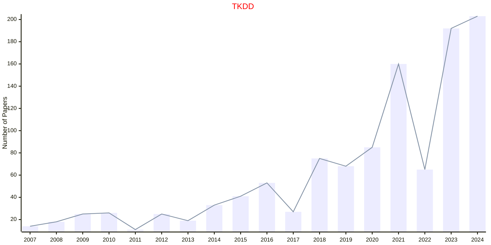

### TMIS

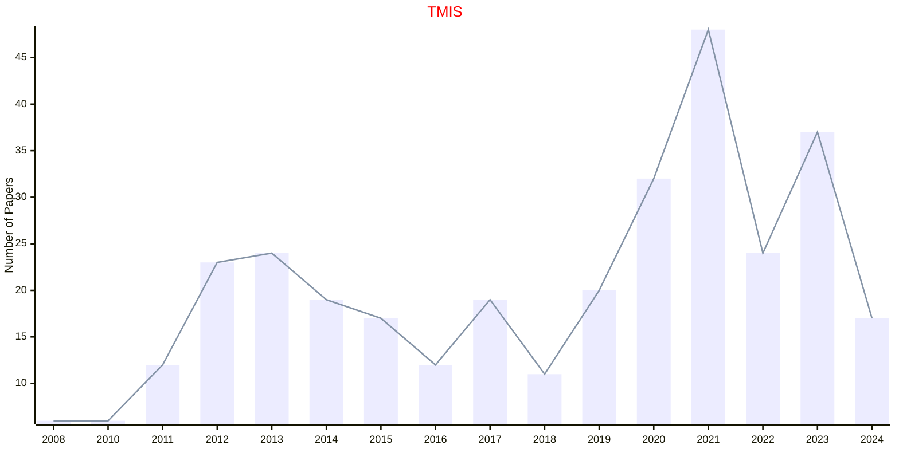

### TOCS

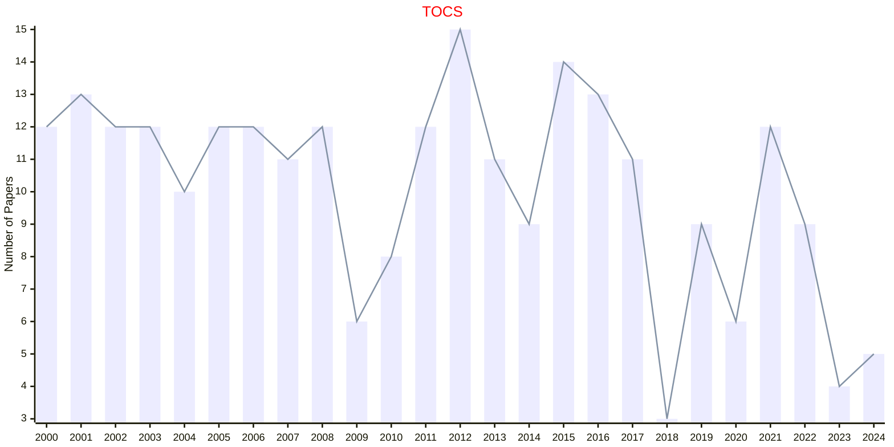

### TODAES

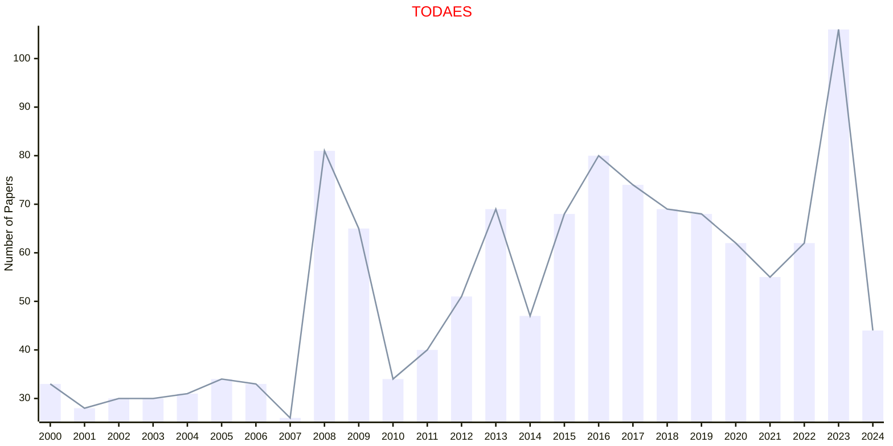

### TOG

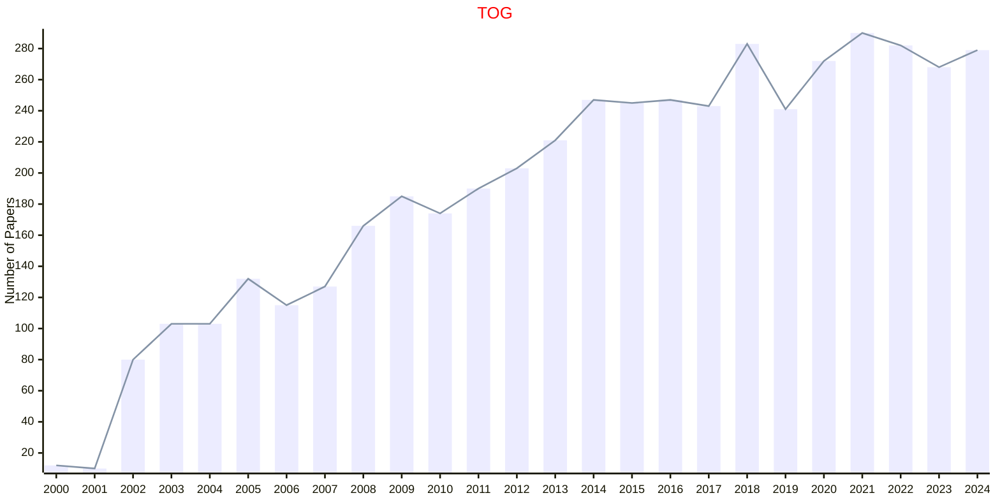

### TOMS

```mermaid
---
config:
    xyChart:
        width: 1200
        height: 600
    themeVariables:
        xyChart:
            titleColor: "#ff0000"
---
xychart-beta
    title "TOMS"
    x-axis [2000, 2001, 2002, 2003, 2004, 2005, 2006, 2007, 2008, 2009, 2010, 2011, 2012, 2013, 2014, 2015, 2016, 2017, 2018, 2019, 2020, 2021, 2022, 2023, 2024]
    y-axis "Number of Papers"
    bar [31, 21, 22, 26, 28, 30, 34, 28, 46, 27, 37, 19, 27, 30, 28, 24, 61, 37, 24, 46, 47, 32, 44, 42, 29]
    line [31, 21, 22, 26, 28, 30, 34, 28, 46, 27, 37, 19, 27, 30, 28, 24, 61, 37, 24, 46, 47, 32, 44, 42, 29]
```

### TOSEM

```mermaid
---
config:
    xyChart:
        width: 1200
        height: 600
    themeVariables:
        xyChart:
            titleColor: "#ff0000"
---
xychart-beta
    title "TOSEM"
    x-axis [2000, 2001, 2002, 2003, 2004, 2005, 2006, 2007, 2008, 2009, 2010, 2011, 2012, 2013, 2014, 2015, 2016, 2017, 2018, 2019, 2020, 2021, 2022, 2023, 2024]
    y-axis "Number of Papers"
    bar [14, 11, 15, 13, 10, 12, 12, 15, 21, 13, 13, 18, 12, 42, 44, 23, 17, 11, 25, 22, 38, 78, 55, 215, 189]
    line [14, 11, 15, 13, 10, 12, 12, 15, 21, 13, 13, 18, 12, 42, 44, 23, 17, 11, 25, 22, 38, 78, 55, 215, 189]
```

### TSLP

```mermaid
---
config:
    xyChart:
        width: 1200
        height: 600
    themeVariables:
        xyChart:
            titleColor: "#ff0000"
---
xychart-beta
    title "TSLP"
    x-axis [2004, 2005, 2006, 2007, 2008, 2009, 2010, 2011, 2012, 2013, 2014]
    y-axis "Number of Papers"
    bar [1, 5, 7, 9, 7, 2, 3, 17, 8, 15, 6]
    line [1, 5, 7, 9, 7, 2, 3, 17, 8, 15, 6]
```

## ACS

### CHRE

```mermaid
---
config:
    xyChart:
        width: 1200
        height: 600
    themeVariables:
        xyChart:
            titleColor: "#ff0000"
---
xychart-beta
    title "CHRE"
    x-axis [2000, 2001, 2002, 2003, 2004, 2005, 2006, 2007, 2008, 2009, 2010, 2011, 2012, 2013, 2014, 2015, 2016, 2017, 2018, 2019, 2020, 2021, 2022, 2023, 2024]
    y-axis "Number of Papers"
    bar [172, 157, 157, 160, 189, 140, 197, 179, 168, 186, 207, 211, 184, 221, 293, 276, 297, 278, 242, 228, 260, 279, 313, 262, 231]
    line [172, 157, 157, 160, 189, 140, 197, 179, 168, 186, 207, 211, 184, 221, 293, 276, 297, 278, 242, 228, 260, 279, 313, 262, 231]
```

### JACS

```mermaid
---
config:
    xyChart:
        width: 1200
        height: 600
    themeVariables:
        xyChart:
            titleColor: "#ff0000"
---
xychart-beta
    title "JACS"
    x-axis [2000, 2001, 2002, 2003, 2004, 2005, 2006, 2007, 2008, 2009, 2010, 2011, 2012, 2013, 2014, 2015, 2016, 2017, 2018, 2019, 2020, 2021, 2022, 2023, 2024]
    y-axis "Number of Papers"
    bar [2450, 2544, 2871, 3185, 3353, 3616, 3475, 3157, 3417, 3504, 3298, 3286, 3216, 2947, 2766, 2479, 2479, 2728, 2517, 2610, 2596, 2464, 2583, 3000, 3830]
    line [2450, 2544, 2871, 3185, 3353, 3616, 3475, 3157, 3417, 3504, 3298, 3286, 3216, 2947, 2766, 2479, 2479, 2728, 2517, 2610, 2596, 2464, 2583, 3000, 3830]
```

## AIAA

### AIAAJ

```mermaid
---
config:
    xyChart:
        width: 1200
        height: 600
    themeVariables:
        xyChart:
            titleColor: "#ff0000"
---
xychart-beta
    title "AIAAJ"
    x-axis [2000, 2001, 2002, 2003, 2004, 2005, 2006, 2007, 2008, 2009, 2010, 2011, 2012, 2013, 2014, 2015, 2016, 2017, 2018, 2019, 2020, 2021, 2022, 2023, 2024]
    y-axis "Number of Papers"
    bar [339, 351, 353, 333, 342, 321, 382, 333, 323, 307, 290, 273, 285, 290, 280, 339, 359, 388, 443, 486, 479, 447, 545, 428, 374]
    line [339, 351, 353, 333, 342, 321, 382, 333, 323, 307, 290, 273, 285, 290, 280, 339, 359, 388, 443, 486, 479, 447, 545, 428, 374]
```

### JGCD

```mermaid
---
config:
    xyChart:
        width: 1200
        height: 600
    themeVariables:
        xyChart:
            titleColor: "#ff0000"
---
xychart-beta
    title "JGCD"
    x-axis [2000, 2001, 2002, 2003, 2004, 2005, 2006, 2007, 2008, 2009, 2010, 2011, 2012, 2013, 2014, 2015, 2016, 2017, 2018, 2019, 2020, 2021, 2022, 2023, 2024]
    y-axis "Number of Papers"
    bar [189, 175, 162, 136, 145, 178, 191, 219, 196, 209, 200, 190, 198, 198, 218, 254, 271, 298, 249, 241, 228, 198, 199, 200, 213]
    line [189, 175, 162, 136, 145, 178, 191, 219, 196, 209, 200, 190, 198, 198, 218, 254, 271, 298, 249, 241, 228, 198, 199, 200, 213]
```

## AIP

### AML

```mermaid
---
config:
    xyChart:
        width: 1200
        height: 600
    themeVariables:
        xyChart:
            titleColor: "#ff0000"
---
xychart-beta
    title "AML"
    x-axis [2023, 2024]
    y-axis "Number of Papers"
    bar [72, 81]
    line [72, 81]
```

### APL

```mermaid
---
config:
    xyChart:
        width: 1200
        height: 600
    themeVariables:
        xyChart:
            titleColor: "#ff0000"
---
xychart-beta
    title "APL"
    x-axis [2000, 2001, 2002, 2003, 2004, 2005, 2006, 2007, 2008, 2009, 2010, 2011, 2012, 2013, 2014, 2015, 2016, 2017, 2018, 2019, 2020, 2021, 2022, 2023, 2024]
    y-axis "Number of Papers"
    bar [2683, 2793, 3221, 3305, 3795, 4480, 6230, 5915, 5541, 4792, 4557, 4532, 5104, 5474, 5148, 3523, 3106, 2805, 2328, 1932, 2116, 2399, 2126, 2375, 2737]
    line [2683, 2793, 3221, 3305, 3795, 4480, 6230, 5915, 5541, 4792, 4557, 4532, 5104, 5474, 5148, 3523, 3106, 2805, 2328, 1932, 2116, 2399, 2126, 2375, 2737]
```

### APR

```mermaid
---
config:
    xyChart:
        width: 1200
        height: 600
    themeVariables:
        xyChart:
            titleColor: "#ff0000"
---
xychart-beta
    title "APR"
    x-axis [2014, 2015, 2016, 2017, 2018, 2019, 2020, 2021, 2022, 2023, 2024]
    y-axis "Number of Papers"
    bar [34, 34, 37, 42, 52, 69, 91, 150, 137, 133, 225]
    line [34, 34, 37, 42, 52, 69, 91, 150, 137, 133, 225]
```

### JCP

```mermaid
---
config:
    xyChart:
        width: 1200
        height: 600
    themeVariables:
        xyChart:
            titleColor: "#ff0000"
---
xychart-beta
    title "JCP"
    x-axis [2000, 2001, 2002, 2003, 2004, 2005, 2006, 2007, 2008, 2009, 2010, 2011, 2012, 2013, 2014, 2015, 2016, 2017, 2018, 2019, 2020, 2021, 2022, 2023, 2024]
    y-axis "Number of Papers"
    bar [2597, 2543, 2524, 2757, 2848, 3005, 2909, 2597, 2864, 2649, 2211, 2726, 2622, 2833, 2872, 2546, 2221, 2067, 2125, 2117, 2072, 1857, 1787, 2021, 2336]
    line [2597, 2543, 2524, 2757, 2848, 3005, 2909, 2597, 2864, 2649, 2211, 2726, 2622, 2833, 2872, 2546, 2221, 2067, 2125, 2117, 2072, 1857, 1787, 2021, 2336]
```

### JMP

```mermaid
---
config:
    xyChart:
        width: 1200
        height: 600
    themeVariables:
        xyChart:
            titleColor: "#ff0000"
---
xychart-beta
    title "JMP"
    x-axis [2000, 2001, 2002, 2003, 2004, 2005, 2006, 2007, 2008, 2009, 2010, 2011, 2012, 2013, 2014, 2015, 2016, 2017, 2018, 2019, 2020, 2021, 2022, 2023, 2024]
    y-axis "Number of Papers"
    bar [480, 371, 392, 366, 322, 459, 393, 444, 385, 506, 579, 483, 529, 534, 473, 488, 476, 454, 511, 472, 427, 462, 456, 411, 375]
    line [480, 371, 392, 366, 322, 459, 393, 444, 385, 506, 579, 483, 529, 534, 473, 488, 476, 454, 511, 472, 427, 462, 456, 411, 375]
```

## AMS

### BAMS

```mermaid
---
config:
    xyChart:
        width: 1200
        height: 600
    themeVariables:
        xyChart:
            titleColor: "#ff0000"
---
xychart-beta
    title "BAMS"
    x-axis [2000, 2001, 2002, 2003, 2004, 2005, 2006, 2007, 2008, 2009, 2010, 2011, 2012, 2013, 2014, 2015, 2016, 2017, 2018, 2019, 2020, 2021, 2022, 2023, 2024]
    y-axis "Number of Papers"
    bar [18, 12, 11, 18, 16, 15, 23, 22, 21, 28, 20, 22, 18, 15, 17, 22, 18, 25, 28, 17, 17, 19, 21, 18, 33]
    line [18, 12, 11, 18, 16, 15, 23, 22, 21, 28, 20, 22, 18, 15, 17, 22, 18, 25, 28, 17, 17, 19, 21, 18, 33]
```

### JAMS

```mermaid
---
config:
    xyChart:
        width: 1200
        height: 600
    themeVariables:
        xyChart:
            titleColor: "#ff0000"
---
xychart-beta
    title "JAMS"
    x-axis [2000, 2001, 2002, 2003, 2004, 2005, 2006, 2007, 2008, 2009, 2010, 2011, 2012, 2013, 2014, 2015, 2016, 2017, 2018, 2019, 2020, 2021, 2022, 2023, 2024]
    y-axis "Number of Papers"
    bar [34, 26, 27, 35, 30, 28, 29, 36, 41, 34, 35, 34, 35, 29, 26, 26, 30, 25, 21, 24, 25, 22, 18, 22, 22]
    line [34, 26, 27, 35, 30, 28, 29, 36, 41, 34, 35, 34, 35, 29, 26, 26, 30, 25, 21, 24, 25, 22, 18, 22, 22]
```

### MCOM

```mermaid
---
config:
    xyChart:
        width: 1200
        height: 600
    themeVariables:
        xyChart:
            titleColor: "#ff0000"
---
xychart-beta
    title "MCOM"
    x-axis [2000, 2001, 2002, 2003, 2004, 2005, 2006, 2007, 2008, 2009, 2010, 2011, 2012, 2013, 2014, 2015, 2016, 2017, 2018, 2019, 2020, 2021, 2022, 2023, 2024]
    y-axis "Number of Papers"
    bar [94, 103, 102, 116, 114, 111, 108, 113, 120, 121, 108, 117, 111, 103, 135, 131, 120, 118, 112, 119, 111, 109, 101, 91, 97]
    line [94, 103, 102, 116, 114, 111, 108, 113, 120, 121, 108, 117, 111, 103, 135, 131, 120, 118, 112, 119, 111, 109, 101, 91, 97]
```

## APS

### PRA

```mermaid
---
config:
    xyChart:
        width: 1200
        height: 600
    themeVariables:
        xyChart:
            titleColor: "#ff0000"
---
xychart-beta
    title "PRA"
    x-axis [2010, 2011, 2012, 2013, 2014, 2015, 2016, 2017, 2018, 2019, 2020, 2021, 2022, 2023, 2024]
    y-axis "Number of Papers"
    bar [2934, 2831, 2858, 2892, 2721, 2623, 2806, 2714, 2673, 2517, 2408, 2317, 2408, 2132, 2554]
    line [2934, 2831, 2858, 2892, 2721, 2623, 2806, 2714, 2673, 2517, 2408, 2317, 2408, 2132, 2554]
```

### PRL

```mermaid
---
config:
    xyChart:
        width: 1200
        height: 600
    themeVariables:
        xyChart:
            titleColor: "#ff0000"
---
xychart-beta
    title "PRL"
    x-axis [2000, 2001, 2002, 2003, 2004, 2005, 2006, 2007, 2008, 2009, 2010, 2011, 2012, 2013, 2014, 2015, 2016, 2017, 2018, 2019, 2020, 2021, 2022, 2023, 2024]
    y-axis "Number of Papers"
    bar [3123, 3286, 3072, 3225, 3847, 3941, 4031, 3817, 4173, 3665, 3349, 3455, 3995, 3765, 2948, 2620, 2478, 2585, 2868, 2717, 2820, 2442, 2136, 2096, 2524]
    line [3123, 3286, 3072, 3225, 3847, 3941, 4031, 3817, 4173, 3665, 3349, 3455, 3995, 3765, 2948, 2620, 2478, 2585, 2868, 2717, 2820, 2442, 2136, 2096, 2524]
```

### PRX

```mermaid
---
config:
    xyChart:
        width: 1200
        height: 600
    themeVariables:
        xyChart:
            titleColor: "#ff0000"
---
xychart-beta
    title "PRX"
    x-axis [2011, 2012, 2013, 2014, 2015, 2016, 2017, 2018, 2019, 2020, 2021, 2022, 2023, 2024]
    y-axis "Number of Papers"
    bar [40, 77, 97, 226, 177, 204, 232, 281, 239, 284, 271, 224, 194, 243]
    line [40, 77, 97, 226, 177, 204, 232, 281, 239, 284, 271, 224, 194, 243]
```

### RMP

```mermaid
---
config:
    xyChart:
        width: 1200
        height: 600
    themeVariables:
        xyChart:
            titleColor: "#ff0000"
---
xychart-beta
    title "RMP"
    x-axis [2000, 2001, 2002, 2003, 2004, 2005, 2006, 2007, 2008, 2009, 2010, 2011, 2012, 2013, 2014, 2015, 2016, 2017, 2018, 2019, 2020, 2021, 2022, 2023, 2024]
    y-axis "Number of Papers"
    bar [32, 33, 34, 40, 23, 39, 34, 36, 39, 49, 77, 44, 46, 46, 39, 38, 46, 43, 43, 41, 34, 33, 38, 36, 35]
    line [32, 33, 34, 40, 23, 39, 34, 36, 39, 49, 77, 44, 46, 46, 39, 38, 46, 43, 43, 41, 34, 33, 38, 36, 35]
```

## CAMBRIDGE

### AAP

```mermaid
---
config:
    xyChart:
        width: 1200
        height: 600
    themeVariables:
        xyChart:
            titleColor: "#ff0000"
---
xychart-beta
    title "AAP"
    x-axis [2000, 2001, 2002, 2003, 2004, 2005, 2006, 2007, 2008, 2009, 2010, 2011, 2012, 2013, 2014, 2015, 2016, 2017, 2018, 2019, 2020, 2021, 2022, 2023, 2024]
    y-axis "Number of Papers"
    bar [75, 68, 72, 69, 79, 56, 64, 68, 65, 65, 71, 64, 61, 62, 65, 66, 89, 71, 68, 49, 51, 46, 50, 52, 44]
    line [75, 68, 72, 69, 79, 56, 64, 68, 65, 65, 71, 64, 61, 62, 65, 66, 89, 71, 68, 49, 51, 46, 50, 52, 44]
```

### ACTAN

```mermaid
---
config:
    xyChart:
        width: 1200
        height: 600
    themeVariables:
        xyChart:
            titleColor: "#ff0000"
---
xychart-beta
    title "ACTAN"
    x-axis [2000, 2001, 2002, 2003, 2004, 2005, 2006, 2007, 2008, 2009, 2010, 2011, 2012, 2013, 2014, 2015, 2016, 2017, 2018, 2019, 2020, 2021, 2022, 2023, 2024]
    y-axis "Number of Papers"
    bar [4, 7, 8, 7, 5, 7, 7, 6, 5, 5, 8, 7, 7, 6, 8, 6, 7, 7, 6, 7, 7, 9, 6, 8, 7]
    line [4, 7, 8, 7, 5, 7, 7, 6, 5, 5, 8, 7, 7, 6, 8, 6, 7, 7, 6, 7, 7, 9, 6, 8, 7]
```

### CPC

```mermaid
---
config:
    xyChart:
        width: 1200
        height: 600
    themeVariables:
        xyChart:
            titleColor: "#ff0000"
---
xychart-beta
    title "CPC"
    x-axis [2000, 2001, 2002, 2003, 2004, 2005, 2006, 2007, 2008, 2009, 2010, 2011, 2012, 2013, 2014, 2015, 2016, 2017, 2018, 2019, 2020, 2021, 2022, 2023, 2024]
    y-axis "Number of Papers"
    bar [42, 35, 46, 46, 54, 52, 61, 57, 56, 63, 52, 71, 63, 62, 65, 44, 50, 53, 50, 49, 48, 52, 49, 50, 45]
    line [42, 35, 46, 46, 54, 52, 61, 57, 56, 63, 52, 71, 63, 62, 65, 44, 50, 53, 50, 49, 48, 52, 49, 50, 45]
```

### POS

```mermaid
---
config:
    xyChart:
        width: 1200
        height: 600
    themeVariables:
        xyChart:
            titleColor: "#ff0000"
---
xychart-beta
    title "POS"
    x-axis [2000, 2001, 2002, 2003, 2004, 2005, 2006, 2007, 2008, 2009, 2010, 2011, 2012, 2013, 2014, 2015, 2016, 2017, 2018, 2019, 2020, 2021, 2022, 2023, 2024]
    y-axis "Number of Papers"
    bar [75, 64, 74, 86, 74, 79, 54, 48, 53, 51, 54, 60, 56, 57, 68, 68, 61, 67, 65, 69, 63, 65, 80, 87, 89]
    line [75, 64, 74, 86, 74, 79, 54, 48, 53, 51, 54, 60, 56, 57, 68, 68, 61, 67, 65, 69, 63, 65, 80, 87, 89]
```

## EDP

## ELSEVIER

### AIJ

```mermaid
---
config:
    xyChart:
        width: 1200
        height: 600
    themeVariables:
        xyChart:
            titleColor: "#ff0000"
---
xychart-beta
    title "AIJ"
    x-axis [2000, 2001, 2002, 2003, 2004, 2005, 2006, 2007, 2008, 2009, 2010, 2011, 2012, 2013, 2014, 2015, 2016, 2017, 2018, 2019, 2020, 2021, 2022, 2023, 2024]
    y-axis "Number of Papers"
    bar [92, 94, 82, 84, 69, 76, 53, 70, 76, 64, 74, 95, 47, 74, 63, 68, 83, 93, 58, 84, 101, 100, 112, 138, 112]
    line [92, 94, 82, 84, 69, 76, 53, 70, 76, 64, 74, 95, 47, 74, 63, 68, 83, 93, 58, 84, 101, 100, 112, 138, 112]
```

### AMC

```mermaid
---
config:
    xyChart:
        width: 1200
        height: 600
    themeVariables:
        xyChart:
            titleColor: "#ff0000"
---
xychart-beta
    title "AMC"
    x-axis [2000, 2001, 2002, 2003, 2004, 2005, 2006, 2007, 2008, 2009, 2010, 2011, 2012, 2013, 2014, 2015, 2016, 2017, 2018, 2019, 2020, 2021, 2022, 2023, 2024]
    y-axis "Number of Papers"
    bar [211, 199, 309, 611, 867, 1057, 1309, 1418, 1109, 823, 1021, 1112, 1074, 1096, 1552, 1387, 651, 578, 856, 871, 683, 795, 738, 605, 513]
    line [211, 199, 309, 611, 867, 1057, 1309, 1418, 1109, 823, 1021, 1112, 1074, 1096, 1552, 1387, 651, 578, 856, 871, 683, 795, 738, 605, 513]
```

### ARTMED

```mermaid
---
config:
    xyChart:
        width: 1200
        height: 600
    themeVariables:
        xyChart:
            titleColor: "#ff0000"
---
xychart-beta
    title "ARTMED"
    x-axis [2000, 2001, 2002, 2003, 2004, 2005, 2006, 2007, 2008, 2009, 2010, 2011, 2012, 2013, 2014, 2015, 2016, 2017, 2018, 2019, 2020, 2021, 2022, 2023, 2024]
    y-axis "Number of Papers"
    bar [53, 62, 59, 63, 70, 71, 60, 59, 61, 62, 60, 60, 57, 61, 54, 59, 53, 61, 76, 112, 165, 139, 133, 181, 210]
    line [53, 62, 59, 63, 70, 71, 60, 59, 61, 62, 60, 60, 57, 61, 54, 59, 53, 61, 76, 112, 165, 139, 133, 181, 210]
```

### ASOC

```mermaid
---
config:
    xyChart:
        width: 1200
        height: 600
    themeVariables:
        xyChart:
            titleColor: "#ff0000"
---
xychart-beta
    title "ASOC"
    x-axis [2001, 2002, 2003, 2004, 2005, 2006, 2007, 2008, 2009, 2010, 2011, 2012, 2013, 2014, 2015, 2016, 2017, 2018, 2019, 2020, 2021, 2022, 2023, 2024]
    y-axis "Number of Papers"
    bar [21, 16, 43, 44, 33, 24, 112, 162, 143, 124, 549, 344, 408, 497, 654, 596, 622, 712, 696, 832, 1054, 909, 950, 1277]
    line [21, 16, 43, 44, 33, 24, 112, 162, 143, 124, 549, 344, 408, 497, 654, 596, 622, 712, 696, 832, 1054, 909, 950, 1277]
```

### AUTOM

```mermaid
---
config:
    xyChart:
        width: 1200
        height: 600
    themeVariables:
        xyChart:
            titleColor: "#ff0000"
---
xychart-beta
    title "AUTOM"
    x-axis [2000, 2001, 2002, 2003, 2004, 2005, 2006, 2007, 2008, 2009, 2010, 2011, 2012, 2013, 2014, 2015, 2016, 2017, 2018, 2019, 2020, 2021, 2022, 2023, 2024]
    y-axis "Number of Papers"
    bar [224, 254, 268, 252, 242, 249, 266, 241, 403, 415, 284, 370, 401, 449, 394, 438, 450, 510, 530, 522, 561, 535, 622, 527, 478]
    line [224, 254, 268, 252, 242, 249, 266, 241, 403, 415, 284, 370, 401, 449, 394, 438, 450, 510, 530, 522, 561, 535, 622, 527, 478]
```

### CMA

```mermaid
---
config:
    xyChart:
        width: 1200
        height: 600
    themeVariables:
        xyChart:
            titleColor: "#ff0000"
---
xychart-beta
    title "CMA"
    x-axis [2000, 2001, 2002, 2003, 2004, 2005, 2006, 2007, 2008, 2009, 2010, 2011, 2012, 2013, 2014, 2015, 2016, 2017, 2018, 2019, 2020, 2021, 2022, 2023, 2024]
    y-axis "Number of Papers"
    bar [341, 297, 256, 390, 343, 288, 288, 303, 596, 502, 708, 889, 509, 353, 337, 298, 369, 418, 487, 475, 392, 365, 359, 420, 457]
    line [341, 297, 256, 390, 343, 288, 288, 303, 596, 502, 708, 889, 509, 353, 337, 298, 369, 418, 487, 475, 392, 365, 359, 420, 457]
```

### CMAME

```mermaid
---
config:
    xyChart:
        width: 1200
        height: 600
    themeVariables:
        xyChart:
            titleColor: "#ff0000"
---
xychart-beta
    title "CMAME"
    x-axis [2000, 2001, 2002, 2003, 2004, 2005, 2006, 2007, 2008, 2009, 2010, 2011, 2012, 2013, 2014, 2015, 2016, 2017, 2018, 2019, 2020, 2021, 2022, 2023, 2024]
    y-axis "Number of Papers"
    bar [418, 321, 252, 264, 265, 257, 471, 359, 405, 303, 257, 283, 295, 268, 303, 382, 386, 489, 444, 583, 690, 602, 719, 615, 835]
    line [418, 321, 252, 264, 265, 257, 471, 359, 405, 303, 257, 283, 295, 268, 303, 382, 386, 489, 444, 583, 690, 602, 719, 615, 835]
```

### COMCOM

```mermaid
---
config:
    xyChart:
        width: 1200
        height: 600
    themeVariables:
        xyChart:
            titleColor: "#ff0000"
---
xychart-beta
    title "COMCOM"
    x-axis [2000, 2001, 2002, 2003, 2004, 2005, 2006, 2007, 2008, 2009, 2010, 2011, 2012, 2013, 2014, 2015, 2016, 2017, 2018, 2019, 2020, 2021, 2022, 2023, 2024]
    y-axis "Number of Papers"
    bar [177, 186, 170, 216, 181, 216, 375, 333, 426, 215, 236, 203, 221, 137, 144, 172, 240, 225, 220, 187, 623, 318, 398, 334, 326]
    line [177, 186, 170, 216, 181, 216, 375, 333, 426, 215, 236, 203, 221, 137, 144, 172, 240, 225, 220, 187, 623, 318, 398, 334, 326]
```

### COR

```mermaid
---
config:
    xyChart:
        width: 1200
        height: 600
    themeVariables:
        xyChart:
            titleColor: "#ff0000"
---
xychart-beta
    title "COR"
    x-axis [2000, 2001, 2002, 2003, 2004, 2005, 2006, 2007, 2008, 2009, 2010, 2011, 2012, 2013, 2014, 2015, 2016, 2017, 2018, 2019, 2020, 2021, 2022, 2023, 2024]
    y-axis "Number of Papers"
    bar [85, 90, 127, 139, 149, 185, 208, 227, 271, 277, 219, 174, 321, 295, 236, 214, 210, 264, 245, 248, 211, 291, 293, 283, 287]
    line [85, 90, 127, 139, 149, 185, 208, 227, 271, 277, 219, 174, 321, 295, 236, 214, 210, 264, 245, 248, 211, 291, 293, 283, 287]
```

### CSDA

```mermaid
---
config:
    xyChart:
        width: 1200
        height: 600
    themeVariables:
        xyChart:
            titleColor: "#ff0000"
---
xychart-beta
    title "CSDA"
    x-axis [2000, 2001, 2002, 2003, 2004, 2005, 2006, 2007, 2008, 2009, 2010, 2011, 2012, 2013, 2014, 2015, 2016, 2017, 2018, 2019, 2020, 2021, 2022, 2023, 2024]
    y-axis "Number of Papers"
    bar [86, 95, 126, 129, 169, 128, 370, 410, 344, 346, 284, 274, 335, 251, 347, 144, 257, 188, 160, 155, 169, 166, 167, 165, 111]
    line [86, 95, 126, 129, 169, 128, 370, 410, 344, 346, 284, 274, 335, 251, 347, 144, 257, 188, 160, 155, 169, 166, 167, 165, 111]
```

### CVIU

```mermaid
---
config:
    xyChart:
        width: 1200
        height: 600
    themeVariables:
        xyChart:
            titleColor: "#ff0000"
---
xychart-beta
    title "CVIU"
    x-axis [2000, 2001, 2002, 2003, 2004, 2005, 2006, 2007, 2008, 2009, 2010, 2011, 2012, 2013, 2014, 2015, 2016, 2017, 2018, 2019, 2020, 2021, 2022, 2023, 2024]
    y-axis "Number of Papers"
    bar [71, 64, 36, 62, 72, 79, 75, 88, 114, 113, 130, 149, 104, 146, 144, 135, 170, 158, 106, 82, 93, 98, 108, 176, 261]
    line [71, 64, 36, 62, 72, 79, 75, 88, 114, 113, 130, 149, 104, 146, 144, 135, 170, 158, 106, 82, 93, 98, 108, 176, 261]
```

### DISOPT

```mermaid
---
config:
    xyChart:
        width: 1200
        height: 600
    themeVariables:
        xyChart:
            titleColor: "#ff0000"
---
xychart-beta
    title "DISOPT"
    x-axis [2004, 2005, 2006, 2007, 2008, 2009, 2010, 2011, 2012, 2013, 2014, 2015, 2016, 2017, 2018, 2019, 2020, 2021, 2022, 2023, 2024]
    y-axis "Number of Papers"
    bar [20, 31, 36, 29, 60, 39, 25, 45, 26, 30, 33, 31, 46, 38, 32, 33, 23, 22, 38, 28, 21]
    line [20, 31, 36, 29, 60, 39, 25, 45, 26, 30, 33, 31, 46, 38, 32, 33, 23, 22, 38, 28, 21]
```

### DKE

```mermaid
---
config:
    xyChart:
        width: 1200
        height: 600
    themeVariables:
        xyChart:
            titleColor: "#ff0000"
---
xychart-beta
    title "DKE"
    x-axis [2000, 2001, 2002, 2003, 2004, 2005, 2006, 2007, 2008, 2009, 2010, 2011, 2012, 2013, 2014, 2015, 2016, 2017, 2018, 2019, 2020, 2021, 2022, 2023, 2024]
    y-axis "Number of Papers"
    bar [60, 62, 61, 60, 65, 66, 80, 141, 109, 83, 74, 54, 48, 73, 35, 42, 34, 32, 74, 47, 40, 33, 63, 76, 82]
    line [60, 62, 61, 60, 65, 66, 80, 141, 109, 83, 74, 54, 48, 73, 35, 42, 34, 32, 74, 47, 40, 33, 63, 76, 82]
```

### DSS

```mermaid
---
config:
    xyChart:
        width: 1200
        height: 600
    themeVariables:
        xyChart:
            titleColor: "#ff0000"
---
xychart-beta
    title "DSS"
    x-axis [2000, 2001, 2002, 2003, 2004, 2005, 2006, 2007, 2008, 2009, 2010, 2011, 2012, 2013, 2014, 2015, 2016, 2017, 2018, 2019, 2020, 2021, 2022, 2023, 2024]
    y-axis "Number of Papers"
    bar [82, 63, 50, 73, 88, 116, 159, 170, 161, 127, 115, 152, 217, 215, 189, 116, 113, 121, 109, 114, 114, 121, 105, 92, 179]
    line [82, 63, 50, 73, 88, 116, 159, 170, 161, 127, 115, 152, 217, 215, 189, 116, 113, 121, 109, 114, 114, 121, 105, 92, 179]
```

### EAAI

```mermaid
---
config:
    xyChart:
        width: 1200
        height: 600
    themeVariables:
        xyChart:
            titleColor: "#ff0000"
---
xychart-beta
    title "EAAI"
    x-axis [2000, 2001, 2002, 2003, 2004, 2005, 2006, 2007, 2008, 2009, 2010, 2011, 2012, 2013, 2014, 2015, 2016, 2017, 2018, 2019, 2020, 2021, 2022, 2023, 2024]
    y-axis "Number of Papers"
    bar [70, 72, 62, 70, 94, 90, 95, 104, 123, 127, 133, 140, 157, 234, 201, 218, 185, 213, 213, 216, 359, 362, 494, 1559, 2047]
    line [70, 72, 62, 70, 94, 90, 95, 104, 123, 127, 133, 140, 157, 234, 201, 218, 185, 213, 213, 216, 359, 362, 494, 1559, 2047]
```

### EJOR

```mermaid
---
config:
    xyChart:
        width: 1200
        height: 600
    themeVariables:
        xyChart:
            titleColor: "#ff0000"
---
xychart-beta
    title "EJOR"
    x-axis [2000, 2001, 2002, 2003, 2004, 2005, 2006, 2007, 2008, 2009, 2010, 2011, 2012, 2013, 2014, 2015, 2016, 2017, 2018, 2019, 2020, 2021, 2022, 2023, 2024]
    y-axis "Number of Papers"
    bar [405, 413, 404, 396, 483, 482, 709, 881, 696, 763, 754, 463, 602, 508, 647, 689, 695, 721, 701, 668, 643, 652, 656, 709, 608]
    line [405, 413, 404, 396, 483, 482, 709, 881, 696, 763, 754, 463, 602, 508, 647, 689, 695, 721, 701, 668, 643, 652, 656, 709, 608]
```

### ESWA

```mermaid
---
config:
    xyChart:
        width: 1200
        height: 600
    themeVariables:
        xyChart:
            titleColor: "#ff0000"
---
xychart-beta
    title "ESWA"
    x-axis [2000, 2001, 2002, 2003, 2004, 2005, 2006, 2007, 2008, 2009, 2010, 2011, 2012, 2013, 2014, 2015, 2016, 2017, 2018, 2019, 2020, 2021, 2022, 2023, 2024]
    y-axis "Number of Papers"
    bar [57, 47, 61, 98, 119, 169, 164, 223, 529, 1408, 1040, 1728, 1381, 746, 720, 795, 636, 627, 613, 716, 773, 1502, 1931, 2278, 3753]
    line [57, 47, 61, 98, 119, 169, 164, 223, 529, 1408, 1040, 1728, 1381, 746, 720, 795, 636, 627, 613, 716, 773, 1502, 1931, 2278, 3753]
```

### IANDC

```mermaid
---
config:
    xyChart:
        width: 1200
        height: 600
    themeVariables:
        xyChart:
            titleColor: "#ff0000"
---
xychart-beta
    title "IANDC"
    x-axis [2000, 2001, 2002, 2003, 2004, 2005, 2006, 2007, 2008, 2009, 2010, 2011, 2012, 2013, 2014, 2015, 2016, 2017, 2018, 2019, 2020, 2021, 2022, 2023, 2024]
    y-axis "Number of Papers"
    bar [79, 102, 103, 91, 66, 58, 62, 68, 81, 70, 79, 85, 66, 75, 67, 82, 69, 120, 91, 54, 81, 97, 158, 73, 75]
    line [79, 102, 103, 91, 66, 58, 62, 68, 81, 70, 79, 85, 66, 75, 67, 82, 69, 120, 91, 54, 81, 97, 158, 73, 75]
```

### ICV

```mermaid
---
config:
    xyChart:
        width: 1200
        height: 600
    themeVariables:
        xyChart:
            titleColor: "#ff0000"
---
xychart-beta
    title "ICV"
    x-axis [2000, 2001, 2002, 2003, 2004, 2005, 2006, 2007, 2008, 2009, 2010, 2011, 2012, 2013, 2014, 2015, 2016, 2017, 2018, 2019, 2020, 2021, 2022, 2023, 2024]
    y-axis "Number of Papers"
    bar [90, 95, 96, 109, 111, 110, 122, 171, 146, 168, 158, 73, 99, 80, 100, 63, 92, 118, 76, 92, 123, 150, 147, 175, 362]
    line [90, 95, 96, 109, 111, 110, 122, 171, 146, 168, 158, 73, 99, 80, 100, 63, 92, 118, 76, 92, 123, 150, 147, 175, 362]
```

### IJAR

```mermaid
---
config:
    xyChart:
        width: 1200
        height: 600
    themeVariables:
        xyChart:
            titleColor: "#ff0000"
---
xychart-beta
    title "IJAR"
    x-axis [2000, 2001, 2002, 2003, 2004, 2005, 2006, 2007, 2008, 2009, 2010, 2011, 2012, 2013, 2014, 2015, 2016, 2017, 2018, 2019, 2020, 2021, 2022, 2023, 2024]
    y-axis "Number of Papers"
    bar [47, 33, 34, 48, 39, 56, 62, 103, 145, 130, 77, 106, 99, 103, 136, 83, 101, 193, 154, 151, 130, 128, 159, 169, 163]
    line [47, 33, 34, 48, 39, 56, 62, 103, 145, 130, 77, 106, 99, 103, 136, 83, 101, 193, 154, 151, 130, 128, 159, 169, 163]
```

### IPL

```mermaid
---
config:
    xyChart:
        width: 1200
        height: 600
    themeVariables:
        xyChart:
            titleColor: "#ff0000"
---
xychart-beta
    title "IPL"
    x-axis [2000, 2001, 2002, 2003, 2004, 2005, 2006, 2007, 2008, 2009, 2010, 2011, 2012, 2013, 2014, 2015, 2016, 2017, 2018, 2019, 2020, 2021, 2022, 2023, 2024]
    y-axis "Number of Papers"
    bar [155, 142, 218, 232, 220, 194, 182, 184, 254, 241, 221, 194, 196, 178, 135, 188, 135, 122, 159, 111, 85, 68, 82, 82, 54]
    line [155, 142, 218, 232, 220, 194, 182, 184, 254, 241, 221, 194, 196, 178, 135, 188, 135, 122, 159, 111, 85, 68, 82, 82, 54]
```

### ISCI

```mermaid
---
config:
    xyChart:
        width: 1200
        height: 600
    themeVariables:
        xyChart:
            titleColor: "#ff0000"
---
xychart-beta
    title "ISCI"
    x-axis [2000, 2001, 2002, 2003, 2004, 2005, 2006, 2007, 2008, 2009, 2010, 2011, 2012, 2013, 2014, 2015, 2016, 2017, 2018, 2019, 2020, 2021, 2022, 2023, 2024]
    y-axis "Number of Papers"
    bar [137, 120, 140, 144, 181, 143, 180, 388, 331, 344, 362, 360, 423, 613, 876, 624, 815, 596, 755, 837, 929, 1310, 1330, 1355, 1308]
    line [137, 120, 140, 144, 181, 143, 180, 388, 331, 344, 362, 360, 423, 613, 876, 624, 815, 596, 755, 837, 929, 1310, 1330, 1355, 1308]
```

### JAIM

```mermaid
---
config:
    xyChart:
        width: 1200
        height: 600
    themeVariables:
        xyChart:
            titleColor: "#ff0000"
---
xychart-beta
    title "JAIM"
    x-axis [2020, 2021, 2022, 2023, 2024]
    y-axis "Number of Papers"
    bar [394, 464, 512, 368, 437]
    line [394, 464, 512, 368, 437]
```

### JAT

```mermaid
---
config:
    xyChart:
        width: 1200
        height: 600
    themeVariables:
        xyChart:
            titleColor: "#ff0000"
---
xychart-beta
    title "JAT"
    x-axis [2000, 2001, 2002, 2003, 2004, 2005, 2006, 2007, 2008, 2009, 2010, 2011, 2012, 2013, 2014, 2015, 2016, 2017, 2018, 2019, 2020, 2021, 2022, 2023, 2024]
    y-axis "Number of Papers"
    bar [122, 102, 101, 139, 106, 117, 109, 112, 91, 126, 133, 102, 90, 102, 86, 123, 84, 70, 54, 78, 89, 62, 47, 56, 48]
    line [122, 102, 101, 139, 106, 117, 109, 112, 91, 126, 133, 102, 90, 102, 86, 123, 84, 70, 54, 78, 89, 62, 47, 56, 48]
```

### JDA

```mermaid
---
config:
    xyChart:
        width: 1200
        height: 600
    themeVariables:
        xyChart:
            titleColor: "#ff0000"
---
xychart-beta
    title "JDA"
    x-axis [2003, 2004, 2005, 2006, 2007, 2008, 2009, 2010, 2011, 2012, 2013, 2014, 2015, 2016, 2017, 2018]
    y-axis "Number of Papers"
    bar [30, 30, 28, 40, 63, 56, 48, 36, 35, 106, 49, 44, 72, 21, 28, 31]
    line [30, 30, 28, 40, 63, 56, 48, 36, 35, 106, 49, 44, 72, 21, 28, 31]
```

### JDE

```mermaid
---
config:
    xyChart:
        width: 1200
        height: 600
    themeVariables:
        xyChart:
            titleColor: "#ff0000"
---
xychart-beta
    title "JDE"
    x-axis [2000, 2001, 2002, 2003, 2004, 2005, 2006, 2007, 2008, 2009, 2010, 2011, 2012, 2013, 2014, 2015, 2016, 2017, 2018, 2019, 2020, 2021, 2022, 2023, 2024]
    y-axis "Number of Papers"
    bar [161, 163, 191, 214, 203, 201, 297, 262, 268, 341, 262, 313, 379, 337, 293, 401, 520, 474, 434, 503, 601, 659, 507, 589, 465]
    line [161, 163, 191, 214, 203, 201, 297, 262, 268, 341, 262, 313, 379, 337, 293, 401, 520, 474, 434, 503, 601, 659, 507, 589, 465]
```

### JMAA

```mermaid
---
config:
    xyChart:
        width: 1200
        height: 600
    themeVariables:
        xyChart:
            titleColor: "#ff0000"
---
xychart-beta
    title "JMAA"
    x-axis [2000, 2001, 2002, 2003, 2004, 2005, 2006, 2007, 2008, 2009, 2010, 2011, 2012, 2013, 2014, 2015, 2016, 2017, 2018, 2019, 2020, 2021, 2022, 2023, 2024]
    y-axis "Number of Papers"
    bar [479, 540, 564, 680, 640, 626, 869, 1306, 1235, 811, 764, 840, 928, 809, 949, 992, 915, 990, 951, 909, 822, 808, 873, 775, 711]
    line [479, 540, 564, 680, 640, 626, 869, 1306, 1235, 811, 764, 840, 928, 809, 949, 992, 915, 990, 951, 909, 822, 808, 873, 775, 711]
```

### JOCS

```mermaid
---
config:
    xyChart:
        width: 1200
        height: 600
    themeVariables:
        xyChart:
            titleColor: "#ff0000"
---
xychart-beta
    title "JOCS"
    x-axis [2010, 2011, 2012, 2013, 2014, 2015, 2016, 2017, 2018, 2019, 2020, 2021, 2022, 2023, 2024]
    y-axis "Number of Papers"
    bar [32, 44, 61, 59, 97, 120, 122, 142, 233, 114, 112, 156, 222, 191, 198]
    line [32, 44, 61, 59, 97, 120, 122, 142, 233, 114, 112, 156, 222, 191, 198]
```

### JOE

```mermaid
---
config:
    xyChart:
        width: 1200
        height: 600
    themeVariables:
        xyChart:
            titleColor: "#ff0000"
---
xychart-beta
    title "JOE"
    x-axis [2000, 2001, 2002, 2003, 2004, 2005, 2006, 2007, 2008, 2009, 2010, 2011, 2012, 2013, 2014, 2015, 2016, 2017, 2018, 2019, 2020, 2021, 2022, 2023, 2024]
    y-axis "Number of Papers"
    bar [92, 96, 98, 95, 91, 87, 130, 189, 171, 104, 146, 148, 180, 101, 156, 200, 155, 130, 126, 163, 154, 163, 141, 274, 226]
    line [92, 96, 98, 95, 91, 87, 130, 189, 171, 104, 146, 148, 180, 101, 156, 200, 155, 130, 126, 163, 154, 163, 141, 274, 226]
```

### JOMA

```mermaid
---
config:
    xyChart:
        width: 1200
        height: 600
    themeVariables:
        xyChart:
            titleColor: "#ff0000"
---
xychart-beta
    title "JOMA"
    x-axis [2000, 2001, 2002, 2003, 2004, 2005, 2006, 2007, 2008, 2009, 2010, 2011, 2012, 2013, 2014, 2015, 2016, 2017, 2018, 2019, 2020, 2021, 2022, 2023, 2024]
    y-axis "Number of Papers"
    bar [61, 61, 92, 93, 85, 118, 126, 109, 137, 173, 194, 110, 176, 213, 206, 169, 184, 135, 101, 147, 84, 92, 161, 86, 91]
    line [61, 61, 92, 93, 85, 118, 126, 109, 137, 173, 194, 110, 176, 213, 206, 169, 184, 135, 101, 147, 84, 92, 161, 86, 91]
```

### JOMP

```mermaid
---
config:
    xyChart:
        width: 1200
        height: 600
    themeVariables:
        xyChart:
            titleColor: "#ff0000"
---
xychart-beta
    title "JOMP"
    x-axis [2000, 2001, 2002, 2003, 2004, 2005, 2006, 2007, 2008, 2009, 2010, 2011, 2012, 2013, 2014, 2015, 2016, 2017, 2018, 2019, 2020, 2021, 2022, 2023, 2024]
    y-axis "Number of Papers"
    bar [44, 64, 57, 67, 57, 59, 70, 47, 52, 79, 67, 57, 57, 39, 40, 34, 76, 72, 42, 60, 76, 47, 33, 42, 29]
    line [44, 64, 57, 67, 57, 59, 70, 47, 52, 79, 67, 57, 57, 39, 40, 34, 76, 72, 42, 60, 76, 47, 33, 42, 29]
```

### JPDC

```mermaid
---
config:
    xyChart:
        width: 1200
        height: 600
    themeVariables:
        xyChart:
            titleColor: "#ff0000"
---
xychart-beta
    title "JPDC"
    x-axis [2000, 2001, 2002, 2003, 2004, 2005, 2006, 2007, 2008, 2009, 2010, 2011, 2012, 2013, 2014, 2015, 2016, 2017, 2018, 2019, 2020, 2021, 2022, 2023, 2024]
    y-axis "Number of Papers"
    bar [75, 106, 102, 114, 121, 140, 128, 93, 124, 94, 111, 141, 148, 145, 126, 98, 88, 171, 212, 214, 172, 177, 155, 125, 129]
    line [75, 106, 102, 114, 121, 140, 128, 93, 124, 94, 111, 141, 148, 145, 126, 98, 88, 171, 212, 214, 172, 177, 155, 125, 129]
```

### JTB

```mermaid
---
config:
    xyChart:
        width: 1200
        height: 600
    themeVariables:
        xyChart:
            titleColor: "#ff0000"
---
xychart-beta
    title "JTB"
    x-axis [2000, 2001, 2002, 2003, 2004, 2005, 2006, 2007, 2008, 2009, 2010, 2011, 2012, 2013, 2014, 2015, 2016, 2017, 2018, 2019, 2020, 2021, 2022, 2023, 2024]
    y-axis "Number of Papers"
    bar [253, 237, 244, 278, 304, 277, 435, 424, 432, 426, 473, 447, 445, 376, 444, 491, 451, 388, 419, 371, 269, 270, 209, 191, 170]
    line [253, 237, 244, 278, 304, 277, 435, 424, 432, 426, 473, 447, 445, 376, 444, 491, 451, 388, 419, 371, 269, 270, 209, 191, 170]
```

### KBS

```mermaid
---
config:
    xyChart:
        width: 1200
        height: 600
    themeVariables:
        xyChart:
            titleColor: "#ff0000"
---
xychart-beta
    title "KBS"
    x-axis [2000, 2001, 2002, 2003, 2004, 2005, 2006, 2007, 2008, 2009, 2010, 2011, 2012, 2013, 2014, 2015, 2016, 2017, 2018, 2019, 2020, 2021, 2022, 2023, 2024]
    y-axis "Number of Papers"
    bar [53, 58, 62, 53, 39, 53, 98, 81, 113, 90, 113, 138, 266, 316, 318, 356, 406, 371, 395, 418, 726, 888, 1242, 898, 1385]
    line [53, 58, 62, 53, 39, 53, 98, 81, 113, 90, 113, 138, 266, 316, 318, 356, 406, 371, 395, 418, 726, 888, 1242, 898, 1385]
```

### MATDES

```mermaid
---
config:
    xyChart:
        width: 1200
        height: 600
    themeVariables:
        xyChart:
            titleColor: "#ff0000"
---
xychart-beta
    title "MATDES"
    x-axis [2015, 2016, 2017, 2018, 2019, 2020, 2021, 2022, 2023, 2024]
    y-axis "Number of Papers"
    bar [690, 1677, 1048, 877, 618, 952, 1083, 1115, 1022, 972]
    line [690, 1677, 1048, 877, 618, 952, 1083, 1115, 1022, 972]
```

### MLA

```mermaid
---
config:
    xyChart:
        width: 1200
        height: 600
    themeVariables:
        xyChart:
            titleColor: "#ff0000"
---
xychart-beta
    title "MLA"
    x-axis [2020, 2021, 2022, 2023, 2024]
    y-axis "Number of Papers"
    bar [8, 106, 138, 57, 91]
    line [8, 106, 138, 57, 91]
```

### NEUCOM

```mermaid
---
config:
    xyChart:
        width: 1200
        height: 600
    themeVariables:
        xyChart:
            titleColor: "#ff0000"
---
xychart-beta
    title "NEUCOM"
    x-axis [2000, 2001, 2002, 2003, 2004, 2005, 2006, 2007, 2008, 2009, 2010, 2011, 2012, 2013, 2014, 2015, 2016, 2017, 2018, 2019, 2020, 2021, 2022, 2023, 2024]
    y-axis "Number of Papers"
    bar [239, 272, 333, 262, 310, 275, 352, 353, 405, 426, 345, 370, 427, 702, 902, 1301, 1840, 1116, 1323, 1152, 1549, 1676, 1433, 961, 1204]
    line [239, 272, 333, 262, 310, 275, 352, 353, 405, 426, 345, 370, 427, 702, 902, 1301, 1840, 1116, 1323, 1152, 1549, 1676, 1433, 961, 1204]
```

### NN

```mermaid
---
config:
    xyChart:
        width: 1200
        height: 600
    themeVariables:
        xyChart:
            titleColor: "#ff0000"
---
xychart-beta
    title "NN"
    x-axis [2000, 2001, 2002, 2003, 2004, 2005, 2006, 2007, 2008, 2009, 2010, 2011, 2012, 2013, 2014, 2015, 2016, 2017, 2018, 2019, 2020, 2021, 2022, 2023, 2024]
    y-axis "Number of Papers"
    bar [94, 124, 112, 146, 121, 132, 155, 114, 163, 158, 136, 126, 185, 181, 153, 167, 143, 171, 228, 224, 400, 401, 406, 513, 736]
    line [94, 124, 112, 146, 121, 132, 155, 114, 163, 158, 136, 126, 185, 181, 153, 167, 143, 171, 228, 224, 400, 401, 406, 513, 736]
```

### ORL

```mermaid
---
config:
    xyChart:
        width: 1200
        height: 600
    themeVariables:
        xyChart:
            titleColor: "#ff0000"
---
xychart-beta
    title "ORL"
    x-axis [2000, 2001, 2002, 2003, 2004, 2005, 2006, 2007, 2008, 2009, 2010, 2011, 2012, 2013, 2014, 2015, 2016, 2017, 2018, 2019, 2020, 2021, 2022, 2023, 2024]
    y-axis "Number of Papers"
    bar [64, 62, 60, 79, 96, 94, 99, 119, 156, 95, 122, 94, 113, 145, 107, 126, 162, 123, 117, 112, 140, 153, 120, 124, 104]
    line [64, 62, 60, 79, 96, 94, 99, 119, 156, 95, 122, 94, 113, 145, 107, 126, 162, 123, 117, 112, 140, 153, 120, 124, 104]
```

### PARCO

```mermaid
---
config:
    xyChart:
        width: 1200
        height: 600
    themeVariables:
        xyChart:
            titleColor: "#ff0000"
---
xychart-beta
    title "PARCO"
    x-axis [2000, 2001, 2002, 2003, 2004, 2005, 2006, 2007, 2008, 2009, 2010, 2011, 2012, 2013, 2014, 2015, 2016, 2017, 2018, 2019, 2020, 2021, 2022, 2023, 2024]
    y-axis "Number of Papers"
    bar [100, 98, 87, 92, 73, 63, 60, 59, 56, 45, 53, 60, 38, 59, 64, 60, 81, 53, 69, 91, 40, 55, 51, 34, 21]
    line [100, 98, 87, 92, 73, 63, 60, 59, 56, 45, 53, 60, 38, 59, 64, 60, 81, 53, 69, 91, 40, 55, 51, 34, 21]
```

### PR

```mermaid
---
config:
    xyChart:
        width: 1200
        height: 600
    themeVariables:
        xyChart:
            titleColor: "#ff0000"
---
xychart-beta
    title "PR"
    x-axis [2000, 2001, 2002, 2003, 2004, 2005, 2006, 2007, 2008, 2009, 2010, 2011, 2012, 2013, 2014, 2015, 2016, 2017, 2018, 2019, 2020, 2021, 2022, 2023, 2024]
    y-axis "Number of Papers"
    bar [167, 211, 245, 245, 207, 239, 235, 318, 322, 315, 353, 246, 370, 291, 322, 323, 327, 416, 404, 380, 415, 506, 679, 781, 819]
    line [167, 211, 245, 245, 207, 239, 235, 318, 322, 315, 353, 246, 370, 291, 322, 323, 327, 416, 404, 380, 415, 506, 679, 781, 819]
```

### RAS

```mermaid
---
config:
    xyChart:
        width: 1200
        height: 600
    themeVariables:
        xyChart:
            titleColor: "#ff0000"
---
xychart-beta
    title "RAS"
    x-axis [2000, 2001, 2002, 2003, 2004, 2005, 2006, 2007, 2008, 2009, 2010, 2011, 2012, 2013, 2014, 2015, 2016, 2017, 2018, 2019, 2020, 2021, 2022, 2023, 2024]
    y-axis "Number of Papers"
    bar [94, 83, 89, 94, 87, 84, 100, 84, 91, 120, 125, 94, 138, 142, 151, 200, 175, 227, 170, 182, 171, 143, 154, 171, 186]
    line [94, 83, 89, 94, 87, 84, 100, 84, 91, 120, 125, 94, 138, 142, 151, 200, 175, 227, 170, 182, 171, 143, 154, 171, 186]
```

### SPA

```mermaid
---
config:
    xyChart:
        width: 1200
        height: 600
    themeVariables:
        xyChart:
            titleColor: "#ff0000"
---
xychart-beta
    title "SPA"
    x-axis [2000, 2001, 2002, 2003, 2004, 2005, 2006, 2007, 2008, 2009, 2010, 2011, 2012, 2013, 2014, 2015, 2016, 2017, 2018, 2019, 2020, 2021, 2022, 2023, 2024]
    y-axis "Number of Papers"
    bar [115, 96, 93, 85, 97, 92, 97, 98, 103, 185, 119, 129, 158, 168, 163, 168, 150, 147, 149, 189, 254, 138, 199, 180, 170]
    line [115, 96, 93, 85, 97, 92, 97, 98, 103, 185, 119, 129, 158, 168, 163, 168, 150, 147, 149, 189, 254, 138, 199, 180, 170]
```

### SWEVO

```mermaid
---
config:
    xyChart:
        width: 1200
        height: 600
    themeVariables:
        xyChart:
            titleColor: "#ff0000"
---
xychart-beta
    title "SWEVO"
    x-axis [2011, 2012, 2013, 2014, 2015, 2016, 2017, 2018, 2019, 2020, 2021, 2022, 2023, 2024]
    y-axis "Number of Papers"
    bar [19, 27, 41, 41, 35, 54, 59, 103, 215, 100, 140, 169, 122, 286]
    line [19, 27, 41, 41, 35, 54, 59, 103, 215, 100, 140, 169, 122, 286]
```

### TCS

```mermaid
---
config:
    xyChart:
        width: 1200
        height: 600
    themeVariables:
        xyChart:
            titleColor: "#ff0000"
---
xychart-beta
    title "TCS"
    x-axis [2000, 2001, 2002, 2003, 2004, 2005, 2006, 2007, 2008, 2009, 2010, 2011, 2012, 2013, 2014, 2015, 2016, 2017, 2018, 2019, 2020, 2021, 2022, 2023, 2024]
    y-axis "Number of Papers"
    bar [348, 385, 399, 587, 448, 445, 470, 437, 464, 480, 330, 567, 469, 446, 445, 522, 465, 380, 353, 475, 582, 507, 423, 371, 346]
    line [348, 385, 399, 587, 448, 445, 470, 437, 464, 480, 330, 567, 469, 446, 445, 522, 465, 380, 353, 475, 582, 507, 423, 371, 346]
```

## EUCLID

## FRONTIERS

### FCOMP

```mermaid
---
config:
    xyChart:
        width: 1200
        height: 600
    themeVariables:
        xyChart:
            titleColor: "#ff0000"
---
xychart-beta
    title "FCOMP"
    x-axis [2019, 2020, 2021, 2022, 2023, 2024]
    y-axis "Number of Papers"
    bar [11, 56, 127, 178, 160, 166]
    line [11, 56, 127, 178, 160, 166]
```

### FCTEG

```mermaid
---
config:
    xyChart:
        width: 1200
        height: 600
    themeVariables:
        xyChart:
            titleColor: "#ff0000"
---
xychart-beta
    title "FCTEG"
    x-axis [2020, 2021, 2022, 2023, 2024]
    y-axis "Number of Papers"
    bar [1, 15, 37, 16, 6]
    line [1, 15, 37, 16, 6]
```

### FDATA

```mermaid
---
config:
    xyChart:
        width: 1200
        height: 600
    themeVariables:
        xyChart:
            titleColor: "#ff0000"
---
xychart-beta
    title "FDATA"
    x-axis [2018, 2019, 2020, 2021, 2022, 2023, 2024]
    y-axis "Number of Papers"
    bar [6, 49, 51, 124, 137, 130, 95]
    line [6, 49, 51, 124, 137, 130, 95]
```

### FRAI

```mermaid
---
config:
    xyChart:
        width: 1200
        height: 600
    themeVariables:
        xyChart:
            titleColor: "#ff0000"
---
xychart-beta
    title "FRAI"
    x-axis [2018, 2019, 2020, 2021, 2022, 2023, 2024]
    y-axis "Number of Papers"
    bar [1, 30, 97, 205, 299, 241, 314]
    line [1, 30, 97, 205, 299, 241, 314]
```

### FROBT

```mermaid
---
config:
    xyChart:
        width: 1200
        height: 600
    themeVariables:
        xyChart:
            titleColor: "#ff0000"
---
xychart-beta
    title "FROBT"
    x-axis [2014, 2015, 2016, 2017, 2018, 2019, 2020, 2021, 2022, 2023, 2024]
    y-axis "Number of Papers"
    bar [17, 33, 79, 73, 139, 144, 211, 411, 394, 242, 261]
    line [17, 33, 79, 73, 139, 144, 211, 411, 394, 242, 261]
```

## IEEE

### ACCESS

```mermaid
---
config:
    xyChart:
        width: 1200
        height: 600
    themeVariables:
        xyChart:
            titleColor: "#ff0000"
---
xychart-beta
    title "ACCESS"
    x-axis [2013, 2014, 2015, 2016, 2017, 2018, 2019, 2020, 2021, 2022, 2023, 2024]
    y-axis "Number of Papers"
    bar [66, 129, 251, 819, 2342, 6621, 15315, 17893, 12475, 9625, 10315, 13377]
    line [66, 129, 251, 819, 2342, 6621, 15315, 17893, 12475, 9625, 10315, 13377]
```

### JSYST

```mermaid
---
config:
    xyChart:
        width: 1200
        height: 600
    themeVariables:
        xyChart:
            titleColor: "#ff0000"
---
xychart-beta
    title "JSYST"
    x-axis [2007, 2008, 2009, 2010, 2011, 2012, 2013, 2014, 2015, 2016, 2017, 2018, 2019, 2020, 2021, 2022, 2023, 2024]
    y-axis "Number of Papers"
    bar [17, 51, 53, 59, 57, 74, 90, 138, 146, 146, 290, 382, 434, 533, 557, 618, 608, 201]
    line [17, 51, 53, 59, 57, 74, 90, 138, 146, 146, 290, 382, 434, 533, 557, 618, 608, 201]
```

### MC

```mermaid
---
config:
    xyChart:
        width: 1200
        height: 600
    themeVariables:
        xyChart:
            titleColor: "#ff0000"
---
xychart-beta
    title "MC"
    x-axis [2000, 2001, 2002, 2003, 2004, 2005, 2006, 2007, 2008, 2009, 2010, 2011, 2012, 2013, 2014, 2015, 2016, 2017, 2018, 2019, 2020, 2021, 2022, 2023, 2024]
    y-axis "Number of Papers"
    bar [163, 173, 208, 202, 211, 187, 227, 213, 228, 235, 213, 232, 238, 275, 236, 243, 254, 221, 168, 167, 196, 216, 212, 212, 217]
    line [163, 173, 208, 202, 211, 187, 227, 213, 228, 235, 213, 232, 238, 275, 236, 243, 254, 221, 168, 167, 196, 216, 212, 212, 217]
```

### MCI

```mermaid
---
config:
    xyChart:
        width: 1200
        height: 600
    themeVariables:
        xyChart:
            titleColor: "#ff0000"
---
xychart-beta
    title "MCI"
    x-axis [2006, 2007, 2008, 2009, 2010, 2011, 2012, 2013, 2014, 2015, 2016, 2017, 2018, 2019, 2020, 2021, 2022, 2023, 2024]
    y-axis "Number of Papers"
    bar [39, 44, 52, 48, 48, 37, 54, 50, 45, 43, 43, 39, 38, 45, 40, 46, 40, 48, 49]
    line [39, 44, 52, 48, 48, 37, 54, 50, 45, 43, 43, 39, 38, 45, 40, 46, 40, 48, 49]
```

### MICRO

```mermaid
---
config:
    xyChart:
        width: 1200
        height: 600
    themeVariables:
        xyChart:
            titleColor: "#ff0000"
---
xychart-beta
    title "MICRO"
    x-axis [2000, 2001, 2002, 2003, 2004, 2005, 2006, 2007, 2008, 2009, 2010, 2011, 2012, 2013, 2014, 2015, 2016, 2017, 2018, 2019, 2020, 2021, 2022, 2023, 2024]
    y-axis "Number of Papers"
    bar [54, 54, 59, 60, 81, 77, 77, 78, 59, 59, 67, 66, 69, 89, 64, 75, 80, 82, 88, 90, 114, 156, 106, 83, 72]
    line [54, 54, 59, 60, 81, 77, 77, 78, 59, 59, 67, 66, 69, 89, 64, 75, 80, 82, 88, 90, 114, 156, 106, 83, 72]
```

### MIS

```mermaid
---
config:
    xyChart:
        width: 1200
        height: 600
    themeVariables:
        xyChart:
            titleColor: "#ff0000"
---
xychart-beta
    title "MIS"
    x-axis [2001, 2002, 2003, 2004, 2005, 2006, 2007, 2008, 2009, 2010, 2011, 2012, 2013, 2014, 2015, 2016, 2017, 2018, 2019, 2020, 2021, 2022, 2023, 2024]
    y-axis "Number of Papers"
    bar [82, 83, 90, 84, 81, 91, 91, 80, 69, 69, 74, 78, 83, 70, 80, 86, 77, 61, 57, 90, 90, 94, 50, 55]
    line [82, 83, 90, 84, 81, 91, 91, 80, 69, 69, 74, 78, 83, 70, 80, 86, 77, 61, 57, 90, 90, 94, 50, 55]
```

### MRA

```mermaid
---
config:
    xyChart:
        width: 1200
        height: 600
    themeVariables:
        xyChart:
            titleColor: "#ff0000"
---
xychart-beta
    title "MRA"
    x-axis [2000, 2001, 2002, 2003, 2004, 2005, 2006, 2007, 2008, 2009, 2010, 2011, 2012, 2013, 2014, 2015, 2016, 2017, 2018, 2019, 2020, 2021, 2022, 2023, 2024]
    y-axis "Number of Papers"
    bar [21, 23, 24, 31, 47, 58, 65, 63, 67, 64, 83, 85, 87, 91, 82, 101, 95, 98, 88, 81, 88, 82, 80, 88, 97]
    line [21, 23, 24, 31, 47, 58, 65, 63, 67, 64, 83, 85, 87, 91, 82, 101, 95, 98, 88, 81, 88, 82, 80, 88, 97]
```

### MSP

```mermaid
---
config:
    xyChart:
        width: 1200
        height: 600
    themeVariables:
        xyChart:
            titleColor: "#ff0000"
---
xychart-beta
    title "MSP"
    x-axis [2000, 2001, 2002, 2003, 2004, 2005, 2006, 2007, 2008, 2009, 2010, 2011, 2012, 2013, 2014, 2015, 2016, 2017, 2018, 2019, 2020, 2021, 2022, 2023, 2024]
    y-axis "Number of Papers"
    bar [27, 34, 37, 44, 87, 101, 114, 110, 114, 107, 116, 124, 112, 115, 110, 108, 101, 114, 107, 106, 106, 93, 81, 93, 69]
    line [27, 34, 37, 44, 87, 101, 114, 110, 114, 107, 116, 124, 112, 115, 110, 108, 101, 114, 107, 106, 106, 93, 81, 93, 69]
```

### MSSC

```mermaid
---
config:
    xyChart:
        width: 1200
        height: 600
    themeVariables:
        xyChart:
            titleColor: "#ff0000"
---
xychart-beta
    title "MSSC"
    x-axis [2009, 2010, 2011, 2012, 2013, 2014, 2015, 2016, 2017, 2018, 2019, 2020, 2021, 2022, 2023, 2024]
    y-axis "Number of Papers"
    bar [60, 113, 107, 102, 98, 102, 79, 143, 150, 161, 168, 125, 124, 114, 154, 144]
    line [60, 113, 107, 102, 98, 102, 79, 143, 150, 161, 168, 125, 124, 114, 154, 144]
```

### PIEEE

```mermaid
---
config:
    xyChart:
        width: 1200
        height: 600
    themeVariables:
        xyChart:
            titleColor: "#ff0000"
---
xychart-beta
    title "PIEEE"
    x-axis [2000, 2001, 2002, 2003, 2004, 2005, 2006, 2007, 2008, 2009, 2010, 2011, 2012, 2013, 2014, 2015, 2016, 2017, 2018, 2019, 2020, 2021, 2022, 2023, 2024]
    y-axis "Number of Papers"
    bar [146, 131, 137, 149, 139, 163, 161, 163, 160, 169, 184, 155, 267, 216, 173, 177, 167, 179, 160, 154, 144, 104, 100, 63, 54]
    line [146, 131, 137, 149, 139, 163, 161, 163, 160, 169, 184, 155, 267, 216, 173, 177, 167, 179, 160, 154, 144, 104, 100, 63, 54]
```

### TAC

```mermaid
---
config:
    xyChart:
        width: 1200
        height: 600
    themeVariables:
        xyChart:
            titleColor: "#ff0000"
---
xychart-beta
    title "TAC"
    x-axis [2000, 2001, 2002, 2003, 2004, 2005, 2006, 2007, 2008, 2009, 2010, 2011, 2012, 2013, 2014, 2015, 2016, 2017, 2018, 2019, 2020, 2021, 2022, 2023, 2024]
    y-axis "Number of Papers"
    bar [351, 305, 310, 325, 304, 300, 270, 301, 316, 392, 379, 362, 381, 386, 382, 408, 483, 676, 460, 535, 529, 617, 674, 765, 843]
    line [351, 305, 310, 325, 304, 300, 270, 301, 316, 392, 379, 362, 381, 386, 382, 408, 483, 676, 460, 535, 529, 617, 674, 765, 843]
```

### TAFFC

```mermaid
---
config:
    xyChart:
        width: 1200
        height: 600
    themeVariables:
        xyChart:
            titleColor: "#ff0000"
---
xychart-beta
    title "TAFFC"
    x-axis [2010, 2011, 2012, 2013, 2014, 2015, 2016, 2017, 2018, 2019, 2020, 2021, 2022, 2023, 2024]
    y-axis "Number of Papers"
    bar [13, 20, 44, 38, 37, 35, 34, 45, 47, 45, 60, 85, 166, 249, 163]
    line [13, 20, 44, 38, 37, 35, 34, 45, 47, 45, 60, 85, 166, 249, 163]
```

### TAI

```mermaid
---
config:
    xyChart:
        width: 1200
        height: 600
    themeVariables:
        xyChart:
            titleColor: "#ff0000"
---
xychart-beta
    title "TAI"
    x-axis [2020, 2021, 2022, 2023, 2024]
    y-axis "Number of Papers"
    bar [22, 50, 80, 147, 525]
    line [22, 50, 80, 147, 525]
```

### TASLP

```mermaid
---
config:
    xyChart:
        width: 1200
        height: 600
    themeVariables:
        xyChart:
            titleColor: "#ff0000"
---
xychart-beta
    title "TASLP"
    x-axis [2014, 2015, 2016, 2017, 2018, 2019, 2020, 2021, 2022, 2023, 2024]
    y-axis "Number of Papers"
    bar [202, 216, 207, 206, 203, 200, 246, 287, 250, 311, 393]
    line [202, 216, 207, 206, 203, 200, 246, 287, 250, 311, 393]
```

### TBD

```mermaid
---
config:
    xyChart:
        width: 1200
        height: 600
    themeVariables:
        xyChart:
            titleColor: "#ff0000"
---
xychart-beta
    title "TBD"
    x-axis [2015, 2016, 2017, 2018, 2019, 2020, 2021, 2022, 2023, 2024]
    y-axis "Number of Papers"
    bar [16, 31, 39, 49, 48, 68, 80, 129, 123, 83]
    line [16, 31, 39, 49, 48, 68, 80, 129, 123, 83]
```

### TC

```mermaid
---
config:
    xyChart:
        width: 1200
        height: 600
    themeVariables:
        xyChart:
            titleColor: "#ff0000"
---
xychart-beta
    title "TC"
    x-axis [2000, 2001, 2002, 2003, 2004, 2005, 2006, 2007, 2008, 2009, 2010, 2011, 2012, 2013, 2014, 2015, 2016, 2017, 2018, 2019, 2020, 2021, 2022, 2023, 2024]
    y-axis "Number of Papers"
    bar [127, 117, 129, 147, 159, 160, 164, 161, 142, 139, 145, 151, 161, 206, 251, 285, 309, 175, 143, 143, 144, 171, 260, 272, 212]
    line [127, 117, 129, 147, 159, 160, 164, 161, 142, 139, 145, 151, 161, 206, 251, 285, 309, 175, 143, 143, 144, 171, 260, 272, 212]
```

### TCC

```mermaid
---
config:
    xyChart:
        width: 1200
        height: 600
    themeVariables:
        xyChart:
            titleColor: "#ff0000"
---
xychart-beta
    title "TCC"
    x-axis [2013, 2014, 2015, 2016, 2017, 2018, 2019, 2020, 2021, 2022, 2023, 2024]
    y-axis "Number of Papers"
    bar [16, 39, 37, 39, 60, 92, 91, 104, 124, 214, 266, 105]
    line [16, 39, 37, 39, 60, 92, 91, 104, 124, 214, 266, 105]
```

### TCDS

```mermaid
---
config:
    xyChart:
        width: 1200
        height: 600
    themeVariables:
        xyChart:
            titleColor: "#ff0000"
---
xychart-beta
    title "TCDS"
    x-axis [2016, 2017, 2018, 2019, 2020, 2021, 2022, 2023, 2024]
    y-axis "Number of Papers"
    bar [28, 38, 104, 55, 76, 92, 152, 196, 175]
    line [28, 38, 104, 55, 76, 92, 152, 196, 175]
```

### TCNS

```mermaid
---
config:
    xyChart:
        width: 1200
        height: 600
    themeVariables:
        xyChart:
            titleColor: "#ff0000"
---
xychart-beta
    title "TCNS"
    x-axis [2014, 2015, 2016, 2017, 2018, 2019, 2020, 2021, 2022, 2023, 2024]
    y-axis "Number of Papers"
    bar [35, 38, 34, 80, 180, 127, 170, 172, 166, 183, 189]
    line [35, 38, 34, 80, 180, 127, 170, 172, 166, 183, 189]
```

### TCSS

```mermaid
---
config:
    xyChart:
        width: 1200
        height: 600
    themeVariables:
        xyChart:
            titleColor: "#ff0000"
---
xychart-beta
    title "TCSS"
    x-axis [2014, 2015, 2016, 2017, 2018, 2019, 2020, 2021, 2022, 2023, 2024]
    y-axis "Number of Papers"
    bar [17, 21, 24, 23, 102, 136, 132, 137, 161, 301, 654]
    line [17, 21, 24, 23, 102, 136, 132, 137, 161, 301, 654]
```

### TCYB

```mermaid
---
config:
    xyChart:
        width: 1200
        height: 600
    themeVariables:
        xyChart:
            titleColor: "#ff0000"
---
xychart-beta
    title "TCYB"
    x-axis [2013, 2014, 2015, 2016, 2017, 2018, 2019, 2020, 2021, 2022, 2023, 2024]
    y-axis "Number of Papers"
    bar [191, 243, 256, 310, 406, 307, 396, 440, 540, 1138, 640, 648]
    line [191, 243, 256, 310, 406, 307, 396, 440, 540, 1138, 640, 648]
```

### TETC

```mermaid
---
config:
    xyChart:
        width: 1200
        height: 600
    themeVariables:
        xyChart:
            titleColor: "#ff0000"
---
xychart-beta
    title "TETC"
    x-axis [2013, 2014, 2015, 2016, 2017, 2018, 2019, 2020, 2021, 2022, 2023, 2024]
    y-axis "Number of Papers"
    bar [34, 42, 53, 51, 52, 53, 54, 88, 185, 164, 85, 92]
    line [34, 42, 53, 51, 52, 53, 54, 88, 185, 164, 85, 92]
```

### TEVC

```mermaid
---
config:
    xyChart:
        width: 1200
        height: 600
    themeVariables:
        xyChart:
            titleColor: "#ff0000"
---
xychart-beta
    title "TEVC"
    x-axis [2000, 2001, 2002, 2003, 2004, 2005, 2006, 2007, 2008, 2009, 2010, 2011, 2012, 2013, 2014, 2015, 2016, 2017, 2018, 2019, 2020, 2021, 2022, 2023, 2024]
    y-axis "Number of Papers"
    bar [31, 50, 48, 38, 42, 62, 48, 54, 53, 83, 62, 55, 61, 58, 72, 67, 76, 74, 76, 90, 96, 90, 118, 138, 129]
    line [31, 50, 48, 38, 42, 62, 48, 54, 53, 83, 62, 55, 61, 58, 72, 67, 76, 74, 76, 90, 96, 90, 118, 138, 129]
```

### TFS

```mermaid
---
config:
    xyChart:
        width: 1200
        height: 600
    themeVariables:
        xyChart:
            titleColor: "#ff0000"
---
xychart-beta
    title "TFS"
    x-axis [2000, 2001, 2002, 2003, 2004, 2005, 2006, 2007, 2008, 2009, 2010, 2011, 2012, 2013, 2014, 2015, 2016, 2017, 2018, 2019, 2020, 2021, 2022, 2023, 2024]
    y-axis "Number of Papers"
    bar [71, 78, 73, 82, 81, 85, 73, 111, 135, 115, 97, 95, 97, 102, 146, 192, 142, 149, 330, 219, 298, 344, 457, 363, 584]
    line [71, 78, 73, 82, 81, 85, 73, 111, 135, 115, 97, 95, 97, 102, 146, 192, 142, 149, 330, 219, 298, 344, 457, 363, 584]
```

### THMS

```mermaid
---
config:
    xyChart:
        width: 1200
        height: 600
    themeVariables:
        xyChart:
            titleColor: "#ff0000"
---
xychart-beta
    title "THMS"
    x-axis [2013, 2014, 2015, 2016, 2017, 2018, 2019, 2020, 2021, 2022, 2023, 2024]
    y-axis "Number of Papers"
    bar [67, 79, 87, 93, 112, 78, 73, 67, 77, 126, 102, 74]
    line [67, 79, 87, 93, 112, 78, 73, 67, 77, 126, 102, 74]
```

### TIFS

```mermaid
---
config:
    xyChart:
        width: 1200
        height: 600
    themeVariables:
        xyChart:
            titleColor: "#ff0000"
---
xychart-beta
    title "TIFS"
    x-axis [2006, 2007, 2008, 2009, 2010, 2011, 2012, 2013, 2014, 2015, 2016, 2017, 2018, 2019, 2020, 2021, 2022, 2023, 2024]
    y-axis "Number of Papers"
    bar [47, 69, 72, 89, 89, 127, 171, 196, 201, 219, 230, 241, 247, 254, 293, 393, 282, 424, 732]
    line [47, 69, 72, 89, 89, 127, 171, 196, 201, 219, 230, 241, 247, 254, 293, 393, 282, 424, 732]
```

### TIP

```mermaid
---
config:
    xyChart:
        width: 1200
        height: 600
    themeVariables:
        xyChart:
            titleColor: "#ff0000"
---
xychart-beta
    title "TIP"
    x-axis [2000, 2001, 2002, 2003, 2004, 2005, 2006, 2007, 2008, 2009, 2010, 2011, 2012, 2013, 2014, 2015, 2016, 2017, 2018, 2019, 2020, 2021, 2022, 2023, 2024]
    y-axis "Number of Papers"
    bar [213, 175, 129, 143, 138, 210, 336, 268, 211, 247, 279, 324, 431, 450, 461, 480, 481, 475, 479, 472, 724, 706, 546, 479, 481]
    line [213, 175, 129, 143, 138, 210, 336, 268, 211, 247, 279, 324, 431, 450, 461, 480, 481, 475, 479, 472, 724, 706, 546, 479, 481]
```

### TIT

```mermaid
---
config:
    xyChart:
        width: 1200
        height: 600
    themeVariables:
        xyChart:
            titleColor: "#ff0000"
---
xychart-beta
    title "TIT"
    x-axis [2000, 2001, 2002, 2003, 2004, 2005, 2006, 2007, 2008, 2009, 2010, 2011, 2012, 2013, 2014, 2015, 2016, 2017, 2018, 2019, 2020, 2021, 2022, 2023, 2024]
    y-axis "Number of Papers"
    bar [275, 290, 282, 321, 333, 411, 477, 402, 481, 438, 488, 574, 511, 569, 519, 454, 476, 483, 502, 531, 501, 492, 482, 449, 507]
    line [275, 290, 282, 321, 333, 411, 477, 402, 481, 438, 488, 574, 511, 569, 519, 454, 476, 483, 502, 531, 501, 492, 482, 449, 507]
```

### TITS

```mermaid
---
config:
    xyChart:
        width: 1200
        height: 600
    themeVariables:
        xyChart:
            titleColor: "#ff0000"
---
xychart-beta
    title "TITS"
    x-axis [2000, 2001, 2002, 2003, 2004, 2005, 2006, 2007, 2008, 2009, 2010, 2011, 2012, 2013, 2014, 2015, 2016, 2017, 2018, 2019, 2020, 2021, 2022, 2023, 2024]
    y-axis "Number of Papers"
    bar [20, 22, 29, 22, 38, 51, 51, 64, 62, 69, 94, 146, 175, 190, 241, 309, 322, 303, 360, 400, 440, 670, 1978, 1209, 1584]
    line [20, 22, 29, 22, 38, 51, 51, 64, 62, 69, 94, 146, 175, 190, 241, 309, 322, 303, 360, 400, 440, 670, 1978, 1209, 1584]
```

### TIV

```mermaid
---
config:
    xyChart:
        width: 1200
        height: 600
    themeVariables:
        xyChart:
            titleColor: "#ff0000"
---
xychart-beta
    title "TIV"
    x-axis [2016, 2017, 2018, 2019, 2020, 2021, 2022, 2023, 2024]
    y-axis "Number of Papers"
    bar [40, 31, 56, 61, 62, 71, 79, 379, 626]
    line [40, 31, 56, 61, 62, 71, 79, 379, 626]
```

### TKDE

```mermaid
---
config:
    xyChart:
        width: 1200
        height: 600
    themeVariables:
        xyChart:
            titleColor: "#ff0000"
---
xychart-beta
    title "TKDE"
    x-axis [2000, 2001, 2002, 2003, 2004, 2005, 2006, 2007, 2008, 2009, 2010, 2011, 2012, 2013, 2014, 2015, 2016, 2017, 2018, 2019, 2020, 2021, 2022, 2023, 2024]
    y-axis "Number of Papers"
    bar [65, 77, 98, 120, 143, 157, 147, 136, 133, 134, 136, 138, 174, 217, 230, 251, 244, 199, 177, 178, 185, 269, 430, 927, 666]
    line [65, 77, 98, 120, 143, 157, 147, 136, 133, 134, 136, 138, 174, 217, 230, 251, 244, 199, 177, 178, 185, 269, 430, 927, 666]
```

### TLT

```mermaid
---
config:
    xyChart:
        width: 1200
        height: 600
    themeVariables:
        xyChart:
            titleColor: "#ff0000"
---
xychart-beta
    title "TLT"
    x-axis [2008, 2009, 2010, 2011, 2012, 2013, 2014, 2015, 2016, 2017, 2018, 2019, 2020, 2021, 2022, 2023, 2024]
    y-axis "Number of Papers"
    bar [27, 35, 39, 34, 34, 37, 35, 34, 39, 47, 48, 42, 66, 61, 66, 89, 168]
    line [27, 35, 39, 34, 34, 37, 35, 34, 39, 47, 48, 42, 66, 61, 66, 89, 168]
```

### TMC

```mermaid
---
config:
    xyChart:
        width: 1200
        height: 600
    themeVariables:
        xyChart:
            titleColor: "#ff0000"
---
xychart-beta
    title "TMC"
    x-axis [2002, 2003, 2004, 2005, 2006, 2007, 2008, 2009, 2010, 2011, 2012, 2013, 2014, 2015, 2016, 2017, 2018, 2019, 2020, 2021, 2022, 2023, 2024]
    y-axis "Number of Papers"
    bar [26, 30, 39, 60, 143, 121, 113, 124, 131, 135, 176, 193, 218, 187, 225, 258, 212, 214, 203, 238, 319, 492, 984]
    line [26, 30, 39, 60, 143, 121, 113, 124, 131, 135, 176, 193, 218, 187, 225, 258, 212, 214, 203, 238, 319, 492, 984]
```

### TMM

```mermaid
---
config:
    xyChart:
        width: 1200
        height: 600
    themeVariables:
        xyChart:
            titleColor: "#ff0000"
---
xychart-beta
    title "TMM"
    x-axis [2000, 2001, 2002, 2003, 2004, 2005, 2006, 2007, 2008, 2009, 2010, 2011, 2012, 2013, 2014, 2015, 2016, 2017, 2018, 2019, 2020, 2021, 2022, 2023, 2024]
    y-axis "Number of Papers"
    bar [21, 36, 47, 48, 84, 126, 119, 148, 154, 141, 81, 125, 154, 193, 205, 209, 227, 241, 282, 268, 264, 353, 350, 741, 874]
    line [21, 36, 47, 48, 84, 126, 119, 148, 154, 141, 81, 125, 154, 193, 205, 209, 227, 241, 282, 268, 264, 353, 350, 741, 874]
```

### TMRB

```mermaid
---
config:
    xyChart:
        width: 1200
        height: 600
    themeVariables:
        xyChart:
            titleColor: "#ff0000"
---
xychart-beta
    title "TMRB"
    x-axis [2019, 2020, 2021, 2022, 2023, 2024]
    y-axis "Number of Papers"
    bar [36, 83, 106, 104, 94, 159]
    line [36, 83, 106, 104, 94, 159]
```

### TNN

```mermaid
---
config:
    xyChart:
        width: 1200
        height: 600
    themeVariables:
        xyChart:
            titleColor: "#ff0000"
---
xychart-beta
    title "TNN"
    x-axis [2000, 2001, 2002, 2003, 2004, 2005, 2006, 2007, 2008, 2009, 2010, 2011]
    y-axis "Number of Papers"
    bar [145, 153, 146, 146, 141, 167, 136, 174, 186, 165, 173, 214]
    line [145, 153, 146, 146, 141, 167, 136, 174, 186, 165, 173, 214]
```

### TNNLS

```mermaid
---
config:
    xyChart:
        width: 1200
        height: 600
    themeVariables:
        xyChart:
            titleColor: "#ff0000"
---
xychart-beta
    title "TNNLS"
    x-axis [2012, 2013, 2014, 2015, 2016, 2017, 2018, 2019, 2020, 2021, 2022, 2023, 2024]
    y-axis "Number of Papers"
    bar [195, 200, 210, 288, 242, 272, 549, 332, 474, 484, 635, 878, 1448]
    line [195, 200, 210, 288, 242, 272, 549, 332, 474, 484, 635, 878, 1448]
```

### TPAMI

```mermaid
---
config:
    xyChart:
        width: 1200
        height: 600
    themeVariables:
        xyChart:
            titleColor: "#ff0000"
---
xychart-beta
    title "TPAMI"
    x-axis [2000, 2001, 2002, 2003, 2004, 2005, 2006, 2007, 2008, 2009, 2010, 2011, 2012, 2013, 2014, 2015, 2016, 2017, 2018, 2019, 2020, 2021, 2022, 2023, 2024]
    y-axis "Number of Papers"
    bar [130, 128, 149, 158, 172, 202, 205, 206, 191, 192, 181, 201, 206, 235, 200, 199, 206, 204, 231, 229, 248, 341, 695, 1039, 732]
    line [130, 128, 149, 158, 172, 202, 205, 206, 191, 192, 181, 201, 206, 235, 200, 199, 206, 204, 231, 229, 248, 341, 695, 1039, 732]
```

### TPDS

```mermaid
---
config:
    xyChart:
        width: 1200
        height: 600
    themeVariables:
        xyChart:
            titleColor: "#ff0000"
---
xychart-beta
    title "TPDS"
    x-axis [2000, 2001, 2002, 2003, 2004, 2005, 2006, 2007, 2008, 2009, 2010, 2011, 2012, 2013, 2014, 2015, 2016, 2017, 2018, 2019, 2020, 2021, 2022, 2023, 2024]
    y-axis "Number of Papers"
    bar [92, 92, 97, 102, 104, 112, 138, 151, 131, 140, 142, 191, 234, 226, 308, 284, 275, 264, 205, 203, 210, 226, 363, 226, 175]
    line [92, 92, 97, 102, 104, 112, 138, 151, 131, 140, 142, 191, 234, 226, 308, 284, 275, 264, 205, 203, 210, 226, 363, 226, 175]
```

### TRA

```mermaid
---
config:
    xyChart:
        width: 1200
        height: 600
    themeVariables:
        xyChart:
            titleColor: "#ff0000"
---
xychart-beta
    title "TRA"
    x-axis [2000, 2001, 2002, 2003, 2004]
    y-axis "Number of Papers"
    bar [95, 100, 98, 105, 68]
    line [95, 100, 98, 105, 68]
```

### TROB

```mermaid
---
config:
    xyChart:
        width: 1200
        height: 600
    themeVariables:
        xyChart:
            titleColor: "#ff0000"
---
xychart-beta
    title "TROB"
    x-axis [2004, 2005, 2006, 2007, 2008, 2009, 2010, 2011, 2012, 2013, 2014, 2015, 2016, 2017, 2018, 2019, 2020, 2021, 2022, 2023, 2024]
    y-axis "Number of Papers"
    bar [44, 141, 120, 126, 140, 145, 105, 114, 133, 131, 144, 134, 133, 126, 129, 123, 123, 150, 238, 283, 269]
    line [44, 141, 120, 126, 140, 145, 105, 114, 133, 131, 144, 134, 133, 126, 129, 123, 123, 150, 238, 283, 269]
```

### TSMC

```mermaid
---
config:
    xyChart:
        width: 1200
        height: 600
    themeVariables:
        xyChart:
            titleColor: "#ff0000"
---
xychart-beta
    title "TSMC"
    x-axis [2013, 2014, 2015, 2016, 2017, 2018, 2019, 2020, 2021, 2022, 2023, 2024]
    y-axis "Number of Papers"
    bar [132, 157, 145, 166, 302, 229, 257, 488, 715, 670, 668, 661]
    line [132, 157, 145, 166, 302, 229, 257, 488, 715, 670, 668, 661]
```

### TSMCA

```mermaid
---
config:
    xyChart:
        width: 1200
        height: 600
    themeVariables:
        xyChart:
            titleColor: "#ff0000"
---
xychart-beta
    title "TSMCA"
    x-axis [2000, 2001, 2002, 2003, 2004, 2005, 2006, 2007, 2008, 2009, 2010, 2011, 2012]
    y-axis "Number of Papers"
    bar [86, 83, 74, 75, 74, 95, 106, 98, 120, 123, 120, 116, 137]
    line [86, 83, 74, 75, 74, 95, 106, 98, 120, 123, 120, 116, 137]
```

### TSMCB

```mermaid
---
config:
    xyChart:
        width: 1200
        height: 600
    themeVariables:
        xyChart:
            titleColor: "#ff0000"
---
xychart-beta
    title "TSMCB"
    x-axis [2000, 2001, 2002, 2003, 2004, 2005, 2006, 2007, 2008, 2009, 2010, 2011, 2012]
    y-axis "Number of Papers"
    bar [91, 96, 84, 100, 240, 139, 133, 142, 155, 143, 147, 145, 141]
    line [91, 96, 84, 100, 240, 139, 133, 142, 155, 143, 147, 145, 141]
```

### TSMCC

```mermaid
---
config:
    xyChart:
        width: 1200
        height: 600
    themeVariables:
        xyChart:
            titleColor: "#ff0000"
---
xychart-beta
    title "TSMCC"
    x-axis [2000, 2001, 2002, 2003, 2004, 2005, 2006, 2007, 2008, 2009, 2010, 2011, 2012]
    y-axis "Number of Papers"
    bar [58, 56, 53, 52, 52, 70, 76, 121, 78, 64, 67, 89, 165]
    line [58, 56, 53, 52, 52, 70, 76, 121, 78, 64, 67, 89, 165]
```

### TVCG

```mermaid
---
config:
    xyChart:
        width: 1200
        height: 600
    themeVariables:
        xyChart:
            titleColor: "#ff0000"
---
xychart-beta
    title "TVCG"
    x-axis [2000, 2001, 2002, 2003, 2004, 2005, 2006, 2007, 2008, 2009, 2010, 2011, 2012, 2013, 2014, 2015, 2016, 2017, 2018, 2019, 2020, 2021, 2022, 2023, 2024]
    y-axis "Number of Papers"
    bar [28, 30, 29, 45, 73, 78, 176, 178, 172, 166, 166, 246, 291, 283, 257, 131, 247, 246, 289, 291, 313, 383, 427, 458, 609]
    line [28, 30, 29, 45, 73, 78, 176, 178, 172, 166, 166, 246, 291, 283, 257, 131, 247, 246, 289, 291, 313, 383, 427, 458, 609]
```

### TVT

```mermaid
---
config:
    xyChart:
        width: 1200
        height: 600
    themeVariables:
        xyChart:
            titleColor: "#ff0000"
---
xychart-beta
    title "TVT"
    x-axis [2000, 2001, 2002, 2003, 2004, 2005, 2006, 2007, 2008, 2009, 2010, 2011, 2012, 2013, 2014, 2015, 2016, 2017, 2018, 2019, 2020, 2021, 2022, 2023, 2024]
    y-axis "Number of Papers"
    bar [235, 153, 168, 162, 183, 211, 186, 374, 381, 511, 452, 444, 406, 449, 447, 541, 913, 976, 1120, 1099, 1425, 1148, 1151, 1418, 1667]
    line [235, 153, 168, 162, 183, 211, 186, 374, 381, 511, 452, 444, 406, 449, 447, 541, 913, 976, 1120, 1099, 1425, 1148, 1151, 1418, 1667]
```

## IGI

### IJAIML

```mermaid
---
config:
    xyChart:
        width: 1200
        height: 600
    themeVariables:
        xyChart:
            titleColor: "#ff0000"
---
xychart-beta
    title "IJAIML"
    x-axis [2019, 2020, 2021, 2022, 2024]
    y-axis "Number of Papers"
    bar [8, 10, 19, 4, 2]
    line [8, 10, 19, 4, 2]
```

### IJSWIS

```mermaid
---
config:
    xyChart:
        width: 1200
        height: 600
    themeVariables:
        xyChart:
            titleColor: "#ff0000"
---
xychart-beta
    title "IJSWIS"
    x-axis [2005, 2006, 2007, 2008, 2009, 2010, 2011, 2012, 2013, 2014, 2015, 2016, 2017, 2018, 2019, 2020, 2021, 2022, 2023, 2024]
    y-axis "Number of Papers"
    bar [13, 13, 15, 14, 13, 12, 12, 16, 15, 14, 12, 17, 31, 31, 20, 26, 22, 55, 49, 69]
    line [13, 13, 15, 14, 13, 12, 12, 16, 15, 14, 12, 17, 31, 31, 20, 26, 22, 55, 49, 69]
```

## IMS

### AOAP

```mermaid
---
config:
    xyChart:
        width: 1200
        height: 600
    themeVariables:
        xyChart:
            titleColor: "#ff0000"
---
xychart-beta
    title "AOAP"
    x-axis [2000, 2001, 2002, 2003, 2004, 2005, 2006, 2007, 2008, 2009, 2010, 2011, 2012, 2013, 2014, 2015, 2016, 2017, 2018, 2019, 2020, 2021, 2022, 2023, 2024]
    y-axis "Number of Papers"
    bar [51, 49, 59, 62, 76, 91, 80, 61, 87, 81, 75, 72, 75, 77, 74, 98, 108, 105, 101, 97, 86, 88, 131, 155, 147]
    line [51, 49, 59, 62, 76, 91, 80, 61, 87, 81, 75, 72, 75, 77, 74, 98, 108, 105, 101, 97, 86, 88, 131, 155, 147]
```

### AOAS

```mermaid
---
config:
    xyChart:
        width: 1200
        height: 600
    themeVariables:
        xyChart:
            titleColor: "#ff0000"
---
xychart-beta
    title "AOAS"
    x-axis [2007, 2008, 2009, 2010, 2011, 2012, 2013, 2014, 2015, 2016, 2017, 2018, 2019, 2020, 2021, 2022, 2023, 2024]
    y-axis "Number of Papers"
    bar [31, 81, 86, 104, 122, 82, 110, 106, 95, 106, 98, 106, 101, 98, 99, 130, 160, 169]
    line [31, 81, 86, 104, 122, 82, 110, 106, 95, 106, 98, 106, 101, 98, 99, 130, 160, 169]
```

### AOP

```mermaid
---
config:
    xyChart:
        width: 1200
        height: 600
    themeVariables:
        xyChart:
            titleColor: "#ff0000"
---
xychart-beta
    title "AOP"
    x-axis [2000, 2001, 2002, 2003, 2004, 2005, 2006, 2007, 2008, 2009, 2010, 2011, 2012, 2013, 2014, 2015, 2016, 2017, 2018, 2019, 2020, 2021, 2022, 2023, 2024]
    y-axis "Number of Papers"
    bar [70, 74, 68, 82, 108, 78, 85, 77, 75, 78, 72, 72, 76, 120, 68, 81, 98, 117, 77, 101, 92, 80, 61, 60, 51]
    line [70, 74, 68, 82, 108, 78, 85, 77, 75, 78, 72, 72, 76, 120, 68, 81, 98, 117, 77, 101, 92, 80, 61, 60, 51]
```

### AOS

```mermaid
---
config:
    xyChart:
        width: 1200
        height: 600
    themeVariables:
        xyChart:
            titleColor: "#ff0000"
---
xychart-beta
    title "AOS"
    x-axis [2000, 2001, 2002, 2003, 2004, 2005, 2006, 2007, 2008, 2009, 2010, 2011, 2012, 2013, 2014, 2015, 2016, 2017, 2018, 2019, 2020, 2021, 2022, 2023, 2024]
    y-axis "Number of Papers"
    bar [75, 67, 68, 80, 100, 98, 120, 112, 107, 147, 126, 119, 118, 111, 92, 99, 99, 90, 127, 121, 155, 151, 142, 97, 115]
    line [75, 67, 68, 80, 100, 98, 120, 112, 107, 147, 126, 119, 118, 111, 92, 99, 99, 90, 127, 121, 155, 151, 142, 97, 115]
```

## INFORMS

### DECA

```mermaid
---
config:
    xyChart:
        width: 1200
        height: 600
    themeVariables:
        xyChart:
            titleColor: "#ff0000"
---
xychart-beta
    title "DECA"
    x-axis [2004, 2005, 2006, 2007, 2008, 2009, 2010, 2011, 2012, 2013, 2014, 2015, 2016, 2017, 2018, 2019, 2020, 2021, 2022, 2023, 2024]
    y-axis "Number of Papers"
    bar [27, 25, 22, 22, 29, 38, 33, 32, 41, 29, 24, 25, 21, 26, 25, 25, 28, 28, 23, 22, 16]
    line [27, 25, 22, 22, 29, 38, 33, 32, 41, 29, 24, 25, 21, 26, 25, 25, 28, 28, 23, 22, 16]
```

### IJAA

```mermaid
---
config:
    xyChart:
        width: 1200
        height: 600
    themeVariables:
        xyChart:
            titleColor: "#ff0000"
---
xychart-beta
    title "IJAA"
    x-axis [2000, 2001, 2002, 2003, 2004, 2005, 2006, 2007, 2008, 2009, 2010, 2011, 2012, 2013, 2014, 2015, 2016, 2017, 2018, 2019, 2020, 2021, 2022, 2023, 2024]
    y-axis "Number of Papers"
    bar [73, 79, 62, 67, 69, 70, 74, 75, 68, 73, 63, 76, 59, 59, 59, 53, 55, 55, 57, 48, 54, 56, 47, 34, 38]
    line [73, 79, 62, 67, 69, 70, 74, 75, 68, 73, 63, 76, 59, 59, 59, 53, 55, 55, 57, 48, 54, 56, 47, 34, 38]
```

### IJDS

```mermaid
---
config:
    xyChart:
        width: 1200
        height: 600
    themeVariables:
        xyChart:
            titleColor: "#ff0000"
---
xychart-beta
    title "IJDS"
    x-axis [2021, 2022, 2023, 2024]
    y-axis "Number of Papers"
    bar [4, 17, 11, 12]
    line [4, 17, 11, 12]
```

### IJOC

```mermaid
---
config:
    xyChart:
        width: 1200
        height: 600
    themeVariables:
        xyChart:
            titleColor: "#ff0000"
---
xychart-beta
    title "IJOC"
    x-axis [2000, 2001, 2002, 2003, 2004, 2005, 2006, 2007, 2008, 2009, 2010, 2011, 2012, 2013, 2014, 2015, 2016, 2017, 2018, 2019, 2020, 2021, 2022, 2023, 2024]
    y-axis "Number of Papers"
    bar [31, 27, 31, 34, 50, 44, 48, 69, 80, 64, 62, 59, 46, 34, 45, 44, 63, 50, 44, 63, 106, 141, 144, 77, 91]
    line [31, 27, 31, 34, 50, 44, 48, 69, 80, 64, 62, 59, 46, 34, 45, 44, 63, 50, 44, 63, 106, 141, 144, 77, 91]
```

### IJOO

```mermaid
---
config:
    xyChart:
        width: 1200
        height: 600
    themeVariables:
        xyChart:
            titleColor: "#ff0000"
---
xychart-beta
    title "IJOO"
    x-axis [2019, 2020, 2021, 2022, 2023, 2024]
    y-axis "Number of Papers"
    bar [19, 16, 19, 18, 17, 12]
    line [19, 16, 19, 18, 17, 12]
```

### ISRE

```mermaid
---
config:
    xyChart:
        width: 1200
        height: 600
    themeVariables:
        xyChart:
            titleColor: "#ff0000"
---
xychart-beta
    title "ISRE"
    x-axis [2000, 2001, 2002, 2003, 2004, 2005, 2006, 2007, 2008, 2009, 2010, 2011, 2012, 2013, 2014, 2015, 2016, 2017, 2018, 2019, 2020, 2021, 2022, 2023, 2024]
    y-axis "Number of Papers"
    bar [27, 26, 30, 23, 29, 34, 34, 33, 35, 37, 62, 56, 80, 68, 55, 54, 60, 59, 64, 84, 81, 84, 83, 92, 106]
    line [27, 26, 30, 23, 29, 34, 34, 33, 35, 37, 62, 56, 80, 68, 55, 54, 60, 59, 64, 84, 81, 84, 83, 92, 106]
```

### ITED

```mermaid
---
config:
    xyChart:
        width: 1200
        height: 600
    themeVariables:
        xyChart:
            titleColor: "#ff0000"
---
xychart-beta
    title "ITED"
    x-axis [2000, 2001, 2002, 2003, 2004, 2005, 2006, 2007, 2008, 2009, 2010, 2011, 2012, 2013, 2014, 2015, 2016, 2017, 2018, 2019, 2020, 2021, 2022, 2023, 2024]
    y-axis "Number of Papers"
    bar [7, 12, 20, 19, 27, 22, 24, 17, 18, 31, 27, 23, 25, 22, 18, 16, 22, 24, 14, 21, 20, 17, 19, 38, 22]
    line [7, 12, 20, 19, 27, 22, 24, 17, 18, 31, 27, 23, 25, 22, 18, 16, 22, 24, 14, 21, 20, 17, 19, 38, 22]
```

### MKSC

```mermaid
---
config:
    xyChart:
        width: 1200
        height: 600
    themeVariables:
        xyChart:
            titleColor: "#ff0000"
---
xychart-beta
    title "MKSC"
    x-axis [2000, 2001, 2002, 2003, 2004, 2005, 2006, 2007, 2008, 2009, 2010, 2011, 2012, 2013, 2014, 2015, 2016, 2017, 2018, 2019, 2020, 2021, 2022, 2023, 2024]
    y-axis "Number of Papers"
    bar [27, 31, 33, 37, 51, 58, 80, 70, 91, 101, 81, 84, 68, 68, 59, 65, 61, 61, 59, 59, 67, 63, 68, 68, 81]
    line [27, 31, 33, 37, 51, 58, 80, 70, 91, 101, 81, 84, 68, 68, 59, 65, 61, 61, 59, 59, 67, 63, 68, 68, 81]
```

### MOOR

```mermaid
---
config:
    xyChart:
        width: 1200
        height: 600
    themeVariables:
        xyChart:
            titleColor: "#ff0000"
---
xychart-beta
    title "MOOR"
    x-axis [2000, 2001, 2002, 2003, 2004, 2005, 2006, 2007, 2008, 2009, 2010, 2011, 2012, 2013, 2014, 2015, 2016, 2017, 2018, 2019, 2020, 2021, 2022, 2023, 2024]
    y-axis "Number of Papers"
    bar [41, 49, 49, 45, 54, 55, 53, 57, 58, 62, 48, 43, 38, 38, 63, 52, 77, 59, 61, 68, 67, 70, 133, 93, 111]
    line [41, 49, 49, 45, 54, 55, 53, 57, 58, 62, 48, 43, 38, 38, 63, 52, 77, 59, 61, 68, 67, 70, 133, 93, 111]
```

### MS

```mermaid
---
config:
    xyChart:
        width: 1200
        height: 600
    themeVariables:
        xyChart:
            titleColor: "#ff0000"
---
xychart-beta
    title "MS"
    x-axis [2000, 2001, 2002, 2003, 2004, 2005, 2006, 2007, 2008, 2009, 2010, 2011, 2012, 2013, 2014, 2015, 2016, 2017, 2018, 2019, 2020, 2021, 2022, 2023, 2024]
    y-axis "Number of Papers"
    bar [117, 118, 106, 116, 155, 146, 164, 150, 169, 161, 167, 153, 161, 181, 182, 188, 209, 244, 320, 304, 303, 388, 444, 387, 447]
    line [117, 118, 106, 116, 155, 146, 164, 150, 169, 161, 167, 153, 161, 181, 182, 188, 209, 244, 320, 304, 303, 388, 444, 387, 447]
```

### MSOM

```mermaid
---
config:
    xyChart:
        width: 1200
        height: 600
    themeVariables:
        xyChart:
            titleColor: "#ff0000"
---
xychart-beta
    title "MSOM"
    x-axis [2000, 2001, 2002, 2003, 2004, 2005, 2006, 2007, 2008, 2009, 2010, 2011, 2012, 2013, 2014, 2015, 2016, 2017, 2018, 2019, 2020, 2021, 2022, 2023, 2024]
    y-axis "Number of Papers"
    bar [25, 28, 22, 23, 24, 23, 26, 38, 46, 47, 44, 44, 50, 54, 47, 50, 41, 46, 51, 58, 85, 97, 187, 133, 133]
    line [25, 28, 22, 23, 24, 23, 26, 38, 46, 47, 44, 44, 50, 54, 47, 50, 41, 46, 51, 58, 85, 97, 187, 133, 133]
```

### OR

```mermaid
---
config:
    xyChart:
        width: 1200
        height: 600
    themeVariables:
        xyChart:
            titleColor: "#ff0000"
---
xychart-beta
    title "OR"
    x-axis [2000, 2001, 2002, 2003, 2004, 2005, 2006, 2007, 2008, 2009, 2010, 2011, 2012, 2013, 2014, 2015, 2016, 2017, 2018, 2019, 2020, 2021, 2022, 2023, 2024]
    y-axis "Number of Papers"
    bar [91, 83, 114, 84, 82, 93, 101, 105, 127, 134, 145, 133, 120, 107, 95, 101, 101, 101, 106, 97, 104, 103, 191, 130, 151]
    line [91, 83, 114, 84, 82, 93, 101, 105, 127, 134, 145, 133, 120, 107, 95, 101, 101, 101, 106, 97, 104, 103, 191, 130, 151]
```

### ORSC

```mermaid
---
config:
    xyChart:
        width: 1200
        height: 600
    themeVariables:
        xyChart:
            titleColor: "#ff0000"
---
xychart-beta
    title "ORSC"
    x-axis [2000, 2001, 2002, 2003, 2004, 2005, 2006, 2007, 2008, 2009, 2010, 2011, 2012, 2013, 2014, 2015, 2016, 2017, 2018, 2019, 2020, 2021, 2022, 2023, 2024]
    y-axis "Number of Papers"
    bar [49, 51, 52, 54, 60, 56, 58, 69, 61, 73, 78, 103, 104, 95, 93, 100, 84, 61, 65, 66, 74, 69, 111, 108, 102]
    line [49, 51, 52, 54, 60, 56, 58, 69, 61, 73, 78, 103, 104, 95, 93, 100, 84, 61, 65, 66, 74, 69, 111, 108, 102]
```

### SERV

```mermaid
---
config:
    xyChart:
        width: 1200
        height: 600
    themeVariables:
        xyChart:
            titleColor: "#ff0000"
---
xychart-beta
    title "SERV"
    x-axis [2009, 2010, 2011, 2012, 2013, 2014, 2015, 2016, 2017, 2018, 2019, 2020, 2021, 2022, 2023, 2024]
    y-axis "Number of Papers"
    bar [26, 23, 26, 31, 26, 29, 29, 39, 35, 36, 21, 13, 19, 21, 19, 23]
    line [26, 23, 26, 31, 26, 29, 29, 39, 35, 36, 21, 13, 19, 21, 19, 23]
```

### STSC

```mermaid
---
config:
    xyChart:
        width: 1200
        height: 600
    themeVariables:
        xyChart:
            titleColor: "#ff0000"
---
xychart-beta
    title "STSC"
    x-axis [2016, 2017, 2018, 2019, 2020, 2021, 2022, 2023, 2024]
    y-axis "Number of Papers"
    bar [19, 23, 28, 22, 19, 30, 23, 33, 27]
    line [19, 23, 28, 22, 19, 30, 23, 33, 27]
```

### STSY

```mermaid
---
config:
    xyChart:
        width: 1200
        height: 600
    themeVariables:
        xyChart:
            titleColor: "#ff0000"
---
xychart-beta
    title "STSY"
    x-axis [2011, 2012, 2013, 2014, 2015, 2016, 2017, 2018, 2019, 2020, 2021, 2022, 2023, 2024]
    y-axis "Number of Papers"
    bar [11, 10, 15, 15, 10, 11, 10, 14, 27, 14, 18, 18, 17, 15]
    line [11, 10, 15, 15, 10, 11, 10, 14, 27, 14, 18, 18, 17, 15]
```

### TRSC

```mermaid
---
config:
    xyChart:
        width: 1200
        height: 600
    themeVariables:
        xyChart:
            titleColor: "#ff0000"
---
xychart-beta
    title "TRSC"
    x-axis [2000, 2001, 2002, 2003, 2004, 2005, 2006, 2007, 2008, 2009, 2010, 2011, 2012, 2013, 2014, 2015, 2016, 2017, 2018, 2019, 2020, 2021, 2022, 2023, 2024]
    y-axis "Number of Papers"
    bar [33, 32, 33, 36, 44, 44, 45, 39, 40, 40, 40, 39, 35, 42, 44, 64, 86, 79, 90, 94, 89, 74, 82, 83, 75]
    line [33, 32, 33, 36, 44, 44, 45, 39, 40, 40, 40, 39, 35, 42, 44, 64, 86, 79, 90, 94, 89, 74, 82, 83, 75]
```

## INTLPRESS

### ACTA

```mermaid
---
config:
    xyChart:
        width: 1200
        height: 600
    themeVariables:
        xyChart:
            titleColor: "#ff0000"
---
xychart-beta
    title "ACTA"
    x-axis [2000, 2001, 2002, 2003, 2004, 2005, 2006, 2007, 2008, 2009, 2010, 2011, 2012, 2013, 2014, 2015, 2016, 2017, 2018, 2019, 2020, 2021, 2022, 2023, 2024]
    y-axis "Number of Papers"
    bar [14, 15, 14, 11, 17, 16, 11, 10, 11, 11, 14, 16, 15, 18, 15, 14, 11, 6, 18, 11, 7, 10, 9, 13, 9]
    line [14, 15, 14, 11, 17, 16, 11, 10, 11, 11, 14, 16, 15, 18, 15, 14, 11, 6, 18, 11, 7, 10, 9, 13, 9]
```

### SII

```mermaid
---
config:
    xyChart:
        width: 1200
        height: 600
    themeVariables:
        xyChart:
            titleColor: "#ff0000"
---
xychart-beta
    title "SII"
    x-axis [2008, 2009, 2010, 2011, 2012, 2013, 2014, 2015, 2016, 2017, 2018, 2019, 2020, 2021, 2022, 2023, 2024]
    y-axis "Number of Papers"
    bar [29, 46, 46, 54, 41, 34, 64, 65, 53, 44, 61, 50, 53, 30, 47, 43, 62]
    line [29, 46, 46, 54, 41, 34, 64, 65, 53, 44, 61, 50, 53, 30, 47, 43, 62]
```

## IOP

### ApJ

```mermaid
---
config:
    xyChart:
        width: 1200
        height: 600
    themeVariables:
        xyChart:
            titleColor: "#ff0000"
---
xychart-beta
    title "ApJ"
    x-axis [2019, 2020, 2021, 2022, 2023, 2024]
    y-axis "Number of Papers"
    bar [28, 3073, 3003, 3334, 2927, 3801]
    line [28, 3073, 3003, 3334, 2927, 3801]
```

### MLST

```mermaid
---
config:
    xyChart:
        width: 1200
        height: 600
    themeVariables:
        xyChart:
            titleColor: "#ff0000"
---
xychart-beta
    title "MLST"
    x-axis [2020, 2021, 2022, 2023, 2024]
    y-axis "Number of Papers"
    bar [118, 125, 99, 196, 317]
    line [118, 125, 99, 196, 317]
```

## IOS

## MIT

### ALJ

```mermaid
---
config:
    xyChart:
        width: 1200
        height: 600
    themeVariables:
        xyChart:
            titleColor: "#ff0000"
---
xychart-beta
    title "ALJ"
    x-axis [2000, 2001, 2002, 2003, 2004, 2005, 2006, 2007, 2008, 2009, 2010, 2011, 2012, 2013, 2014, 2015, 2016, 2017, 2018, 2019, 2020, 2021, 2022, 2023, 2024]
    y-axis "Number of Papers"
    bar [26, 30, 26, 27, 30, 33, 41, 33, 38, 29, 25, 37, 20, 27, 26, 36, 30, 30, 25, 28, 27, 21, 31, 29, 37]
    line [26, 30, 26, 27, 30, 33, 41, 33, 38, 29, 25, 37, 20, 27, 26, 36, 30, 30, 25, 28, 27, 21, 31, 29, 37]
```

### COLI

```mermaid
---
config:
    xyChart:
        width: 1200
        height: 600
    themeVariables:
        xyChart:
            titleColor: "#ff0000"
---
xychart-beta
    title "COLI"
    x-axis [2000, 2001, 2002, 2003, 2004, 2005, 2006, 2007, 2008, 2009, 2010, 2011, 2012, 2013, 2014, 2015, 2016, 2017, 2018, 2019, 2020, 2021, 2022, 2023, 2024]
    y-axis "Number of Papers"
    bar [54, 56, 50, 36, 34, 30, 44, 41, 36, 35, 46, 47, 40, 38, 37, 33, 32, 29, 35, 26, 26, 29, 40, 30, 41]
    line [54, 56, 50, 36, 34, 30, 44, 41, 36, 35, 46, 47, 40, 38, 37, 33, 32, 29, 35, 26, 26, 29, 40, 30, 41]
```

### DINT

```mermaid
---
config:
    xyChart:
        width: 1200
        height: 600
    themeVariables:
        xyChart:
            titleColor: "#ff0000"
---
xychart-beta
    title "DINT"
    x-axis [2019, 2020, 2021, 2022, 2023, 2024]
    y-axis "Number of Papers"
    bar [22, 40, 47, 59, 49, 20]
    line [22, 40, 47, 59, 49, 20]
```

### ECJ

```mermaid
---
config:
    xyChart:
        width: 1200
        height: 600
    themeVariables:
        xyChart:
            titleColor: "#ff0000"
---
xychart-beta
    title "ECJ"
    x-axis [2000, 2001, 2002, 2003, 2004, 2005, 2006, 2007, 2008, 2009, 2010, 2011, 2012, 2013, 2014, 2015, 2016, 2017, 2018, 2019, 2020, 2021, 2022, 2023, 2024]
    y-axis "Number of Papers"
    bar [27, 28, 20, 25, 28, 27, 24, 22, 22, 28, 24, 23, 24, 24, 24, 24, 27, 23, 22, 26, 25, 19, 20, 17, 18]
    line [27, 28, 20, 25, 28, 27, 24, 22, 22, 28, 24, 23, 24, 24, 24, 24, 27, 23, 22, 26, 25, 19, 20, 17, 18]
```

### JMLR

```mermaid
---
config:
    xyChart:
        width: 1200
        height: 600
    themeVariables:
        xyChart:
            titleColor: "#ff0000"
---
xychart-beta
    title "JMLR"
    x-axis [2000, 2001, 2002, 2003, 2004, 2005, 2006, 2007, 2008, 2009, 2010, 2011, 2012, 2013, 2014, 2015, 2016, 2017, 2018, 2019, 2020, 2021, 2022, 2023, 2024]
    y-axis "Number of Papers"
    bar [4, 21, 50, 78, 54, 73, 100, 91, 95, 100, 117, 105, 119, 118, 120, 118, 235, 149, 169, 184, 252, 290, 351, 401, 417]
    line [4, 21, 50, 78, 54, 73, 100, 91, 95, 100, 117, 105, 119, 118, 120, 118, 235, 149, 169, 184, 252, 290, 351, 401, 417]
```

### NECO

```mermaid
---
config:
    xyChart:
        width: 1200
        height: 600
    themeVariables:
        xyChart:
            titleColor: "#ff0000"
---
xychart-beta
    title "NECO"
    x-axis [2000, 2001, 2002, 2003, 2004, 2005, 2006, 2007, 2008, 2009, 2010, 2011, 2012, 2013, 2014, 2015, 2016, 2017, 2018, 2019, 2020, 2021, 2022, 2023, 2024]
    y-axis "Number of Papers"
    bar [128, 116, 123, 113, 105, 108, 120, 127, 118, 135, 114, 108, 116, 105, 97, 95, 97, 112, 105, 88, 78, 103, 84, 66, 84]
    line [128, 116, 123, 113, 105, 108, 120, 127, 118, 135, 114, 108, 116, 105, 97, 95, 97, 112, 105, 88, 78, 103, 84, 66, 84]
```

### NETN

```mermaid
---
config:
    xyChart:
        width: 1200
        height: 600
    themeVariables:
        xyChart:
            titleColor: "#ff0000"
---
xychart-beta
    title "NETN"
    x-axis [2017, 2018, 2019, 2020, 2021, 2022, 2023, 2024]
    y-axis "Number of Papers"
    bar [24, 39, 45, 57, 42, 62, 68, 78]
    line [24, 39, 45, 57, 42, 62, 68, 78]
```

### TACL

```mermaid
---
config:
    xyChart:
        width: 1200
        height: 600
    themeVariables:
        xyChart:
            titleColor: "#ff0000"
---
xychart-beta
    title "TACL"
    x-axis [2013, 2014, 2015, 2016, 2017, 2018, 2019, 2020, 2021, 2022, 2023, 2024]
    y-axis "Number of Papers"
    bar [35, 44, 45, 41, 37, 48, 45, 55, 93, 84, 99, 95]
    line [35, 44, 45, 41, 37, 48, 45, 55, 93, 84, 99, 95]
```

### TMLR

```mermaid
---
config:
    xyChart:
        width: 1200
        height: 600
    themeVariables:
        xyChart:
            titleColor: "#ff0000"
---
xychart-beta
    title "TMLR"
    x-axis [2022, 2023, 2024]
    y-axis "Number of Papers"
    bar [216, 611, 953]
    line [216, 611, 953]
```

## NATURE

### NATCS

```mermaid
---
config:
    xyChart:
        width: 1200
        height: 600
    themeVariables:
        xyChart:
            titleColor: "#ff0000"
---
xychart-beta
    title "NATCS"
    x-axis [2021, 2022, 2023, 2024]
    y-axis "Number of Papers"
    bar [179, 201, 197, 164]
    line [179, 201, 197, 164]
```

### NATEE

```mermaid
---
config:
    xyChart:
        width: 1200
        height: 600
    themeVariables:
        xyChart:
            titleColor: "#ff0000"
---
xychart-beta
    title "NATEE"
    x-axis [2016, 2017, 2018, 2019, 2020, 2021, 2022, 2023, 2024]
    y-axis "Number of Papers"
    bar [12, 344, 347, 309, 284, 266, 327, 316, 324]
    line [12, 344, 347, 309, 284, 266, 327, 316, 324]
```

### NATMI

```mermaid
---
config:
    xyChart:
        width: 1200
        height: 600
    themeVariables:
        xyChart:
            titleColor: "#ff0000"
---
xychart-beta
    title "NATMI"
    x-axis [2019, 2020, 2021, 2022, 2023, 2024]
    y-axis "Number of Papers"
    bar [127, 132, 164, 163, 180, 183]
    line [127, 132, 164, 163, 180, 183]
```

### NATURE

```mermaid
---
config:
    xyChart:
        width: 1200
        height: 600
    themeVariables:
        xyChart:
            titleColor: "#ff0000"
---
xychart-beta
    title "NATURE"
    x-axis [2000, 2001, 2002, 2003, 2004, 2005, 2006, 2007, 2008, 2009, 2010, 2011, 2012, 2013, 2014, 2015, 2016, 2017, 2018, 2019, 2020, 2021, 2022, 2023, 2024]
    y-axis "Number of Papers"
    bar [3262, 3172, 2962, 2962, 2991, 3254, 3293, 3305, 3700, 3681, 3444, 3344, 3407, 3330, 3311, 3419, 3369, 2689, 2600, 2897, 2633, 2750, 2953, 2912, 3030]
    line [3262, 3172, 2962, 2962, 2991, 3254, 3293, 3305, 3700, 3681, 3444, 3344, 3407, 3330, 3311, 3419, 3369, 2689, 2600, 2897, 2633, 2750, 2953, 2912, 3030]
```

### NBT

```mermaid
---
config:
    xyChart:
        width: 1200
        height: 600
    themeVariables:
        xyChart:
            titleColor: "#ff0000"
---
xychart-beta
    title "NBT"
    x-axis [2000, 2001, 2002, 2003, 2004, 2005, 2006, 2007, 2008, 2009, 2010, 2011, 2012, 2013, 2014, 2015, 2016, 2017, 2018, 2019, 2020, 2021, 2022, 2023, 2024]
    y-axis "Number of Papers"
    bar [846, 554, 452, 498, 496, 481, 534, 462, 487, 480, 489, 467, 530, 475, 488, 478, 450, 393, 384, 390, 388, 378, 404, 408, 434]
    line [846, 554, 452, 498, 496, 481, 534, 462, 487, 480, 489, 467, 530, 475, 488, 478, 450, 393, 384, 390, 388, 378, 404, 408, 434]
```

### NCHEM

```mermaid
---
config:
    xyChart:
        width: 1200
        height: 600
    themeVariables:
        xyChart:
            titleColor: "#ff0000"
---
xychart-beta
    title "NCHEM"
    x-axis [2009, 2010, 2011, 2012, 2013, 2014, 2015, 2016, 2017, 2018, 2019, 2020, 2021, 2022, 2023, 2024]
    y-axis "Number of Papers"
    bar [223, 300, 278, 305, 289, 307, 268, 228, 235, 228, 208, 208, 239, 248, 281, 315]
    line [223, 300, 278, 305, 289, 307, 268, 228, 235, 228, 208, 208, 239, 248, 281, 315]
```

### NCOMMS

```mermaid
---
config:
    xyChart:
        width: 1200
        height: 600
    themeVariables:
        xyChart:
            titleColor: "#ff0000"
---
xychart-beta
    title "NCOMMS"
    x-axis [2010, 2011, 2012, 2013, 2014, 2015, 2016, 2017, 2018]
    y-axis "Number of Papers"
    bar [150, 452, 100, 2, 17, 1, 3, 1, 57]
    line [150, 452, 100, 2, 17, 1, 3, 1, 57]
```

### NG

```mermaid
---
config:
    xyChart:
        width: 1200
        height: 600
    themeVariables:
        xyChart:
            titleColor: "#ff0000"
---
xychart-beta
    title "NG"
    x-axis [2000, 2001, 2002, 2003, 2004, 2005, 2006, 2007, 2008, 2009, 2010, 2011, 2012, 2013, 2014, 2015, 2016, 2017, 2018, 2019, 2020, 2021, 2022, 2023, 2024]
    y-axis "Number of Papers"
    bar [385, 355, 339, 321, 337, 337, 342, 356, 343, 291, 270, 308, 354, 347, 320, 296, 275, 288, 273, 262, 200, 233, 271, 351, 405]
    line [385, 355, 339, 321, 337, 337, 342, 356, 343, 291, 270, 308, 354, 347, 320, 296, 275, 288, 273, 262, 200, 233, 271, 351, 405]
```

### NMAT

```mermaid
---
config:
    xyChart:
        width: 1200
        height: 600
    themeVariables:
        xyChart:
            titleColor: "#ff0000"
---
xychart-beta
    title "NMAT"
    x-axis [2002, 2003, 2004, 2005, 2006, 2007, 2008, 2009, 2010, 2011, 2012, 2013, 2014, 2015, 2016, 2017, 2018, 2019, 2020, 2021, 2022, 2023, 2024]
    y-axis "Number of Papers"
    bar [85, 246, 243, 246, 256, 266, 257, 242, 265, 266, 305, 312, 310, 335, 291, 259, 270, 290, 279, 312, 280, 308, 326]
    line [85, 246, 243, 246, 256, 266, 257, 242, 265, 266, 305, 312, 310, 335, 291, 259, 270, 290, 279, 312, 280, 308, 326]
```

### NMETH

```mermaid
---
config:
    xyChart:
        width: 1200
        height: 600
    themeVariables:
        xyChart:
            titleColor: "#ff0000"
---
xychart-beta
    title "NMETH"
    x-axis [2004, 2005, 2006, 2007, 2008, 2009, 2010, 2011, 2012, 2013, 2014, 2015, 2016, 2017, 2018, 2019, 2020, 2021, 2022, 2023, 2024]
    y-axis "Number of Papers"
    bar [75, 297, 289, 311, 309, 322, 350, 365, 459, 465, 449, 460, 403, 424, 410, 410, 346, 328, 354, 401, 415]
    line [75, 297, 289, 311, 309, 322, 350, 365, 459, 465, 449, 460, 403, 424, 410, 410, 346, 328, 354, 401, 415]
```

### NPHYS

```mermaid
---
config:
    xyChart:
        width: 1200
        height: 600
    themeVariables:
        xyChart:
            titleColor: "#ff0000"
---
xychart-beta
    title "NPHYS"
    x-axis [2005, 2006, 2007, 2008, 2009, 2010, 2011, 2012, 2013, 2014, 2015, 2016, 2017, 2018, 2019, 2020, 2021, 2022, 2023, 2024]
    y-axis "Number of Papers"
    bar [70, 287, 310, 293, 294, 310, 308, 331, 316, 348, 370, 364, 362, 386, 369, 330, 386, 390, 443, 424]
    line [70, 287, 310, 293, 294, 310, 308, 331, 316, 348, 370, 364, 362, 386, 369, 330, 386, 390, 443, 424]
```

### NPJQI

```mermaid
---
config:
    xyChart:
        width: 1200
        height: 600
    themeVariables:
        xyChart:
            titleColor: "#ff0000"
---
xychart-beta
    title "NPJQI"
    x-axis [2015, 2016, 2017]
    y-axis "Number of Papers"
    bar [11, 26, 1]
    line [11, 26, 1]
```

### SREP

```mermaid
---
config:
    xyChart:
        width: 1200
        height: 600
    themeVariables:
        xyChart:
            titleColor: "#ff0000"
---
xychart-beta
    title "SREP"
    x-axis [2015, 2016, 2017, 2018]
    y-axis "Number of Papers"
    bar [6, 64, 31, 81]
    line [6, 64, 31, 81]
```

## NOW

### FTML

```mermaid
---
config:
    xyChart:
        width: 1200
        height: 600
    themeVariables:
        xyChart:
            titleColor: "#ff0000"
---
xychart-beta
    title "FTML"
    x-axis [2008, 2009, 2010, 2011, 2012, 2013, 2014, 2015, 2016, 2017, 2018, 2019, 2020, 2021, 2022, 2023, 2024]
    y-axis "Number of Papers"
    bar [2, 2, 3, 2, 7, 4, 4, 3, 3, 3, 4, 5, 4, 6, 4, 6, 6]
    line [2, 2, 3, 2, 7, 4, 4, 3, 3, 3, 4, 5, 4, 6, 4, 6, 6]
```

### FTOPT

```mermaid
---
config:
    xyChart:
        width: 1200
        height: 600
    themeVariables:
        xyChart:
            titleColor: "#ff0000"
---
xychart-beta
    title "FTOPT"
    x-axis [2013, 2014, 2015, 2016, 2017, 2018, 2020, 2021, 2022, 2023, 2024]
    y-axis "Number of Papers"
    bar [2, 1, 1, 2, 2, 1, 2, 1, 1, 1, 6]
    line [2, 1, 1, 2, 2, 1, 2, 1, 1, 1, 6]
```

### FTSP

```mermaid
---
config:
    xyChart:
        width: 1200
        height: 600
    themeVariables:
        xyChart:
            titleColor: "#ff0000"
---
xychart-beta
    title "FTSP"
    x-axis [2007, 2008, 2009, 2010, 2011, 2012, 2013, 2014, 2015, 2016, 2017, 2018, 2019, 2020, 2021, 2022, 2023, 2024]
    y-axis "Number of Papers"
    bar [1, 5, 1, 3, 2, 4, 3, 2, 2, 4, 3, 3, 2, 2, 2, 4, 4, 3]
    line [1, 5, 1, 3, 2, 4, 3, 2, 2, 4, 3, 3, 2, 2, 2, 4, 4, 3]
```

## OPEN

## OXFORD

### BIOMET

```mermaid
---
config:
    xyChart:
        width: 1200
        height: 600
    themeVariables:
        xyChart:
            titleColor: "#ff0000"
---
xychart-beta
    title "BIOMET"
    x-axis [2000, 2001, 2002, 2003, 2004, 2005, 2006, 2007, 2008, 2009, 2010, 2011, 2012, 2013, 2014, 2015, 2016, 2017, 2018, 2019, 2020, 2021, 2022, 2023, 2024]
    y-axis "Number of Papers"
    bar [78, 89, 77, 81, 73, 80, 82, 75, 75, 82, 80, 71, 79, 82, 80, 79, 73, 75, 76, 74, 73, 72, 81, 71, 90]
    line [78, 89, 77, 81, 73, 80, 82, 75, 75, 82, 80, 71, 79, 82, 80, 79, 73, 75, 76, 74, 73, 72, 81, 71, 90]
```

### BIOMTC

```mermaid
---
config:
    xyChart:
        width: 1200
        height: 600
    themeVariables:
        xyChart:
            titleColor: "#ff0000"
---
xychart-beta
    title "BIOMTC"
    x-axis [2000, 2001, 2002, 2003, 2004, 2005, 2006, 2007, 2008, 2009, 2010, 2011, 2012, 2013, 2014, 2015, 2016, 2017, 2018, 2019, 2020, 2021, 2022, 2023, 2024]
    y-axis "Number of Papers"
    bar [191, 172, 129, 164, 165, 210, 222, 220, 230, 208, 170, 208, 173, 135, 121, 142, 170, 184, 206, 167, 147, 141, 163, 337, 200]
    line [191, 172, 129, 164, 165, 210, 222, 220, 230, 208, 170, 208, 173, 135, 121, 142, 170, 184, 206, 167, 147, 141, 163, 337, 200]
```

### BIOSTAT

```mermaid
---
config:
    xyChart:
        width: 1200
        height: 600
    themeVariables:
        xyChart:
            titleColor: "#ff0000"
---
xychart-beta
    title "BIOSTAT"
    x-axis [2000, 2001, 2002, 2003, 2004, 2005, 2006, 2007, 2008, 2009, 2010, 2011, 2012, 2013, 2014, 2015, 2016, 2017, 2018, 2019, 2020, 2021, 2022, 2023, 2024]
    y-axis "Number of Papers"
    bar [32, 33, 41, 45, 43, 50, 43, 63, 60, 66, 68, 57, 60, 63, 61, 62, 58, 55, 40, 49, 70, 57, 72, 64, 116]
    line [32, 33, 41, 45, 43, 50, 43, 63, 60, 66, 68, 57, 60, 63, 61, 62, 58, 55, 40, 49, 70, 57, 72, 64, 116]
```

### COMJNL

```mermaid
---
config:
    xyChart:
        width: 1200
        height: 600
    themeVariables:
        xyChart:
            titleColor: "#ff0000"
---
xychart-beta
    title "COMJNL"
    x-axis [2000, 2001, 2002, 2003, 2004, 2005, 2006, 2007, 2008, 2009, 2010, 2011, 2012, 2013, 2014, 2015, 2016, 2017, 2018, 2019, 2020, 2021, 2022, 2023, 2024]
    y-axis "Number of Papers"
    bar [40, 46, 97, 82, 81, 79, 85, 77, 61, 78, 145, 165, 142, 109, 129, 224, 126, 124, 133, 121, 135, 135, 228, 217, 256]
    line [40, 46, 97, 82, 81, 79, 85, 77, 61, 78, 145, 165, 142, 109, 129, 224, 126, 124, 133, 121, 135, 135, 228, 217, 256]
```

### EVLETT

```mermaid
---
config:
    xyChart:
        width: 1200
        height: 600
    themeVariables:
        xyChart:
            titleColor: "#ff0000"
---
xychart-beta
    title "EVLETT"
    x-axis [2017, 2018, 2019, 2020, 2021, 2022, 2023, 2024]
    y-axis "Number of Papers"
    bar [34, 54, 58, 50, 57, 46, 44, 83]
    line [34, 54, 58, 50, 57, 46, 44, 83]
```

### JRSSIG

```mermaid
---
config:
    xyChart:
        width: 1200
        height: 600
    themeVariables:
        xyChart:
            titleColor: "#ff0000"
---
xychart-beta
    title "JRSSIG"
    x-axis [2004, 2005, 2006, 2007, 2008, 2009, 2010, 2011, 2012, 2013, 2014, 2015, 2016, 2017, 2018, 2019, 2020, 2021, 2022, 2023, 2024]
    y-axis "Number of Papers"
    bar [73, 67, 69, 61, 63, 62, 67, 66, 92, 87, 58, 80, 109, 109, 116, 119, 124, 123, 107, 103, 84]
    line [73, 67, 69, 61, 63, 62, 67, 66, 92, 87, 58, 80, 109, 109, 116, 119, 124, 123, 107, 103, 84]
```

### JRSSSA

```mermaid
---
config:
    xyChart:
        width: 1200
        height: 600
    themeVariables:
        xyChart:
            titleColor: "#ff0000"
---
xychart-beta
    title "JRSSSA"
    x-axis [2000, 2001, 2002, 2003, 2004, 2005, 2006, 2007, 2008, 2009, 2010, 2011, 2012, 2013, 2014, 2015, 2016, 2017, 2018, 2019, 2020, 2021, 2022, 2023, 2024]
    y-axis "Number of Papers"
    bar [28, 42, 37, 33, 95, 111, 107, 117, 93, 93, 97, 101, 67, 51, 56, 70, 70, 87, 81, 105, 96, 119, 248, 90, 123]
    line [28, 42, 37, 33, 95, 111, 107, 117, 93, 93, 97, 101, 67, 51, 56, 70, 70, 87, 81, 105, 96, 119, 248, 90, 123]
```

### JRSSSB

```mermaid
---
config:
    xyChart:
        width: 1200
        height: 600
    themeVariables:
        xyChart:
            titleColor: "#ff0000"
---
xychart-beta
    title "JRSSSB"
    x-axis [2000, 2001, 2002, 2003, 2004, 2005, 2006, 2007, 2008, 2009, 2010, 2011, 2012, 2013, 2014, 2015, 2016, 2017, 2018, 2019, 2020, 2021, 2022, 2023, 2024]
    y-axis "Number of Papers"
    bar [52, 48, 51, 58, 56, 43, 42, 46, 52, 48, 31, 31, 34, 37, 40, 41, 48, 71, 48, 37, 51, 47, 104, 77, 147]
    line [52, 48, 51, 58, 56, 43, 42, 46, 52, 48, 31, 31, 34, 37, 40, 41, 48, 71, 48, 37, 51, 47, 104, 77, 147]
```

### JRSSSC

```mermaid
---
config:
    xyChart:
        width: 1200
        height: 600
    themeVariables:
        xyChart:
            titleColor: "#ff0000"
---
xychart-beta
    title "JRSSSC"
    x-axis [2000, 2001, 2002, 2003, 2004, 2005, 2006, 2007, 2008, 2009, 2010, 2011, 2012, 2013, 2014, 2015, 2016, 2017, 2018, 2019, 2020, 2021, 2022, 2023, 2024]
    y-axis "Number of Papers"
    bar [40, 36, 34, 37, 44, 60, 41, 38, 39, 44, 51, 42, 40, 41, 43, 42, 42, 58, 67, 80, 64, 70, 89, 90, 69]
    line [40, 36, 34, 37, 44, 60, 41, 38, 39, 44, 51, 42, 40, 41, 43, 42, 42, 58, 67, 80, 64, 70, 89, 90, 69]
```

### NSR

```mermaid
---
config:
    xyChart:
        width: 1200
        height: 600
    themeVariables:
        xyChart:
            titleColor: "#ff0000"
---
xychart-beta
    title "NSR"
    x-axis [2014, 2015, 2016, 2017, 2018, 2019, 2020, 2021, 2022, 2023, 2024]
    y-axis "Number of Papers"
    bar [99, 85, 86, 124, 155, 200, 252, 279, 296, 357, 456]
    line [99, 85, 86, 124, 155, 200, 252, 279, 296, 357, 456]
```

## PEERJ

### PEERJCS

```mermaid
---
config:
    xyChart:
        width: 1200
        height: 600
    themeVariables:
        xyChart:
            titleColor: "#ff0000"
---
xychart-beta
    title "PEERJCS"
    x-axis [2015, 2016, 2017, 2018, 2019, 2020, 2021, 2022, 2023, 2024]
    y-axis "Number of Papers"
    bar [38, 64, 40, 26, 76, 87, 466, 371, 551, 818]
    line [38, 64, 40, 26, 76, 87, 466, 371, 551, 818]
```

## PNAS

### PNAS

```mermaid
---
config:
    xyChart:
        width: 1200
        height: 600
    themeVariables:
        xyChart:
            titleColor: "#ff0000"
---
xychart-beta
    title "PNAS"
    x-axis [2000, 2001, 2002, 2003, 2004, 2005, 2006, 2007, 2008, 2009, 2010, 2011, 2012, 2013, 2014, 2015, 2016, 2017, 2018, 2019, 2020, 2021, 2022, 2023, 2024]
    y-axis "Number of Papers"
    bar [2595, 2806, 3112, 2920, 3337, 3497, 3670, 3825, 3967, 4283, 4187, 4145, 4416, 4675, 4288, 4096, 3929, 3971, 3997, 4010, 4384, 4271, 3875, 3388, 2990]
    line [2595, 2806, 3112, 2920, 3337, 3497, 3670, 3825, 3967, 4283, 4187, 4145, 4416, 4675, 4288, 4096, 3929, 3971, 3997, 4010, 4384, 4271, 3875, 3388, 2990]
```

## PRINCETON

### ANNALS

```mermaid
---
config:
    xyChart:
        width: 1200
        height: 600
    themeVariables:
        xyChart:
            titleColor: "#ff0000"
---
xychart-beta
    title "ANNALS"
    x-axis [2000, 2001, 2002, 2003, 2004, 2005, 2006, 2007, 2008, 2009, 2010, 2011, 2012, 2013, 2014, 2015, 2016, 2017, 2018, 2019, 2020, 2021, 2022, 2023, 2024]
    y-axis "Number of Papers"
    bar [53, 44, 50, 51, 59, 63, 52, 46, 50, 65, 103, 85, 75, 49, 47, 43, 41, 44, 34, 37, 37, 34, 29, 34, 40]
    line [53, 44, 50, 51, 59, 63, 52, 46, 50, 65, 103, 85, 75, 49, 47, 43, 41, 44, 34, 37, 37, 34, 29, 34, 40]
```

## SAGE

### ADBE

```mermaid
---
config:
    xyChart:
        width: 1200
        height: 600
    themeVariables:
        xyChart:
            titleColor: "#ff0000"
---
xychart-beta
    title "ADBE"
    x-axis [2000, 2001, 2002, 2003, 2004, 2005, 2006, 2007, 2008, 2009, 2010, 2011, 2012, 2013, 2014, 2015, 2016, 2017, 2018, 2019, 2020, 2021, 2022, 2023, 2024]
    y-axis "Number of Papers"
    bar [16, 17, 12, 24, 19, 22, 24, 27, 24, 42, 30, 24, 31, 36, 39, 30, 31, 20, 27, 35, 49, 44, 56, 44, 34]
    line [16, 17, 12, 24, 19, 22, 24, 27, 24, 42, 30, 24, 31, 36, 39, 30, 31, 20, 27, 35, 49, 44, 56, 44, 34]
```

### BECB

```mermaid
---
config:
    xyChart:
        width: 1200
        height: 600
    themeVariables:
        xyChart:
            titleColor: "#ff0000"
---
xychart-beta
    title "BECB"
    x-axis [2009, 2010, 2011, 2012, 2013, 2014, 2016, 2017, 2018, 2019, 2020, 2021, 2022, 2023, 2024]
    y-axis "Number of Papers"
    bar [1, 5, 3, 1, 9, 2, 10, 3, 4, 2, 3, 2, 2, 8, 22]
    line [1, 5, 3, 1, 9, 2, 10, 3, 4, 2, 3, 2, 2, 8, 22]
```

### DSC

```mermaid
---
config:
    xyChart:
        width: 1200
        height: 600
    themeVariables:
        xyChart:
            titleColor: "#ff0000"
---
xychart-beta
    title "DSC"
    x-axis [2017, 2019, 2020, 2021, 2022, 2023, 2024]
    y-axis "Number of Papers"
    bar [13, 9, 7, 6, 19, 2, 5]
    line [13, 9, 7, 6, 19, 2, 5]
```

### EAI

```mermaid
---
config:
    xyChart:
        width: 1200
        height: 600
    themeVariables:
        xyChart:
            titleColor: "#ff0000"
---
xychart-beta
    title "EAI"
    x-axis [2000, 2001, 2002, 2003, 2004, 2005, 2006, 2007, 2008, 2009, 2010, 2011, 2012, 2013, 2014, 2015, 2016, 2017, 2018, 2019, 2020, 2021, 2022, 2023, 2024]
    y-axis "Number of Papers"
    bar [36, 28, 22, 32, 33, 33, 33, 29, 28, 17, 23, 29, 32, 35, 61, 54, 39, 27, 34, 23, 13, 18, 30, 24, 41]
    line [36, 28, 22, 32, 33, 33, 33, 29, 28, 17, 23, 29, 32, 35, 61, 54, 39, 27, 34, 23, 13, 18, 30, 24, 41]
```

### ICAE

```mermaid
---
config:
    xyChart:
        width: 1200
        height: 600
    themeVariables:
        xyChart:
            titleColor: "#ff0000"
---
xychart-beta
    title "ICAE"
    x-axis [2000, 2001, 2002, 2003, 2004, 2005, 2006, 2007, 2008, 2009, 2010, 2011, 2012, 2013, 2014, 2015, 2016, 2017, 2018, 2019, 2020, 2021, 2022, 2023, 2024]
    y-axis "Number of Papers"
    bar [24, 27, 27, 32, 27, 31, 26, 25, 28, 25, 30, 29, 30, 30, 30, 26, 29, 33, 20, 29, 25, 35, 26, 25, 24]
    line [24, 27, 27, 32, 27, 31, 26, 25, 28, 25, 30, 29, 30, 30, 30, 26, 29, 33, 20, 29, 25, 35, 26, 25, 24]
```

### IDA

```mermaid
---
config:
    xyChart:
        width: 1200
        height: 600
    themeVariables:
        xyChart:
            titleColor: "#ff0000"
---
xychart-beta
    title "IDA"
    x-axis [2000, 2001, 2002, 2003, 2004, 2005, 2006, 2007, 2008, 2009, 2010, 2011, 2012, 2013, 2014, 2015, 2016, 2017, 2018, 2019, 2020, 2021, 2022, 2023, 2024]
    y-axis "Number of Papers"
    bar [38, 37, 37, 37, 40, 39, 38, 42, 40, 52, 47, 57, 58, 62, 77, 90, 90, 91, 75, 89, 90, 86, 89, 106, 90]
    line [38, 37, 37, 37, 40, 39, 38, 42, 40, 52, 47, 57, 58, 62, 77, 90, 90, 91, 75, 89, 90, 86, 89, 106, 90]
```

### IJARS

```mermaid
---
config:
    xyChart:
        width: 1200
        height: 600
    themeVariables:
        xyChart:
            titleColor: "#ff0000"
---
xychart-beta
    title "IJARS"
    x-axis [2004, 2005, 2006, 2007, 2008, 2009, 2010, 2011, 2012, 2013, 2014, 2015, 2016, 2017, 2018, 2019, 2020, 2021, 2022, 2023, 2024]
    y-axis "Number of Papers"
    bar [32, 39, 49, 51, 47, 41, 37, 76, 261, 408, 192, 191, 238, 265, 228, 245, 293, 128, 67, 45, 70]
    line [32, 39, 49, 51, 47, 41, 37, 76, 261, 408, 192, 191, 238, 265, 228, 245, 293, 128, 67, 45, 70]
```

### IJRR

```mermaid
---
config:
    xyChart:
        width: 1200
        height: 600
    themeVariables:
        xyChart:
            titleColor: "#ff0000"
---
xychart-beta
    title "IJRR"
    x-axis [2000, 2001, 2002, 2003, 2004, 2005, 2006, 2007, 2008, 2009, 2010, 2011, 2012, 2013, 2014, 2015, 2016, 2017, 2018, 2019, 2020, 2021, 2022, 2023, 2024]
    y-axis "Number of Papers"
    bar [77, 60, 65, 61, 73, 67, 75, 72, 76, 103, 98, 103, 103, 98, 99, 91, 86, 83, 88, 84, 90, 78, 49, 61, 97]
    line [77, 60, 65, 61, 73, 67, 75, 72, 76, 103, 98, 103, 103, 98, 99, 91, 86, 83, 88, 84, 90, 78, 49, 61, 97]
```

### JACT

```mermaid
---
config:
    xyChart:
        width: 1200
        height: 600
    themeVariables:
        xyChart:
            titleColor: "#ff0000"
---
xychart-beta
    title "JACT"
    x-axis [2007, 2008, 2009, 2010, 2011, 2012, 2013, 2014, 2015, 2016, 2017, 2018, 2019, 2020, 2021, 2022, 2023, 2024]
    y-axis "Number of Papers"
    bar [25, 36, 33, 35, 43, 40, 28, 30, 25, 31, 37, 38, 50, 34, 34, 11, 21, 11]
    line [25, 36, 33, 35, 43, 40, 28, 30, 25, 31, 37, 38, 50, 34, 34, 11, 21, 11]
```

### JAISE

```mermaid
---
config:
    xyChart:
        width: 1200
        height: 600
    themeVariables:
        xyChart:
            titleColor: "#ff0000"
---
xychart-beta
    title "JAISE"
    x-axis [2009, 2010, 2011, 2012, 2013, 2014, 2015, 2016, 2017, 2018, 2019, 2020, 2021, 2022, 2023, 2024]
    y-axis "Number of Papers"
    bar [36, 35, 34, 52, 48, 54, 61, 54, 56, 37, 37, 39, 34, 31, 24, 29]
    line [36, 35, 34, 52, 48, 54, 61, 54, 56, 37, 37, 39, 34, 31, 24, 29]
```

### JIFS

```mermaid
---
config:
    xyChart:
        width: 1200
        height: 600
    themeVariables:
        xyChart:
            titleColor: "#ff0000"
---
xychart-beta
    title "JIFS"
    x-axis [2000, 2001, 2002, 2003, 2004, 2005, 2006, 2007, 2008, 2009, 2010, 2011, 2012, 2013, 2014, 2015, 2016, 2017, 2018, 2019, 2020, 2021, 2022, 2023, 2024]
    y-axis "Number of Papers"
    bar [36, 28, 22, 27, 23, 32, 52, 46, 36, 21, 37, 19, 34, 185, 549, 575, 582, 739, 930, 1009, 1379, 1276, 256, 806, 523]
    line [36, 28, 22, 27, 23, 32, 52, 46, 36, 21, 37, 19, 34, 185, 549, 575, 582, 739, 930, 1009, 1379, 1276, 256, 806, 523]
```

### POM

```mermaid
---
config:
    xyChart:
        width: 1200
        height: 600
    themeVariables:
        xyChart:
            titleColor: "#ff0000"
---
xychart-beta
    title "POM"
    x-axis [2000, 2001, 2002, 2003, 2004, 2005, 2006, 2007, 2008, 2009, 2010, 2011, 2012, 2013, 2014, 2015, 2016, 2017, 2018, 2019, 2020, 2021, 2022, 2023, 2024]
    y-axis "Number of Papers"
    bar [30, 35, 35, 33, 30, 36, 36, 54, 70, 71, 75, 84, 88, 116, 179, 170, 178, 154, 143, 172, 162, 297, 280, 235, 124]
    line [30, 35, 35, 33, 30, 36, 36, 54, 70, 71, 75, 84, 88, 116, 179, 170, 178, 154, 143, 172, 162, 297, 280, 235, 124]
```

### SW

```mermaid
---
config:
    xyChart:
        width: 1200
        height: 600
    themeVariables:
        xyChart:
            titleColor: "#ff0000"
---
xychart-beta
    title "SW"
    x-axis [2010, 2011, 2012, 2013, 2014, 2015, 2016, 2017, 2018, 2019, 2020, 2021, 2022, 2023, 2024]
    y-axis "Number of Papers"
    bar [24, 13, 23, 32, 34, 43, 57, 35, 46, 42, 60, 40, 58, 28, 97]
    line [24, 13, 23, 32, 34, 43, 57, 35, 46, 42, 60, 40, 58, 28, 97]
```

## SCIENTIFIC

## SIAM

### JUQ

```mermaid
---
config:
    xyChart:
        width: 1200
        height: 600
    themeVariables:
        xyChart:
            titleColor: "#ff0000"
---
xychart-beta
    title "JUQ"
    x-axis [2013, 2014, 2015, 2016, 2017, 2018, 2019, 2020, 2021, 2022, 2023, 2024]
    y-axis "Number of Papers"
    bar [24, 36, 48, 53, 48, 63, 50, 52, 55, 62, 46, 50]
    line [24, 36, 48, 53, 48, 63, 50, 52, 55, 62, 46, 50]
```

### MMS

```mermaid
---
config:
    xyChart:
        width: 1200
        height: 600
    themeVariables:
        xyChart:
            titleColor: "#ff0000"
---
xychart-beta
    title "MMS"
    x-axis [2003, 2004, 2005, 2006, 2007, 2008, 2009, 2010, 2011, 2012, 2013, 2014, 2015, 2016, 2017, 2018, 2019, 2020, 2021, 2022, 2023, 2024]
    y-axis "Number of Papers"
    bar [37, 19, 95, 55, 45, 56, 55, 69, 67, 55, 54, 67, 59, 53, 64, 69, 47, 58, 69, 53, 58, 53]
    line [37, 19, 95, 55, 45, 56, 55, 69, 67, 55, 54, 67, 59, 53, 64, 69, 47, 58, 69, 53, 58, 53]
```

### SIADS

```mermaid
---
config:
    xyChart:
        width: 1200
        height: 600
    themeVariables:
        xyChart:
            titleColor: "#ff0000"
---
xychart-beta
    title "SIADS"
    x-axis [2002, 2003, 2004, 2005, 2006, 2007, 2008, 2009, 2010, 2011, 2012, 2013, 2014, 2015, 2016, 2017, 2018, 2019, 2020, 2021, 2022, 2023, 2024]
    y-axis "Number of Papers"
    bar [12, 23, 21, 43, 31, 26, 58, 63, 47, 48, 62, 62, 67, 68, 77, 74, 87, 74, 92, 85, 87, 105, 96]
    line [12, 23, 21, 43, 31, 26, 58, 63, 47, 48, 62, 62, 67, 68, 77, 74, 87, 74, 92, 85, 87, 105, 96]
```

### SIAGA

```mermaid
---
config:
    xyChart:
        width: 1200
        height: 600
    themeVariables:
        xyChart:
            titleColor: "#ff0000"
---
xychart-beta
    title "SIAGA"
    x-axis [2017, 2018, 2019, 2020, 2021, 2022, 2023, 2024]
    y-axis "Number of Papers"
    bar [33, 25, 30, 20, 26, 28, 32, 37]
    line [33, 25, 30, 20, 26, 28, 32, 37]
```

### SIAP

```mermaid
---
config:
    xyChart:
        width: 1200
        height: 600
    themeVariables:
        xyChart:
            titleColor: "#ff0000"
---
xychart-beta
    title "SIAP"
    x-axis [2000, 2001, 2002, 2003, 2004, 2005, 2006, 2007, 2008, 2009, 2010, 2011, 2012, 2013, 2014, 2015, 2016, 2017, 2018, 2019, 2020, 2021, 2022, 2023, 2024]
    y-axis "Number of Papers"
    bar [123, 81, 79, 96, 112, 101, 79, 100, 102, 106, 90, 109, 90, 104, 90, 117, 106, 99, 146, 116, 116, 120, 89, 99, 140]
    line [123, 81, 79, 96, 112, 101, 79, 100, 102, 106, 90, 109, 90, 104, 90, 117, 106, 99, 146, 116, 116, 120, 89, 99, 140]
```

### SICOMP

```mermaid
---
config:
    xyChart:
        width: 1200
        height: 600
    themeVariables:
        xyChart:
            titleColor: "#ff0000"
---
xychart-beta
    title "SICOMP"
    x-axis [2000, 2001, 2002, 2003, 2004, 2005, 2006, 2007, 2008, 2009, 2010, 2011, 2012, 2013, 2014, 2015, 2016, 2017, 2018, 2019, 2020, 2021, 2022, 2023, 2024]
    y-axis "Number of Papers"
    bar [134, 68, 55, 78, 70, 98, 78, 83, 94, 83, 103, 76, 72, 95, 74, 57, 70, 62, 81, 56, 65, 65, 68, 58, 57]
    line [134, 68, 55, 78, 70, 98, 78, 83, 94, 83, 103, 76, 72, 95, 74, 57, 70, 62, 81, 56, 65, 65, 68, 58, 57]
```

### SICON

```mermaid
---
config:
    xyChart:
        width: 1200
        height: 600
    themeVariables:
        xyChart:
            titleColor: "#ff0000"
---
xychart-beta
    title "SICON"
    x-axis [2000, 2001, 2002, 2003, 2004, 2005, 2006, 2007, 2008, 2009, 2010, 2011, 2012, 2013, 2014, 2015, 2016, 2017, 2018, 2019, 2020, 2021, 2022, 2023, 2024]
    y-axis "Number of Papers"
    bar [150, 59, 120, 105, 91, 111, 97, 112, 109, 146, 119, 109, 139, 178, 155, 144, 135, 160, 176, 162, 151, 188, 160, 139, 134]
    line [150, 59, 120, 105, 91, 111, 97, 112, 109, 146, 119, 109, 139, 178, 155, 144, 135, 160, 176, 162, 151, 188, 160, 139, 134]
```

### SIDMA

```mermaid
---
config:
    xyChart:
        width: 1200
        height: 600
    themeVariables:
        xyChart:
            titleColor: "#ff0000"
---
xychart-beta
    title "SIDMA"
    x-axis [2000, 2001, 2002, 2003, 2004, 2005, 2006, 2007, 2008, 2009, 2010, 2011, 2012, 2013, 2014, 2015, 2016, 2017, 2018, 2019, 2020, 2021, 2022, 2023, 2024]
    y-axis "Number of Papers"
    bar [38, 52, 38, 60, 71, 83, 76, 60, 116, 110, 145, 112, 113, 130, 122, 128, 123, 132, 150, 120, 133, 143, 144, 124, 145]
    line [38, 52, 38, 60, 71, 83, 76, 60, 116, 110, 145, 112, 113, 130, 122, 128, 123, 132, 150, 120, 133, 143, 144, 124, 145]
```

### SIFIN

```mermaid
---
config:
    xyChart:
        width: 1200
        height: 600
    themeVariables:
        xyChart:
            titleColor: "#ff0000"
---
xychart-beta
    title "SIFIN"
    x-axis [2010, 2011, 2012, 2013, 2014, 2015, 2016, 2017, 2018, 2019, 2020, 2021, 2022, 2023, 2024]
    y-axis "Number of Papers"
    bar [35, 39, 28, 33, 27, 43, 33, 31, 42, 32, 41, 56, 56, 48, 38]
    line [35, 39, 28, 33, 27, 43, 33, 31, 42, 32, 41, 56, 56, 48, 38]
```

### SIIMS

```mermaid
---
config:
    xyChart:
        width: 1200
        height: 600
    themeVariables:
        xyChart:
            titleColor: "#ff0000"
---
xychart-beta
    title "SIIMS"
    x-axis [2008, 2009, 2010, 2011, 2012, 2013, 2014, 2015, 2016, 2017, 2018, 2019, 2020, 2021, 2022, 2023, 2024]
    y-axis "Number of Papers"
    bar [20, 49, 45, 45, 46, 96, 99, 97, 73, 76, 87, 71, 75, 63, 66, 74, 74]
    line [20, 49, 45, 45, 46, 96, 99, 97, 73, 76, 87, 71, 75, 63, 66, 74, 74]
```

### SIMA

```mermaid
---
config:
    xyChart:
        width: 1200
        height: 600
    themeVariables:
        xyChart:
            titleColor: "#ff0000"
---
xychart-beta
    title "SIMA"
    x-axis [2000, 2001, 2002, 2003, 2004, 2005, 2006, 2007, 2008, 2009, 2010, 2011, 2012, 2013, 2014, 2015, 2016, 2017, 2018, 2019, 2020, 2021, 2022, 2023, 2024]
    y-axis "Number of Papers"
    bar [96, 72, 60, 78, 52, 114, 95, 75, 107, 117, 135, 108, 163, 144, 149, 159, 147, 157, 202, 165, 203, 221, 189, 226, 244]
    line [96, 72, 60, 78, 52, 114, 95, 75, 107, 117, 135, 108, 163, 144, 149, 159, 147, 157, 202, 165, 203, 221, 189, 226, 244]
```

### SIMAX

```mermaid
---
config:
    xyChart:
        width: 1200
        height: 600
    themeVariables:
        xyChart:
            titleColor: "#ff0000"
---
xychart-beta
    title "SIMAX"
    x-axis [2000, 2001, 2002, 2003, 2004, 2005, 2006, 2007, 2008, 2009, 2010, 2011, 2012, 2013, 2014, 2015, 2016, 2017, 2018, 2019, 2020, 2021, 2022, 2023, 2024]
    y-axis "Number of Papers"
    bar [110, 73, 74, 89, 48, 88, 81, 58, 87, 73, 108, 75, 65, 80, 76, 80, 78, 70, 77, 65, 76, 70, 72, 74, 96]
    line [110, 73, 74, 89, 48, 88, 81, 58, 87, 73, 108, 75, 65, 80, 76, 80, 78, 70, 77, 65, 76, 70, 72, 74, 96]
```

### SIMODS

```mermaid
---
config:
    xyChart:
        width: 1200
        height: 600
    themeVariables:
        xyChart:
            titleColor: "#ff0000"
---
xychart-beta
    title "SIMODS"
    x-axis [2019, 2020, 2021, 2022, 2023, 2024]
    y-axis "Number of Papers"
    bar [33, 45, 52, 58, 46, 47]
    line [33, 45, 52, 58, 46, 47]
```

### SINUM

```mermaid
---
config:
    xyChart:
        width: 1200
        height: 600
    themeVariables:
        xyChart:
            titleColor: "#ff0000"
---
xychart-beta
    title "SINUM"
    x-axis [2000, 2001, 2002, 2003, 2004, 2005, 2006, 2007, 2008, 2009, 2010, 2011, 2012, 2013, 2014, 2015, 2016, 2017, 2018, 2019, 2020, 2021, 2022, 2023, 2024]
    y-axis "Number of Papers"
    bar [143, 81, 137, 109, 81, 146, 137, 121, 138, 170, 129, 119, 150, 153, 146, 128, 147, 130, 147, 115, 141, 117, 118, 107, 112]
    line [143, 81, 137, 109, 81, 146, 137, 121, 138, 170, 129, 119, 150, 153, 146, 128, 147, 130, 147, 115, 141, 117, 118, 107, 112]
```

### SIOPT

```mermaid
---
config:
    xyChart:
        width: 1200
        height: 600
    themeVariables:
        xyChart:
            titleColor: "#ff0000"
---
xychart-beta
    title "SIOPT"
    x-axis [2000, 2001, 2002, 2003, 2004, 2005, 2006, 2007, 2008, 2009, 2010, 2011, 2012, 2013, 2014, 2015, 2016, 2017, 2018, 2019, 2020, 2021, 2022, 2023, 2024]
    y-axis "Number of Papers"
    bar [78, 40, 91, 44, 46, 79, 71, 73, 90, 73, 109, 72, 72, 103, 82, 105, 114, 105, 131, 122, 128, 120, 111, 116, 138]
    line [78, 40, 91, 44, 46, 79, 71, 73, 90, 73, 109, 72, 72, 103, 82, 105, 114, 105, 131, 122, 128, 120, 111, 116, 138]
```

### SIREV

```mermaid
---
config:
    xyChart:
        width: 1200
        height: 600
    themeVariables:
        xyChart:
            titleColor: "#ff0000"
---
xychart-beta
    title "SIREV"
    x-axis [2000, 2001, 2002, 2003, 2004, 2005, 2006, 2007, 2008, 2009, 2010, 2011, 2012, 2013, 2014, 2015, 2016, 2017, 2018, 2019, 2020, 2021, 2022, 2023, 2024]
    y-axis "Number of Papers"
    bar [45, 41, 40, 44, 47, 43, 43, 45, 44, 44, 41, 42, 40, 42, 39, 40, 44, 45, 46, 44, 46, 45, 50, 51, 41]
    line [45, 41, 40, 44, 47, 43, 43, 45, 44, 44, 41, 42, 40, 42, 39, 40, 44, 45, 46, 44, 46, 45, 50, 51, 41]
```

### SISC

```mermaid
---
config:
    xyChart:
        width: 1200
        height: 600
    themeVariables:
        xyChart:
            titleColor: "#ff0000"
---
xychart-beta
    title "SISC"
    x-axis [2000, 2001, 2002, 2003, 2004, 2005, 2006, 2007, 2008, 2009, 2010, 2011, 2012, 2013, 2014, 2015, 2016, 2017, 2018, 2019, 2020, 2021, 2022, 2023, 2024]
    y-axis "Number of Papers"
    bar [110, 114, 69, 127, 87, 120, 160, 123, 181, 142, 195, 157, 179, 236, 212, 223, 262, 232, 264, 257, 239, 261, 213, 185, 259]
    line [110, 114, 69, 127, 87, 120, 160, 123, 181, 142, 195, 157, 179, 236, 212, 223, 262, 232, 264, 257, 239, 261, 213, 185, 259]
```

### TVP

```mermaid
---
config:
    xyChart:
        width: 1200
        height: 600
    themeVariables:
        xyChart:
            titleColor: "#ff0000"
---
xychart-beta
    title "TVP"
    x-axis [2000, 2001, 2002, 2003, 2004, 2005, 2006, 2007, 2008, 2009, 2010, 2011, 2012, 2013, 2014, 2015, 2016, 2017, 2018, 2019, 2020, 2021, 2022, 2023, 2024]
    y-axis "Number of Papers"
    bar [71, 69, 71, 74, 65, 60, 71, 63, 58, 60, 63, 59, 58, 58, 54, 55, 52, 49, 66, 54, 43, 48, 54, 50, 47]
    line [71, 69, 71, 74, 65, 60, 71, 63, 58, 60, 63, 59, 58, 58, 54, 55, 52, 49, 66, 54, 43, 48, 54, 50, 47]
```

## SPRINGER

### AAMAS

```mermaid
---
config:
    xyChart:
        width: 1200
        height: 600
    themeVariables:
        xyChart:
            titleColor: "#ff0000"
---
xychart-beta
    title "AAMAS"
    x-axis [2000, 2001, 2002, 2003, 2004, 2005, 2006, 2007, 2008, 2009, 2010, 2011, 2012, 2013, 2014, 2015, 2016, 2017, 2018, 2019, 2020, 2021, 2022, 2023, 2024]
    y-axis "Number of Papers"
    bar [16, 24, 20, 26, 17, 26, 26, 28, 31, 34, 33, 36, 34, 31, 30, 36, 40, 49, 25, 26, 56, 47, 53, 47, 51]
    line [16, 24, 20, 26, 17, 26, 26, 28, 31, 34, 33, 36, 34, 31, 30, 36, 40, 49, 25, 26, 56, 47, 53, 47, 51]
```

### AIL

```mermaid
---
config:
    xyChart:
        width: 1200
        height: 600
    themeVariables:
        xyChart:
            titleColor: "#ff0000"
---
xychart-beta
    title "AIL"
    x-axis [2000, 2001, 2002, 2003, 2004, 2005, 2006, 2007, 2008, 2009, 2010, 2011, 2012, 2013, 2014, 2015, 2016, 2017, 2018, 2019, 2020, 2021, 2022, 2023, 2024]
    y-axis "Number of Papers"
    bar [22, 21, 19, 17, 21, 15, 16, 22, 18, 13, 18, 13, 14, 17, 14, 15, 14, 21, 14, 16, 19, 21, 22, 30, 33]
    line [22, 21, 19, 17, 21, 15, 16, 22, 18, 13, 18, 13, 14, 17, 14, 15, 14, 21, 14, 16, 19, 21, 22, 30, 33]
```

### AIR

```mermaid
---
config:
    xyChart:
        width: 1200
        height: 600
    themeVariables:
        xyChart:
            titleColor: "#ff0000"
---
xychart-beta
    title "AIR"
    x-axis [2000, 2001, 2002, 2003, 2004, 2005, 2006, 2007, 2008, 2009, 2010, 2011, 2012, 2013, 2014, 2015, 2016, 2017, 2018, 2019, 2020, 2021, 2022, 2023, 2024]
    y-axis "Number of Papers"
    bar [29, 40, 33, 41, 46, 47, 47, 37, 22, 14, 34, 36, 40, 42, 83, 49, 38, 38, 44, 109, 177, 155, 161, 449, 349]
    line [29, 40, 33, 41, 46, 47, 47, 37, 22, 14, 34, 36, 40, 42, 83, 49, 38, 38, 44, 109, 177, 155, 161, 449, 349]
```

### AISM

```mermaid
---
config:
    xyChart:
        width: 1200
        height: 600
    themeVariables:
        xyChart:
            titleColor: "#ff0000"
---
xychart-beta
    title "AISM"
    x-axis [2000, 2001, 2002, 2003, 2004, 2005, 2006, 2007, 2008, 2009, 2010, 2011, 2012, 2013, 2014, 2015, 2016, 2017, 2018, 2019, 2020, 2021, 2022, 2023, 2024]
    y-axis "Number of Papers"
    bar [55, 61, 68, 57, 47, 47, 49, 41, 44, 46, 54, 59, 58, 43, 40, 42, 45, 49, 47, 48, 58, 47, 47, 39, 33]
    line [55, 61, 68, 57, 47, 47, 49, 41, 44, 46, 54, 59, 58, 43, 40, 42, 45, 49, 47, 48, 58, 47, 47, 39, 33]
```

### AMAI

```mermaid
---
config:
    xyChart:
        width: 1200
        height: 600
    themeVariables:
        xyChart:
            titleColor: "#ff0000"
---
xychart-beta
    title "AMAI"
    x-axis [2000, 2001, 2002, 2003, 2004, 2005, 2006, 2007, 2008, 2009, 2010, 2011, 2012, 2013, 2014, 2015, 2016, 2017, 2018, 2019, 2020, 2021, 2022, 2023, 2024]
    y-axis "Number of Papers"
    bar [33, 44, 60, 54, 49, 48, 39, 43, 41, 45, 45, 54, 39, 40, 42, 49, 50, 53, 38, 41, 56, 51, 54, 41, 68]
    line [33, 44, 60, 54, 49, 48, 39, 43, 41, 45, 45, 54, 39, 40, 42, 49, 50, 53, 38, 41, 56, 51, 54, 41, 68]
```

### APIN

```mermaid
---
config:
    xyChart:
        width: 1200
        height: 600
    themeVariables:
        xyChart:
            titleColor: "#ff0000"
---
xychart-beta
    title "APIN"
    x-axis [2000, 2001, 2002, 2003, 2004, 2005, 2006, 2007, 2008, 2009, 2010, 2011, 2012, 2013, 2014, 2015, 2016, 2017, 2018, 2019, 2020, 2021, 2022, 2023, 2024]
    y-axis "Number of Papers"
    bar [36, 34, 39, 36, 42, 41, 43, 42, 46, 45, 54, 58, 103, 92, 125, 108, 128, 137, 295, 255, 284, 476, 750, 1190, 666]
    line [36, 34, 39, 36, 42, 41, 43, 42, 46, 45, 54, 58, 103, 92, 125, 108, 128, 137, 295, 255, 284, 476, 750, 1190, 666]
```

### AR

```mermaid
---
config:
    xyChart:
        width: 1200
        height: 600
    themeVariables:
        xyChart:
            titleColor: "#ff0000"
---
xychart-beta
    title "AR"
    x-axis [2000, 2001, 2002, 2003, 2004, 2005, 2006, 2007, 2008, 2009, 2010, 2011, 2012, 2013, 2014, 2015, 2016, 2017, 2018, 2019, 2020, 2021, 2022, 2023, 2024]
    y-axis "Number of Papers"
    bar [46, 62, 39, 38, 30, 41, 40, 53, 53, 46, 52, 51, 56, 41, 50, 57, 78, 90, 103, 124, 88, 65, 52, 90, 30]
    line [46, 62, 39, 38, 30, 41, 40, 53, 53, 46, 52, 51, 56, 41, 50, 57, 78, 90, 103, 124, 88, 65, 52, 90, 30]
```

### Alg

```mermaid
---
config:
    xyChart:
        width: 1200
        height: 600
    themeVariables:
        xyChart:
            titleColor: "#ff0000"
---
xychart-beta
    title "Alg"
    x-axis [2000, 2001, 2002, 2003, 2004, 2005, 2006, 2007, 2008, 2009, 2010, 2011, 2012, 2013, 2014, 2015, 2016, 2017, 2018, 2019, 2020, 2021, 2022, 2023, 2024]
    y-axis "Number of Papers"
    bar [73, 90, 95, 54, 74, 54, 77, 78, 79, 96, 125, 133, 136, 108, 119, 131, 146, 158, 164, 161, 140, 129, 140, 137, 123]
    line [73, 90, 95, 54, 74, 54, 77, 78, 79, 96, 125, 133, 136, 108, 119, 131, 146, 158, 164, 161, 140, 129, 140, 137, 123]
```

### BCYB

```mermaid
---
config:
    xyChart:
        width: 1200
        height: 600
    themeVariables:
        xyChart:
            titleColor: "#ff0000"
---
xychart-beta
    title "BCYB"
    x-axis [2000, 2001, 2002, 2003, 2004, 2005, 2006, 2007, 2008, 2009, 2010, 2011, 2012, 2013, 2014, 2015, 2016, 2017, 2018, 2019, 2020, 2021, 2022, 2023, 2024]
    y-axis "Number of Papers"
    bar [96, 86, 82, 89, 81, 83, 86, 79, 81, 72, 66, 57, 53, 45, 54, 44, 34, 28, 40, 36, 40, 49, 45, 30, 17]
    line [96, 86, 82, 89, 81, 83, 86, 79, 81, 72, 66, 57, 53, 45, 54, 44, 34, 28, 40, 36, 40, 49, 45, 30, 17]
```

### CC

```mermaid
---
config:
    xyChart:
        width: 1200
        height: 600
    themeVariables:
        xyChart:
            titleColor: "#ff0000"
---
xychart-beta
    title "CC"
    x-axis [2009, 2010, 2011, 2012, 2013, 2014, 2015, 2016, 2017, 2018, 2019, 2020, 2021, 2022, 2023, 2024]
    y-axis "Number of Papers"
    bar [28, 37, 44, 45, 56, 70, 63, 87, 67, 86, 60, 87, 112, 143, 141, 212]
    line [28, 37, 44, 45, 56, 70, 63, 87, 67, 86, 60, 87, 112, 143, 141, 212]
```

### CIS

```mermaid
---
config:
    xyChart:
        width: 1200
        height: 600
    themeVariables:
        xyChart:
            titleColor: "#ff0000"
---
xychart-beta
    title "CIS"
    x-axis [2015, 2016, 2017, 2018, 2019, 2020, 2021, 2022, 2023, 2024]
    y-axis "Number of Papers"
    bar [9, 20, 21, 23, 34, 52, 201, 294, 300, 300]
    line [9, 20, 21, 23, 34, 52, 201, 294, 300, 300]
```

### CMS

```mermaid
---
config:
    xyChart:
        width: 1200
        height: 600
    themeVariables:
        xyChart:
            titleColor: "#ff0000"
---
xychart-beta
    title "CMS"
    x-axis [2013, 2014, 2015, 2016, 2017, 2018, 2019, 2020, 2021, 2022, 2023, 2024]
    y-axis "Number of Papers"
    bar [25, 22, 25, 24, 24, 24, 24, 24, 24, 34, 35, 32]
    line [25, 22, 25, 24, 24, 24, 24, 24, 24, 34, 35, 32]
```

### COAP

```mermaid
---
config:
    xyChart:
        width: 1200
        height: 600
    themeVariables:
        xyChart:
            titleColor: "#ff0000"
---
xychart-beta
    title "COAP"
    x-axis [2000, 2001, 2002, 2003, 2004, 2005, 2006, 2007, 2008, 2009, 2010, 2011, 2012, 2013, 2014, 2015, 2016, 2017, 2018, 2019, 2020, 2021, 2022, 2023, 2024]
    y-axis "Number of Papers"
    bar [44, 49, 51, 45, 49, 46, 55, 59, 55, 67, 79, 87, 136, 96, 89, 94, 99, 75, 96, 96, 97, 90, 86, 105, 98]
    line [44, 49, 51, 45, 49, 46, 55, 59, 55, 67, 79, 87, 136, 96, 89, 94, 99, 75, 96, 96, 97, 90, 86, 105, 98]
```

### Constr

```mermaid
---
config:
    xyChart:
        width: 1200
        height: 600
    themeVariables:
        xyChart:
            titleColor: "#ff0000"
---
xychart-beta
    title "Constr"
    x-axis [2000, 2001, 2002, 2003, 2004, 2005, 2006, 2007, 2008, 2009, 2010, 2011, 2012, 2013, 2014, 2015, 2016, 2017, 2018, 2019, 2020, 2021, 2022, 2023, 2024]
    y-axis "Number of Papers"
    bar [16, 19, 19, 19, 13, 20, 19, 20, 21, 22, 25, 17, 16, 20, 19, 45, 31, 29, 20, 11, 13, 4, 17, 29, 11]
    line [16, 19, 19, 19, 13, 20, 19, 20, 21, 22, 25, 17, 16, 20, 19, 45, 31, 29, 20, 11, 13, 4, 17, 29, 11]
```

### DMKD

```mermaid
---
config:
    xyChart:
        width: 1200
        height: 600
    themeVariables:
        xyChart:
            titleColor: "#ff0000"
---
xychart-beta
    title "DMKD"
    x-axis [2000, 2001, 2002, 2003, 2004, 2005, 2006, 2007, 2008, 2009, 2010, 2011, 2012, 2013, 2014, 2015, 2016, 2017, 2018, 2019, 2020, 2021, 2022, 2023, 2024]
    y-axis "Number of Papers"
    bar [14, 15, 16, 18, 25, 23, 30, 30, 34, 34, 39, 32, 47, 40, 49, 62, 49, 62, 59, 62, 60, 82, 69, 72, 135]
    line [14, 15, 16, 18, 25, 23, 30, 30, 34, 34, 39, 32, 47, 40, 49, 62, 49, 62, 59, 62, 60, 82, 69, 72, 135]
```

### EI

```mermaid
---
config:
    xyChart:
        width: 1200
        height: 600
    themeVariables:
        xyChart:
            titleColor: "#ff0000"
---
xychart-beta
    title "EI"
    x-axis [2008, 2009, 2010, 2011, 2012, 2013, 2014, 2015, 2016, 2017, 2018, 2019, 2020, 2021, 2022, 2023, 2024]
    y-axis "Number of Papers"
    bar [15, 18, 12, 16, 23, 9, 25, 13, 16, 3, 11, 50, 56, 121, 171, 137, 224]
    line [15, 18, 12, 16, 23, 9, 25, 13, 16, 3, 11, 50, 56, 121, 171, 137, 224]
```

### FODM

```mermaid
---
config:
    xyChart:
        width: 1200
        height: 600
    themeVariables:
        xyChart:
            titleColor: "#ff0000"
---
xychart-beta
    title "FODM"
    x-axis [2002, 2003, 2004, 2005, 2006, 2007, 2008, 2009, 2010, 2011, 2012, 2013, 2014, 2015, 2016, 2017, 2018, 2019, 2020, 2021, 2022, 2023, 2024]
    y-axis "Number of Papers"
    bar [20, 21, 21, 23, 25, 27, 28, 22, 20, 21, 24, 28, 24, 23, 24, 25, 23, 24, 24, 25, 24, 28, 28]
    line [20, 21, 21, 23, 25, 27, 28, 22, 20, 21, 24, 28, 24, 23, 24, 25, 23, 24, 24, 25, 24, 28, 28]
```

### FoCM

```mermaid
---
config:
    xyChart:
        width: 1200
        height: 600
    themeVariables:
        xyChart:
            titleColor: "#ff0000"
---
xychart-beta
    title "FoCM"
    x-axis [2001, 2002, 2003, 2004, 2005, 2006, 2007, 2008, 2009, 2010, 2011, 2012, 2013, 2014, 2015, 2016, 2017, 2018, 2019, 2020, 2021, 2022, 2023, 2024]
    y-axis "Number of Papers"
    bar [16, 15, 14, 11, 15, 16, 17, 27, 28, 28, 27, 24, 32, 39, 45, 47, 42, 41, 40, 37, 40, 45, 42, 48]
    line [16, 15, 14, 11, 15, 16, 17, 27, 28, 28, 27, 24, 32, 39, 45, 47, 42, 41, 40, 37, 40, 45, 42, 48]
```

### GPEM

```mermaid
---
config:
    xyChart:
        width: 1200
        height: 600
    themeVariables:
        xyChart:
            titleColor: "#ff0000"
---
xychart-beta
    title "GPEM"
    x-axis [2000, 2001, 2002, 2003, 2004, 2005, 2006, 2007, 2008, 2009, 2010, 2011, 2012, 2013, 2014, 2015, 2016, 2017, 2018, 2019, 2020, 2021, 2022, 2023, 2024]
    y-axis "Number of Papers"
    bar [19, 24, 22, 23, 26, 27, 25, 27, 25, 22, 22, 31, 24, 24, 32, 24, 25, 32, 27, 24, 33, 27, 29, 26, 24]
    line [19, 24, 22, 23, 26, 27, 25, 27, 25, 22, 22, 31, 24, 24, 32, 24, 25, 32, 27, 24, 33, 27, 29, 26, 24]
```

### IJCIS

```mermaid
---
config:
    xyChart:
        width: 1200
        height: 600
    themeVariables:
        xyChart:
            titleColor: "#ff0000"
---
xychart-beta
    title "IJCIS"
    x-axis [2008, 2009, 2010, 2011, 2012, 2013, 2014, 2015, 2016, 2017, 2018, 2019, 2020, 2021, 2022, 2023, 2024]
    y-axis "Number of Papers"
    bar [33, 37, 86, 137, 92, 93, 117, 101, 90, 50, 87, 50, 50, 50, 50, 50, 116]
    line [33, 37, 86, 137, 92, 93, 117, 101, 90, 50, 87, 50, 50, 50, 50, 50, 116]
```

### IJCV

```mermaid
---
config:
    xyChart:
        width: 1200
        height: 600
    themeVariables:
        xyChart:
            titleColor: "#ff0000"
---
xychart-beta
    title "IJCV"
    x-axis [2000, 2001, 2002, 2003, 2004, 2005, 2006, 2007, 2008, 2009, 2010, 2011, 2012, 2013, 2014, 2015, 2016, 2017, 2018, 2019, 2020, 2021, 2022, 2023, 2024]
    y-axis "Number of Papers"
    bar [71, 56, 78, 52, 67, 72, 95, 96, 96, 96, 103, 100, 94, 95, 95, 93, 90, 104, 77, 94, 157, 168, 155, 174, 300]
    line [71, 56, 78, 52, 67, 72, 95, 96, 96, 96, 103, 100, 94, 95, 95, 93, 90, 104, 77, 94, 157, 168, 155, 174, 300]
```

### IJDAR

```mermaid
---
config:
    xyChart:
        width: 1200
        height: 600
    themeVariables:
        xyChart:
            titleColor: "#ff0000"
---
xychart-beta
    title "IJDAR"
    x-axis [2000, 2001, 2002, 2003, 2004, 2005, 2006, 2007, 2008, 2009, 2010, 2011, 2012, 2013, 2014, 2015, 2016, 2017, 2018, 2019, 2020, 2021, 2022, 2023, 2024]
    y-axis "Number of Papers"
    bar [21, 26, 19, 38, 6, 16, 21, 40, 12, 23, 22, 32, 20, 26, 27, 25, 23, 16, 20, 29, 18, 25, 29, 29, 44]
    line [21, 26, 19, 38, 6, 16, 21, 40, 12, 23, 22, 32, 20, 26, 27, 25, 23, 16, 20, 29, 18, 25, 29, 29, 44]
```

### IJFS

```mermaid
---
config:
    xyChart:
        width: 1200
        height: 600
    themeVariables:
        xyChart:
            titleColor: "#ff0000"
---
xychart-beta
    title "IJFS"
    x-axis [2015, 2016, 2017, 2018, 2019, 2020, 2021, 2022, 2023, 2024]
    y-axis "Number of Papers"
    bar [58, 100, 152, 194, 197, 190, 169, 234, 205, 168]
    line [58, 100, 152, 194, 197, 190, 169, 234, 205, 168]
```

### IJMIR

```mermaid
---
config:
    xyChart:
        width: 1200
        height: 600
    themeVariables:
        xyChart:
            titleColor: "#ff0000"
---
xychart-beta
    title "IJMIR"
    x-axis [2012, 2013, 2014, 2015, 2016, 2017, 2018, 2019, 2020, 2021, 2022, 2023, 2024]
    y-axis "Number of Papers"
    bar [20, 23, 21, 23, 24, 23, 21, 21, 21, 20, 44, 42, 41]
    line [20, 23, 21, 23, 24, 23, 21, 21, 21, 20, 44, 42, 41]
```

### IJMLC

```mermaid
---
config:
    xyChart:
        width: 1200
        height: 600
    themeVariables:
        xyChart:
            titleColor: "#ff0000"
---
xychart-beta
    title "IJMLC"
    x-axis [2010, 2011, 2012, 2013, 2014, 2015, 2016, 2017, 2018, 2019, 2020, 2021, 2022, 2023, 2024]
    y-axis "Number of Papers"
    bar [8, 27, 32, 66, 81, 84, 90, 156, 160, 257, 177, 219, 246, 273, 353]
    line [8, 27, 32, 66, 81, 84, 90, 156, 160, 257, 177, 219, 246, 273, 353]
```

### INVENT

```mermaid
---
config:
    xyChart:
        width: 1200
        height: 600
    themeVariables:
        xyChart:
            titleColor: "#ff0000"
---
xychart-beta
    title "INVENT"
    x-axis [2000, 2001, 2002, 2003, 2004, 2005, 2006, 2007, 2008, 2009, 2010, 2011, 2012, 2013, 2014, 2015, 2016, 2017, 2018, 2019, 2020, 2021, 2022, 2023, 2024]
    y-axis "Number of Papers"
    bar [75, 74, 70, 67, 70, 71, 70, 67, 71, 66, 63, 53, 64, 62, 57, 80, 76, 76, 74, 78, 76, 74, 78, 74, 79]
    line [75, 74, 70, 67, 70, 71, 70, 67, 71, 66, 63, 53, 64, 62, 57, 80, 76, 76, 74, 78, 76, 74, 78, 74, 79]
```

### JAMC

```mermaid
---
config:
    xyChart:
        width: 1200
        height: 600
    themeVariables:
        xyChart:
            titleColor: "#ff0000"
---
xychart-beta
    title "JAMC"
    x-axis [2000, 2001, 2002, 2003, 2004, 2005, 2006, 2007, 2008, 2009, 2010, 2011, 2012, 2013, 2014, 2015, 2016, 2017, 2018, 2019, 2020, 2021, 2022, 2023, 2024]
    y-axis "Number of Papers"
    bar [49, 52, 60, 68, 78, 99, 140, 104, 107, 117, 103, 122, 125, 92, 79, 97, 100, 104, 106, 105, 110, 128, 212, 211, 263]
    line [49, 52, 60, 68, 78, 99, 140, 104, 107, 117, 103, 122, 125, 92, 79, 97, 100, 104, 106, 105, 110, 128, 212, 211, 263]
```

### JAR

```mermaid
---
config:
    xyChart:
        width: 1200
        height: 600
    themeVariables:
        xyChart:
            titleColor: "#ff0000"
---
xychart-beta
    title "JAR"
    x-axis [2000, 2001, 2002, 2003, 2004, 2005, 2006, 2007, 2008, 2009, 2010, 2011, 2012, 2013, 2014, 2015, 2016, 2017, 2018, 2019, 2020, 2021, 2022, 2023, 2024]
    y-axis "Number of Papers"
    bar [30, 37, 40, 35, 27, 32, 29, 32, 28, 27, 35, 32, 37, 37, 28, 30, 29, 35, 37, 62, 60, 37, 37, 40, 25]
    line [30, 37, 40, 35, 27, 32, 29, 32, 28, 27, 35, 32, 37, 37, 28, 30, 29, 35, 37, 62, 60, 37, 37, 40, 25]
```

### JCO

```mermaid
---
config:
    xyChart:
        width: 1200
        height: 600
    themeVariables:
        xyChart:
            titleColor: "#ff0000"
---
xychart-beta
    title "JCO"
    x-axis [2000, 2001, 2002, 2003, 2004, 2005, 2006, 2007, 2008, 2009, 2010, 2011, 2012, 2013, 2014, 2015, 2016, 2017, 2018, 2019, 2020, 2021, 2022, 2023, 2024]
    y-axis "Number of Papers"
    bar [25, 30, 25, 26, 29, 50, 60, 66, 56, 51, 60, 88, 77, 106, 113, 129, 192, 172, 154, 147, 117, 107, 255, 164, 134]
    line [25, 30, 25, 26, 29, 50, 60, 66, 56, 51, 60, 88, 77, 106, 113, 129, 192, 172, 154, 147, 117, 107, 255, 164, 134]
```

### JGO

```mermaid
---
config:
    xyChart:
        width: 1200
        height: 600
    themeVariables:
        xyChart:
            titleColor: "#ff0000"
---
xychart-beta
    title "JGO"
    x-axis [2000, 2001, 2002, 2003, 2004, 2005, 2006, 2007, 2008, 2009, 2010, 2011, 2012, 2013, 2014, 2015, 2016, 2017, 2018, 2019, 2020, 2021, 2022, 2023, 2024]
    y-axis "Number of Papers"
    bar [80, 72, 70, 74, 82, 115, 104, 114, 134, 113, 127, 134, 149, 231, 128, 127, 120, 123, 130, 124, 121, 123, 128, 121, 119]
    line [80, 72, 70, 74, 82, 115, 104, 114, 134, 113, 127, 134, 149, 231, 128, 127, 120, 123, 130, 124, 121, 123, 128, 121, 119]
```

### JIIS

```mermaid
---
config:
    xyChart:
        width: 1200
        height: 600
    themeVariables:
        xyChart:
            titleColor: "#ff0000"
---
xychart-beta
    title "JIIS"
    x-axis [2000, 2001, 2002, 2003, 2004, 2005, 2006, 2007, 2008, 2009, 2010, 2011, 2012, 2013, 2014, 2015, 2016, 2017, 2018, 2019, 2020, 2021, 2022, 2023, 2024]
    y-axis "Number of Papers"
    bar [26, 26, 30, 27, 25, 23, 30, 26, 25, 26, 32, 37, 60, 48, 52, 38, 52, 48, 51, 50, 54, 52, 61, 77, 78]
    line [26, 26, 30, 27, 25, 23, 30, 26, 25, 26, 32, 37, 60, 48, 52, 38, 52, 48, 51, 50, 54, 52, 61, 77, 78]
```

### JIM

```mermaid
---
config:
    xyChart:
        width: 1200
        height: 600
    themeVariables:
        xyChart:
            titleColor: "#ff0000"
---
xychart-beta
    title "JIM"
    x-axis [2000, 2001, 2002, 2003, 2004, 2005, 2006, 2007, 2008, 2009, 2010, 2011, 2012, 2013, 2014, 2015, 2016, 2017, 2018, 2019, 2020, 2021, 2022, 2023, 2024]
    y-axis "Number of Papers"
    bar [43, 39, 41, 44, 65, 52, 57, 56, 62, 69, 77, 83, 210, 97, 107, 98, 89, 142, 123, 190, 127, 145, 139, 188, 217]
    line [43, 39, 41, 44, 65, 52, 57, 56, 62, 69, 77, 83, 210, 97, 107, 98, 89, 142, 123, 190, 127, 145, 139, 188, 217]
```

### JIRS

```mermaid
---
config:
    xyChart:
        width: 1200
        height: 600
    themeVariables:
        xyChart:
            titleColor: "#ff0000"
---
xychart-beta
    title "JIRS"
    x-axis [2000, 2001, 2002, 2003, 2004, 2005, 2006, 2007, 2008, 2009, 2010, 2011, 2012, 2013, 2014, 2015, 2016, 2017, 2018, 2019, 2020, 2021, 2022, 2023, 2024]
    y-axis "Number of Papers"
    bar [78, 79, 80, 75, 51, 62, 61, 81, 73, 92, 94, 126, 122, 142, 184, 181, 158, 165, 167, 220, 251, 248, 255, 241, 170]
    line [78, 79, 80, 75, 51, 62, 61, 81, 73, 92, 94, 126, 122, 142, 184, 181, 158, 165, 167, 220, 251, 248, 255, 241, 170]
```

### JLLI

```mermaid
---
config:
    xyChart:
        width: 1200
        height: 600
    themeVariables:
        xyChart:
            titleColor: "#ff0000"
---
xychart-beta
    title "JLLI"
    x-axis [2000, 2001, 2002, 2003, 2004, 2005, 2006, 2007, 2008, 2009, 2010, 2011, 2012, 2013, 2014, 2015, 2016, 2017, 2018, 2019, 2020, 2021, 2022, 2023, 2024]
    y-axis "Number of Papers"
    bar [34, 31, 24, 29, 40, 25, 20, 26, 25, 26, 25, 24, 21, 18, 25, 20, 15, 14, 14, 23, 22, 28, 30, 34, 16]
    line [34, 31, 24, 29, 40, 25, 20, 26, 25, 26, 25, 24, 21, 18, 25, 20, 15, 14, 14, 23, 22, 28, 30, 34, 16]
```

### JMIV

```mermaid
---
config:
    xyChart:
        width: 1200
        height: 600
    themeVariables:
        xyChart:
            titleColor: "#ff0000"
---
xychart-beta
    title "JMIV"
    x-axis [2000, 2001, 2002, 2003, 2004, 2005, 2006, 2007, 2008, 2009, 2010, 2011, 2012, 2013, 2014, 2015, 2016, 2017, 2018, 2019, 2020, 2021, 2022, 2023, 2024]
    y-axis "Number of Papers"
    bar [26, 30, 36, 32, 33, 43, 68, 58, 63, 63, 54, 51, 64, 67, 97, 81, 78, 76, 88, 75, 76, 66, 59, 49, 55]
    line [26, 30, 36, 32, 33, 43, 68, 58, 63, 63, 54, 51, 64, 67, 97, 81, 78, 76, 88, 75, 76, 66, 59, 49, 55]
```

### JMUI

```mermaid
---
config:
    xyChart:
        width: 1200
        height: 600
    themeVariables:
        xyChart:
            titleColor: "#ff0000"
---
xychart-beta
    title "JMUI"
    x-axis [2007, 2008, 2009, 2010, 2011, 2012, 2013, 2014, 2015, 2016, 2017, 2018, 2019, 2020, 2021, 2022, 2023, 2024]
    y-axis "Number of Papers"
    bar [12, 20, 5, 28, 7, 37, 27, 34, 34, 27, 25, 23, 33, 29, 33, 27, 22, 22]
    line [12, 20, 5, 28, 7, 37, 27, 34, 34, 27, 25, 23, 33, 29, 33, 27, 22, 22]
```

### JOH

```mermaid
---
config:
    xyChart:
        width: 1200
        height: 600
    themeVariables:
        xyChart:
            titleColor: "#ff0000"
---
xychart-beta
    title "JOH"
    x-axis [2000, 2001, 2002, 2003, 2004, 2005, 2006, 2007, 2008, 2009, 2010, 2011, 2012, 2013, 2014, 2015, 2016, 2017, 2018, 2019, 2020, 2021, 2022, 2023, 2024]
    y-axis "Number of Papers"
    bar [28, 30, 33, 22, 28, 23, 23, 27, 30, 27, 41, 28, 36, 40, 27, 31, 33, 20, 33, 35, 36, 35, 23, 16, 16]
    line [28, 30, 33, 22, 28, 23, 23, 27, 30, 27, 41, 28, 36, 40, 27, 31, 33, 20, 33, 35, 36, 35, 23, 16, 16]
```

### JOTA

```mermaid
---
config:
    xyChart:
        width: 1200
        height: 600
    themeVariables:
        xyChart:
            titleColor: "#ff0000"
---
xychart-beta
    title "JOTA"
    x-axis [2000, 2001, 2002, 2003, 2004, 2005, 2006, 2007, 2008, 2009, 2010, 2011, 2012, 2013, 2014, 2015, 2016, 2017, 2018, 2019, 2020, 2021, 2022, 2023, 2024]
    y-axis "Number of Papers"
    bar [182, 159, 155, 158, 148, 167, 127, 135, 143, 141, 150, 146, 211, 202, 215, 219, 227, 196, 182, 216, 195, 167, 175, 184, 260]
    line [182, 159, 155, 158, 148, 167, 127, 135, 143, 141, 150, 146, 211, 202, 215, 219, 227, 196, 182, 216, 195, 167, 175, 184, 260]
```

### JRTIP

```mermaid
---
config:
    xyChart:
        width: 1200
        height: 600
    themeVariables:
        xyChart:
            titleColor: "#ff0000"
---
xychart-beta
    title "JRTIP"
    x-axis [2006, 2007, 2008, 2009, 2010, 2011, 2012, 2013, 2014, 2015, 2016, 2017, 2018, 2019, 2020, 2021, 2022, 2023, 2024]
    y-axis "Number of Papers"
    bar [20, 40, 28, 32, 25, 28, 25, 35, 53, 56, 127, 57, 115, 163, 148, 188, 93, 123, 192]
    line [20, 40, 28, 32, 25, 28, 25, 35, 53, 56, 127, 57, 115, 163, 148, 188, 93, 123, 192]
```

### KIS

```mermaid
---
config:
    xyChart:
        width: 1200
        height: 600
    themeVariables:
        xyChart:
            titleColor: "#ff0000"
---
xychart-beta
    title "KIS"
    x-axis [2000, 2001, 2002, 2003, 2004, 2005, 2006, 2007, 2008, 2009, 2010, 2011, 2012, 2013, 2014, 2015, 2016, 2017, 2018, 2019, 2020, 2021, 2022, 2023, 2024]
    y-axis "Number of Papers"
    bar [26, 25, 26, 21, 42, 46, 46, 48, 66, 63, 79, 99, 106, 106, 114, 110, 117, 125, 109, 174, 163, 117, 122, 190, 267]
    line [26, 25, 26, 21, 42, 46, 46, 48, 66, 63, 79, 99, 106, 106, 114, 110, 117, 125, 109, 174, 163, 117, 122, 190, 267]
```

### MAM

```mermaid
---
config:
    xyChart:
        width: 1200
        height: 600
    themeVariables:
        xyChart:
            titleColor: "#ff0000"
---
xychart-beta
    title "MAM"
    x-axis [2000, 2001, 2002, 2003, 2004, 2005, 2006, 2007, 2008, 2009, 2010, 2011, 2012, 2013, 2014, 2015, 2016, 2017, 2018, 2019, 2020, 2021, 2022, 2023, 2024]
    y-axis "Number of Papers"
    bar [50, 46, 37, 36, 37, 27, 36, 32, 41, 40, 41, 39, 27, 32, 32, 26, 29, 37, 37, 32, 31, 33, 34, 34, 53]
    line [50, 46, 37, 36, 37, 27, 36, 32, 41, 40, 41, 39, 27, 32, 32, 26, 29, 37, 37, 32, 31, 33, 34, 34, 53]
```

### MECO

```mermaid
---
config:
    xyChart:
        width: 1200
        height: 600
    themeVariables:
        xyChart:
            titleColor: "#ff0000"
---
xychart-beta
    title "MECO"
    x-axis [2009, 2010, 2011, 2012, 2013, 2014, 2015, 2016, 2017, 2018, 2019, 2020, 2021, 2022, 2023, 2024]
    y-axis "Number of Papers"
    bar [23, 23, 24, 25, 25, 24, 23, 25, 29, 36, 33, 25, 28, 30, 23, 33]
    line [23, 23, 24, 25, 25, 24, 23, 25, 29, 36, 33, 25, 28, 30, 23, 33]
```

### ML

```mermaid
---
config:
    xyChart:
        width: 1200
        height: 600
    themeVariables:
        xyChart:
            titleColor: "#ff0000"
---
xychart-beta
    title "ML"
    x-axis [2000, 2001, 2002, 2003, 2004, 2005, 2006, 2007, 2008, 2009, 2010, 2011, 2012, 2013, 2014, 2015, 2016, 2017, 2018, 2019, 2020, 2021, 2022, 2023, 2024]
    y-axis "Number of Papers"
    bar [45, 53, 59, 47, 46, 45, 55, 46, 55, 52, 61, 58, 55, 61, 63, 80, 68, 75, 75, 88, 87, 102, 147, 166, 294]
    line [45, 53, 59, 47, 46, 45, 55, 46, 55, 52, 61, 58, 55, 61, 63, 80, 68, 75, 75, 88, 87, 102, 147, 166, 294]
```

### MP

```mermaid
---
config:
    xyChart:
        width: 1200
        height: 600
    themeVariables:
        xyChart:
            titleColor: "#ff0000"
---
xychart-beta
    title "MP"
    x-axis [2000, 2001, 2002, 2003, 2004, 2005, 2006, 2007, 2008, 2009, 2010, 2011, 2012, 2013, 2014, 2015, 2016, 2017, 2018, 2019, 2020, 2021, 2022, 2023, 2024]
    y-axis "Number of Papers"
    bar [69, 56, 77, 116, 78, 89, 112, 55, 76, 101, 92, 82, 110, 127, 104, 137, 120, 106, 130, 101, 103, 123, 175, 172, 144]
    line [69, 56, 77, 116, 78, 89, 112, 55, 76, 101, 92, 82, 110, 127, 104, 137, 120, 106, 130, 101, 103, 123, 175, 172, 144]
```

### MPC

```mermaid
---
config:
    xyChart:
        width: 1200
        height: 600
    themeVariables:
        xyChart:
            titleColor: "#ff0000"
---
xychart-beta
    title "MPC"
    x-axis [2009, 2010, 2011, 2012, 2013, 2014, 2015, 2016, 2017, 2018, 2019, 2020, 2021, 2022, 2023, 2024]
    y-axis "Number of Papers"
    bar [9, 11, 11, 14, 13, 14, 16, 17, 15, 20, 19, 21, 20, 21, 21, 20]
    line [9, 11, 11, 14, 13, 14, 16, 17, 15, 20, 19, 21, 20, 21, 21, 20]
```

### MVA

```mermaid
---
config:
    xyChart:
        width: 1200
        height: 600
    themeVariables:
        xyChart:
            titleColor: "#ff0000"
---
xychart-beta
    title "MVA"
    x-axis [2000, 2001, 2002, 2003, 2004, 2005, 2006, 2007, 2008, 2009, 2010, 2011, 2012, 2013, 2014, 2015, 2016, 2017, 2018, 2019, 2020, 2021, 2022, 2023, 2024]
    y-axis "Number of Papers"
    bar [36, 17, 8, 62, 25, 28, 39, 29, 35, 37, 71, 77, 85, 119, 132, 70, 95, 66, 90, 87, 74, 126, 97, 130, 138]
    line [36, 17, 8, 62, 25, 28, 39, 29, 35, 37, 71, 77, 85, 119, 132, 70, 95, 66, 90, 87, 74, 126, 97, 130, 138]
```

### NACO

```mermaid
---
config:
    xyChart:
        width: 1200
        height: 600
    themeVariables:
        xyChart:
            titleColor: "#ff0000"
---
xychart-beta
    title "NACO"
    x-axis [2002, 2003, 2004, 2005, 2006, 2007, 2008, 2009, 2010, 2011, 2012, 2013, 2014, 2015, 2016, 2017, 2018, 2019, 2020, 2021, 2022, 2023, 2024]
    y-axis "Number of Papers"
    bar [22, 27, 27, 25, 23, 24, 40, 48, 57, 77, 67, 51, 45, 56, 54, 50, 63, 69, 54, 54, 45, 52, 42]
    line [22, 27, 27, 25, 23, 24, 40, 48, 57, 77, 67, 51, 45, 56, 54, 50, 63, 69, 54, 54, 45, 52, 42]
```

### NCA

```mermaid
---
config:
    xyChart:
        width: 1200
        height: 600
    themeVariables:
        xyChart:
            titleColor: "#ff0000"
---
xychart-beta
    title "NCA"
    x-axis [2000, 2001, 2002, 2003, 2004, 2005, 2006, 2007, 2008, 2009, 2010, 2011, 2012, 2013, 2014, 2015, 2016, 2017, 2018, 2019, 2020, 2021, 2022, 2023, 2024]
    y-axis "Number of Papers"
    bar [36, 30, 25, 40, 42, 39, 38, 55, 61, 102, 114, 125, 247, 472, 371, 169, 208, 359, 577, 545, 937, 1041, 1200, 1484, 1328]
    line [36, 30, 25, 40, 42, 39, 38, 55, 61, 102, 114, 125, 247, 472, 371, 169, 208, 359, 577, 545, 937, 1041, 1200, 1484, 1328]
```

### NPL

```mermaid
---
config:
    xyChart:
        width: 1200
        height: 600
    themeVariables:
        xyChart:
            titleColor: "#ff0000"
---
xychart-beta
    title "NPL"
    x-axis [2000, 2001, 2002, 2003, 2004, 2005, 2006, 2007, 2008, 2009, 2010, 2011, 2012, 2013, 2014, 2015, 2016, 2017, 2018, 2019, 2020, 2021, 2022, 2023, 2024]
    y-axis "Number of Papers"
    bar [46, 43, 47, 39, 34, 45, 40, 30, 36, 32, 36, 39, 37, 52, 37, 74, 101, 124, 166, 245, 283, 234, 270, 444, 194]
    line [46, 43, 47, 39, 34, 45, 40, 30, 36, 32, 36, 39, 37, 52, 37, 74, 101, 124, 166, 245, 283, 234, 270, 444, 194]
```

### PAAA

```mermaid
---
config:
    xyChart:
        width: 1200
        height: 600
    themeVariables:
        xyChart:
            titleColor: "#ff0000"
---
xychart-beta
    title "PAAA"
    x-axis [2000, 2001, 2002, 2003, 2004, 2005, 2006, 2007, 2008, 2009, 2010, 2011, 2012, 2013, 2014, 2015, 2016, 2017, 2018, 2019, 2020, 2021, 2022, 2023, 2024]
    y-axis "Number of Papers"
    bar [30, 29, 37, 24, 57, 26, 34, 28, 32, 32, 38, 33, 33, 46, 60, 65, 81, 85, 80, 110, 112, 125, 70, 115, 155]
    line [30, 29, 37, 24, 57, 26, 34, 28, 32, 32, 38, 33, 33, 46, 60, 65, 81, 85, 80, 110, 112, 125, 70, 115, 155]
```

### PTRF

```mermaid
---
config:
    xyChart:
        width: 1200
        height: 600
    themeVariables:
        xyChart:
            titleColor: "#ff0000"
---
xychart-beta
    title "PTRF"
    x-axis [2000, 2001, 2002, 2003, 2004, 2005, 2006, 2007, 2008, 2009, 2010, 2011, 2012, 2013, 2014, 2015, 2016, 2017, 2018, 2019, 2020, 2021, 2022, 2023, 2024]
    y-axis "Number of Papers"
    bar [81, 64, 66, 70, 67, 68, 66, 61, 62, 65, 63, 68, 75, 87, 66, 61, 74, 74, 72, 86, 82, 73, 75, 75, 72]
    line [81, 64, 66, 70, 67, 68, 66, 61, 62, 65, 63, 68, 75, 87, 66, 61, 74, 74, 72, 86, 82, 73, 75, 75, 72]
```

### SAC

```mermaid
---
config:
    xyChart:
        width: 1200
        height: 600
    themeVariables:
        xyChart:
            titleColor: "#ff0000"
---
xychart-beta
    title "SAC"
    x-axis [2000, 2001, 2002, 2003, 2004, 2005, 2006, 2007, 2008, 2009, 2010, 2011, 2012, 2013, 2014, 2015, 2016, 2017, 2018, 2019, 2020, 2021, 2022, 2023, 2024]
    y-axis "Number of Papers"
    bar [30, 39, 36, 39, 30, 29, 30, 32, 36, 40, 39, 51, 92, 57, 74, 97, 87, 102, 77, 80, 99, 82, 110, 142, 210]
    line [30, 39, 36, 39, 30, 29, 30, 32, 36, 40, 39, 51, 92, 57, 74, 97, 87, 102, 77, 80, 99, 82, 110, 142, 210]
```

### SI

```mermaid
---
config:
    xyChart:
        width: 1200
        height: 600
    themeVariables:
        xyChart:
            titleColor: "#ff0000"
---
xychart-beta
    title "SI"
    x-axis [2007, 2008, 2009, 2010, 2011, 2012, 2013, 2014, 2015, 2016, 2017, 2018, 2019, 2020, 2021, 2022, 2023, 2024]
    y-axis "Number of Papers"
    bar [8, 12, 14, 14, 14, 12, 14, 13, 14, 13, 13, 17, 14, 12, 17, 12, 12, 13]
    line [8, 12, 14, 14, 14, 12, 14, 13, 14, 13, 13, 17, 14, 12, 17, 12, 12, 13]
```

### SOCO

```mermaid
---
config:
    xyChart:
        width: 1200
        height: 600
    themeVariables:
        xyChart:
            titleColor: "#ff0000"
---
xychart-beta
    title "SOCO"
    x-axis [2000, 2001, 2002, 2003, 2004, 2005, 2006, 2007, 2008, 2009, 2010, 2011, 2012, 2013, 2014, 2015, 2016, 2017, 2018, 2019, 2020, 2021, 2022, 2023, 2024]
    y-axis "Number of Papers"
    bar [37, 66, 69, 77, 68, 99, 139, 122, 121, 104, 135, 179, 170, 178, 188, 268, 348, 539, 599, 901, 1200, 950, 882, 1164, 796]
    line [37, 66, 69, 77, 68, 99, 139, 122, 121, 104, 135, 179, 170, 178, 188, 268, 348, 539, 599, 901, 1200, 950, 882, 1164, 796]
```

## TAYLOR

### AAI

```mermaid
---
config:
    xyChart:
        width: 1200
        height: 600
    themeVariables:
        xyChart:
            titleColor: "#ff0000"
---
xychart-beta
    title "AAI"
    x-axis [2000, 2001, 2002, 2003, 2004, 2005, 2006, 2007, 2008, 2009, 2010, 2011, 2012, 2013, 2014, 2015, 2016, 2017, 2018, 2019, 2020, 2021, 2022, 2023, 2024]
    y-axis "Number of Papers"
    bar [40, 43, 35, 48, 50, 39, 34, 40, 43, 45, 42, 43, 49, 45, 44, 50, 47, 40, 53, 66, 57, 113, 171, 106, 143]
    line [40, 43, 35, 48, 50, 39, 34, 40, 43, 45, 42, 43, 49, 45, 44, 50, 47, 40, 53, 66, 57, 113, 171, 106, 143]
```

### CSCI

```mermaid
---
config:
    xyChart:
        width: 1200
        height: 600
    themeVariables:
        xyChart:
            titleColor: "#ff0000"
---
xychart-beta
    title "CSCI"
    x-axis [2000, 2001, 2002, 2003, 2004, 2005, 2006, 2007, 2008, 2009, 2010, 2011, 2012, 2013, 2014, 2015, 2016, 2017, 2018, 2019, 2020, 2021, 2022, 2023, 2024]
    y-axis "Number of Papers"
    bar [15, 13, 23, 19, 24, 21, 36, 21, 20, 22, 19, 19, 9, 11, 24, 25, 22, 33, 19, 17, 21, 59, 136, 92, 48]
    line [15, 13, 23, 19, 24, 21, 36, 21, 20, 22, 19, 19, 9, 11, 24, 25, 22, 33, 19, 17, 21, 59, 136, 92, 48]
```

### CYBS

```mermaid
---
config:
    xyChart:
        width: 1200
        height: 600
    themeVariables:
        xyChart:
            titleColor: "#ff0000"
---
xychart-beta
    title "CYBS"
    x-axis [2000, 2001, 2002, 2003, 2004, 2005, 2006, 2007, 2008, 2009, 2010, 2011, 2012, 2013, 2014, 2015, 2016, 2017, 2018, 2019, 2020, 2021, 2022, 2023, 2024]
    y-axis "Number of Papers"
    bar [43, 43, 40, 40, 48, 40, 46, 46, 41, 35, 38, 36, 39, 38, 38, 39, 38, 31, 30, 40, 55, 26, 42, 65, 104]
    line [43, 43, 40, 40, 48, 40, 46, 46, 41, 35, 38, 36, 39, 38, 38, 39, 38, 31, 30, 40, 55, 26, 42, 65, 104]
```

### ENGO

```mermaid
---
config:
    xyChart:
        width: 1200
        height: 600
    themeVariables:
        xyChart:
            titleColor: "#ff0000"
---
xychart-beta
    title "ENGO"
    x-axis [2000, 2001, 2002, 2003, 2004, 2005, 2006, 2007, 2008, 2009, 2010, 2011, 2012, 2013, 2014, 2015, 2016, 2017, 2018, 2019, 2020, 2021, 2022, 2023, 2024]
    y-axis "Number of Papers"
    bar [32, 23, 38, 43, 40, 48, 58, 53, 64, 65, 62, 69, 84, 75, 91, 94, 116, 125, 127, 120, 121, 122, 119, 116, 119]
    line [32, 23, 38, 43, 40, 48, 58, 53, 64, 65, 62, 69, 84, 75, 91, 94, 116, 125, 127, 120, 121, 122, 119, 116, 119]
```

### IJCON

```mermaid
---
config:
    xyChart:
        width: 1200
        height: 600
    themeVariables:
        xyChart:
            titleColor: "#ff0000"
---
xychart-beta
    title "IJCON"
    x-axis [2000, 2001, 2002, 2003, 2004, 2005, 2006, 2007, 2008, 2009, 2010, 2011, 2012, 2013, 2014, 2015, 2016, 2017, 2018, 2019, 2020, 2021, 2022, 2023, 2024]
    y-axis "Number of Papers"
    bar [140, 155, 127, 150, 129, 115, 130, 153, 152, 186, 210, 164, 156, 193, 209, 217, 191, 215, 208, 239, 261, 298, 288, 210, 236]
    line [140, 155, 127, 150, 129, 115, 130, 153, 152, 186, 210, 164, 156, 193, 209, 217, 191, 215, 208, 239, 261, 298, 288, 210, 236]
```

### IJSS

```mermaid
---
config:
    xyChart:
        width: 1200
        height: 600
    themeVariables:
        xyChart:
            titleColor: "#ff0000"
---
xychart-beta
    title "IJSS"
    x-axis [2000, 2001, 2002, 2003, 2004, 2005, 2006, 2007, 2008, 2009, 2010, 2011, 2012, 2013, 2014, 2015, 2016, 2017, 2018, 2019, 2020, 2021, 2022, 2023, 2024]
    y-axis "Number of Papers"
    bar [155, 142, 109, 79, 77, 95, 102, 87, 103, 115, 126, 183, 197, 195, 211, 241, 332, 317, 257, 213, 230, 228, 223, 172, 222]
    line [155, 142, 109, 79, 77, 95, 102, 87, 103, 115, 126, 183, 197, 195, 211, 241, 332, 317, 257, 213, 230, 228, 223, 172, 222]
```

### JASA

```mermaid
---
config:
    xyChart:
        width: 1200
        height: 600
    themeVariables:
        xyChart:
            titleColor: "#ff0000"
---
xychart-beta
    title "JASA"
    x-axis [2000, 2001, 2002, 2003, 2004, 2005, 2006, 2007, 2008, 2009, 2010, 2011, 2012, 2013, 2014, 2015, 2016, 2017, 2018, 2019, 2020, 2021, 2022, 2023, 2024]
    y-axis "Number of Papers"
    bar [191, 185, 177, 167, 174, 200, 254, 214, 212, 158, 150, 148, 145, 132, 142, 158, 166, 155, 153, 172, 179, 178, 182, 116, 267]
    line [191, 185, 177, 167, 174, 200, 254, 214, 212, 158, 150, 148, 145, 132, 142, 158, 166, 155, 153, 172, 179, 178, 182, 116, 267]
```

### JBES

```mermaid
---
config:
    xyChart:
        width: 1200
        height: 600
    themeVariables:
        xyChart:
            titleColor: "#ff0000"
---
xychart-beta
    title "JBES"
    x-axis [2000, 2001, 2002, 2003, 2004, 2005, 2006, 2007, 2008, 2009, 2010, 2011, 2012, 2013, 2014, 2015, 2016, 2017, 2018, 2019, 2020, 2021, 2022, 2023, 2024]
    y-axis "Number of Papers"
    bar [49, 46, 44, 47, 42, 48, 44, 45, 50, 48, 43, 51, 50, 46, 58, 49, 51, 44, 60, 59, 70, 76, 169, 87, 108]
    line [49, 46, 44, 47, 42, 48, 44, 45, 50, 48, 43, 51, 50, 46, 58, 49, 51, 44, 60, 59, 70, 76, 169, 87, 108]
```

### JEEE

```mermaid
---
config:
    xyChart:
        width: 1200
        height: 600
    themeVariables:
        xyChart:
            titleColor: "#ff0000"
---
xychart-beta
    title "JEEE"
    x-axis [2000, 2001, 2002, 2003, 2004, 2005, 2006, 2007, 2008, 2009, 2010, 2011, 2012, 2013, 2014, 2015, 2016, 2017, 2018, 2019, 2020, 2021, 2022, 2023, 2024]
    y-axis "Number of Papers"
    bar [34, 28, 32, 35, 37, 36, 35, 33, 34, 39, 40, 35, 36, 34, 30, 36, 38, 52, 44, 45, 45, 46, 40, 40, 44]
    line [34, 28, 32, 35, 37, 36, 35, 33, 34, 39, 40, 35, 36, 34, 30, 36, 38, 52, 44, 45, 45, 46, 40, 40, 44]
```

### JETAI

```mermaid
---
config:
    xyChart:
        width: 1200
        height: 600
    themeVariables:
        xyChart:
            titleColor: "#ff0000"
---
xychart-beta
    title "JETAI"
    x-axis [2000, 2001, 2002, 2003, 2004, 2005, 2006, 2007, 2008, 2009, 2010, 2011, 2012, 2013, 2014, 2015, 2016, 2017, 2018, 2019, 2020, 2021, 2022, 2023, 2024]
    y-axis "Number of Papers"
    bar [33, 29, 19, 27, 14, 25, 27, 16, 22, 16, 15, 28, 33, 36, 32, 45, 56, 74, 56, 45, 49, 51, 47, 56, 88]
    line [33, 29, 19, 27, 14, 25, 27, 16, 22, 16, 15, 28, 33, 36, 32, 45, 56, 74, 56, 45, 49, 51, 47, 56, 88]
```

### JOAS

```mermaid
---
config:
    xyChart:
        width: 1200
        height: 600
    themeVariables:
        xyChart:
            titleColor: "#ff0000"
---
xychart-beta
    title "JOAS"
    x-axis [2000, 2001, 2002, 2003, 2004, 2005, 2006, 2007, 2008, 2009, 2010, 2011, 2012, 2013, 2014, 2015, 2016, 2017, 2018, 2019, 2020, 2021, 2022, 2023, 2024]
    y-axis "Number of Papers"
    bar [86, 88, 91, 86, 77, 80, 87, 93, 112, 114, 158, 234, 212, 211, 195, 200, 191, 175, 178, 168, 162, 174, 215, 150, 169]
    line [86, 88, 91, 86, 77, 80, 87, 93, 112, 114, 158, 234, 212, 211, 195, 200, 191, 175, 178, 168, 162, 174, 215, 150, 169]
```

### OMS

```mermaid
---
config:
    xyChart:
        width: 1200
        height: 600
    themeVariables:
        xyChart:
            titleColor: "#ff0000"
---
xychart-beta
    title "OMS"
    x-axis [2000, 2001, 2002, 2003, 2004, 2005, 2006, 2007, 2008, 2009, 2010, 2011, 2012, 2013, 2014, 2015, 2016, 2017, 2018, 2019, 2020, 2021, 2022, 2023, 2024]
    y-axis "Number of Papers"
    bar [27, 32, 44, 48, 47, 48, 61, 60, 63, 55, 64, 52, 61, 70, 74, 63, 68, 63, 66, 66, 59, 55, 89, 45, 56]
    line [27, 32, 44, 48, 47, 48, 61, 60, 63, 55, 64, 52, 61, 70, 74, 63, 68, 63, 66, 66, 59, 55, 89, 45, 56]
```

### OPTIM

```mermaid
---
config:
    xyChart:
        width: 1200
        height: 600
    themeVariables:
        xyChart:
            titleColor: "#ff0000"
---
xychart-beta
    title "OPTIM"
    x-axis [2000, 2001, 2002, 2003, 2004, 2005, 2006, 2007, 2008, 2009, 2010, 2011, 2012, 2013, 2014, 2015, 2016, 2017, 2018, 2019, 2020, 2021, 2022, 2023, 2024]
    y-axis "Number of Papers"
    bar [48, 55, 49, 45, 43, 46, 43, 48, 59, 65, 84, 97, 86, 97, 118, 156, 133, 135, 132, 107, 120, 116, 201, 112, 163]
    line [48, 55, 49, 45, 43, 46, 43, 48, 59, 65, 84, 97, 86, 97, 118, 156, 133, 135, 132, 107, 120, 116, 201, 112, 163]
```

## WILEY

### AAIL

```mermaid
---
config:
    xyChart:
        width: 1200
        height: 600
    themeVariables:
        xyChart:
            titleColor: "#ff0000"
---
xychart-beta
    title "AAIL"
    x-axis [2020, 2021, 2022, 2023, 2024]
    y-axis "Number of Papers"
    bar [7, 33, 9, 8, 7]
    line [7, 33, 9, 8, 7]
```

### ADVS

```mermaid
---
config:
    xyChart:
        width: 1200
        height: 600
    themeVariables:
        xyChart:
            titleColor: "#ff0000"
---
xychart-beta
    title "ADVS"
    x-axis [2014, 2015, 2016, 2017, 2018, 2019, 2020, 2021, 2022, 2023, 2024]
    y-axis "Number of Papers"
    bar [8, 158, 202, 248, 459, 666, 826, 1091, 1734, 2161, 3419]
    line [8, 158, 202, 248, 459, 666, 826, 1091, 1734, 2161, 3419]
```

### AIM

```mermaid
---
config:
    xyChart:
        width: 1200
        height: 600
    themeVariables:
        xyChart:
            titleColor: "#ff0000"
---
xychart-beta
    title "AIM"
    x-axis [2000, 2001, 2002, 2003, 2004, 2005, 2006, 2007, 2008, 2009, 2010, 2011, 2012, 2013, 2014, 2015, 2016, 2017, 2018, 2019, 2020, 2021, 2022, 2023, 2024]
    y-axis "Number of Papers"
    bar [52, 61, 64, 58, 51, 66, 59, 55, 58, 54, 45, 53, 55, 53, 51, 54, 70, 60, 56, 44, 47, 41, 37, 52, 59]
    line [52, 61, 64, 58, 51, 66, 59, 55, 58, 54, 45, 53, 55, 53, 51, 54, 70, 60, 56, 44, 47, 41, 37, 52, 59]
```

### AISY

```mermaid
---
config:
    xyChart:
        width: 1200
        height: 600
    themeVariables:
        xyChart:
            titleColor: "#ff0000"
---
xychart-beta
    title "AISY"
    x-axis [2019, 2020, 2021, 2022, 2023, 2024]
    y-axis "Number of Papers"
    bar [74, 205, 207, 314, 392, 340]
    line [74, 205, 207, 314, 392, 340]
```

### ANGEW

```mermaid
---
config:
    xyChart:
        width: 1200
        height: 600
    themeVariables:
        xyChart:
            titleColor: "#ff0000"
---
xychart-beta
    title "ANGEW"
    x-axis [2024]
    y-axis "Number of Papers"
    bar [4234]
    line [4234]
```

### BIMJ

```mermaid
---
config:
    xyChart:
        width: 1200
        height: 600
    themeVariables:
        xyChart:
            titleColor: "#ff0000"
---
xychart-beta
    title "BIMJ"
    x-axis [2000, 2001, 2002, 2003, 2004, 2005, 2006, 2007, 2008, 2009, 2010, 2011, 2012, 2013, 2014, 2015, 2016, 2017, 2018, 2019, 2020, 2021, 2022, 2023, 2024]
    y-axis "Number of Papers"
    bar [76, 74, 75, 75, 383, 95, 114, 108, 110, 95, 72, 85, 66, 85, 98, 95, 112, 108, 117, 124, 150, 118, 108, 120, 124]
    line [76, 74, 75, 75, 383, 95, 114, 108, 110, 95, 72, 85, 66, 85, 98, 95, 112, 108, 117, 124, 150, 118, 108, 120, 124]
```

### CAAITIT

```mermaid
---
config:
    xyChart:
        width: 1200
        height: 600
    themeVariables:
        xyChart:
            titleColor: "#ff0000"
---
xychart-beta
    title "CAAITIT"
    x-axis [2017, 2018, 2019, 2020, 2021, 2022, 2023, 2024]
    y-axis "Number of Papers"
    bar [17, 28, 29, 39, 41, 62, 110, 107]
    line [17, 28, 29, 39, 41, 62, 110, 107]
```

### COIN

```mermaid
---
config:
    xyChart:
        width: 1200
        height: 600
    themeVariables:
        xyChart:
            titleColor: "#ff0000"
---
xychart-beta
    title "COIN"
    x-axis [2000, 2001, 2002, 2003, 2004, 2005, 2006, 2007, 2008, 2009, 2010, 2011, 2012, 2013, 2014, 2015, 2016, 2017, 2018, 2019, 2020, 2021, 2022, 2023, 2024]
    y-axis "Number of Papers"
    bar [30, 41, 37, 16, 36, 22, 19, 30, 11, 17, 19, 30, 24, 26, 29, 27, 27, 40, 52, 46, 82, 91, 90, 48, 122]
    line [30, 41, 37, 16, 36, 22, 19, 30, 11, 17, 19, 30, 24, 26, 29, 27, 27, 40, 52, 46, 82, 91, 90, 48, 122]
```

### EXSY

```mermaid
---
config:
    xyChart:
        width: 1200
        height: 600
    themeVariables:
        xyChart:
            titleColor: "#ff0000"
---
xychart-beta
    title "EXSY"
    x-axis [2000, 2001, 2002, 2003, 2004, 2005, 2006, 2007, 2008, 2009, 2010, 2011, 2012, 2013, 2014, 2015, 2016, 2017, 2018, 2019, 2020, 2021, 2022, 2023, 2024]
    y-axis "Number of Papers"
    bar [27, 29, 33, 39, 30, 32, 46, 23, 35, 36, 32, 32, 36, 40, 42, 52, 46, 51, 76, 104, 118, 147, 257, 260, 275]
    line [27, 29, 33, 39, 30, 32, 46, 23, 35, 36, 32, 32, 36, 40, 42, 52, 46, 51, 76, 104, 118, 147, 257, 260, 275]
```

### IETCV

```mermaid
---
config:
    xyChart:
        width: 1200
        height: 600
    themeVariables:
        xyChart:
            titleColor: "#ff0000"
---
xychart-beta
    title "IETCV"
    x-axis [2013, 2014, 2015, 2016, 2017, 2018, 2019, 2020, 2021, 2022, 2023, 2024]
    y-axis "Number of Papers"
    bar [49, 68, 96, 102, 80, 134, 87, 70, 49, 58, 82, 98]
    line [49, 68, 96, 102, 80, 134, 87, 70, 49, 58, 82, 98]
```

### IETIP

```mermaid
---
config:
    xyChart:
        width: 1200
        height: 600
    themeVariables:
        xyChart:
            titleColor: "#ff0000"
---
xychart-beta
    title "IETIP"
    x-axis [2013, 2014, 2015, 2016, 2017, 2018, 2019, 2020, 2021, 2022, 2023, 2024]
    y-axis "Number of Papers"
    bar [87, 85, 120, 109, 144, 271, 323, 501, 298, 304, 315, 346]
    line [87, 85, 120, 109, 144, 271, 323, 501, 298, 304, 315, 346]
```

### IJIS

```mermaid
---
config:
    xyChart:
        width: 1200
        height: 600
    themeVariables:
        xyChart:
            titleColor: "#ff0000"
---
xychart-beta
    title "IJIS"
    x-axis [2000, 2001, 2002, 2003, 2004, 2005, 2006, 2007, 2008, 2009, 2010, 2011, 2012, 2013, 2014, 2015, 2016, 2017, 2018, 2019, 2020, 2021, 2022, 2023, 2024]
    y-axis "Number of Papers"
    bar [62, 78, 66, 74, 76, 67, 68, 65, 66, 65, 64, 63, 53, 65, 58, 59, 75, 76, 125, 154, 91, 300, 508, 181, 142]
    line [62, 78, 66, 74, 76, 67, 68, 65, 66, 65, 64, 63, 53, 65, 58, 59, 75, 76, 125, 154, 91, 300, 508, 181, 142]
```

### IJNME

```mermaid
---
config:
    xyChart:
        width: 1200
        height: 600
    themeVariables:
        xyChart:
            titleColor: "#ff0000"
---
xychart-beta
    title "IJNME"
    x-axis [2000, 2001, 2002, 2003, 2004, 2005, 2006, 2007, 2008, 2009, 2010, 2011, 2012, 2013, 2014, 2015, 2016, 2017, 2018, 2019, 2020, 2021, 2022, 2023, 2024]
    y-axis "Number of Papers"
    bar [248, 271, 269, 306, 308, 266, 314, 308, 334, 282, 270, 274, 269, 204, 173, 213, 205, 264, 247, 217, 252, 301, 255, 219, 213]
    line [248, 271, 269, 306, 308, 266, 314, 308, 334, 282, 270, 274, 269, 204, 173, 213, 205, 264, 247, 217, 252, 301, 255, 219, 213]
```

### INSR

```mermaid
---
config:
    xyChart:
        width: 1200
        height: 600
    themeVariables:
        xyChart:
            titleColor: "#ff0000"
---
xychart-beta
    title "INSR"
    x-axis [2000, 2001, 2002, 2003, 2004, 2005, 2006, 2007, 2008, 2009, 2010, 2011, 2012, 2013, 2014, 2015, 2016, 2017, 2018, 2019, 2020, 2021, 2022, 2023, 2024]
    y-axis "Number of Papers"
    bar [27, 29, 35, 41, 27, 59, 25, 90, 99, 97, 103, 111, 114, 106, 81, 64, 57, 48, 41, 57, 75, 48, 45, 29, 28]
    line [27, 29, 35, 41, 27, 59, 25, 90, 99, 97, 103, 111, 114, 106, 81, 64, 57, 48, 41, 57, 75, 48, 45, 29, 28]
```

### JCC

```mermaid
---
config:
    xyChart:
        width: 1200
        height: 600
    themeVariables:
        xyChart:
            titleColor: "#ff0000"
---
xychart-beta
    title "JCC"
    x-axis [2000, 2001, 2002, 2003, 2004, 2005, 2006, 2007, 2008, 2009, 2010, 2011, 2012, 2013, 2014, 2015, 2016, 2017, 2018, 2019, 2020, 2021, 2022, 2023, 2024]
    y-axis "Number of Papers"
    bar [130, 178, 166, 205, 204, 174, 187, 258, 270, 263, 292, 346, 295, 349, 303, 295, 357, 261, 253, 270, 241, 206, 178, 206, 254]
    line [130, 178, 166, 205, 204, 174, 187, 258, 270, 263, 292, 346, 295, 349, 303, 295, 357, 261, 253, 270, 241, 206, 178, 206, 254]
```

### JOM

```mermaid
---
config:
    xyChart:
        width: 1200
        height: 600
    themeVariables:
        xyChart:
            titleColor: "#ff0000"
---
xychart-beta
    title "JOM"
    x-axis [2000, 2001, 2002, 2003, 2004, 2005, 2006, 2007, 2008, 2009, 2010, 2011, 2012, 2013, 2014, 2015, 2016, 2017, 2018, 2019, 2020, 2021, 2022, 2023, 2024]
    y-axis "Number of Papers"
    bar [30, 53, 62, 53, 73, 72, 60, 93, 60, 43, 46, 69, 44, 55, 48, 65, 62, 25, 48, 38, 45, 42, 36, 60, 55]
    line [30, 53, 62, 53, 73, 72, 60, 93, 60, 43, 46, 69, 44, 55, 48, 65, 62, 25, 48, 38, 45, 42, 36, 60, 55]
```

### JTSA

```mermaid
---
config:
    xyChart:
        width: 1200
        height: 600
    themeVariables:
        xyChart:
            titleColor: "#ff0000"
---
xychart-beta
    title "JTSA"
    x-axis [2000, 2001, 2002, 2003, 2004, 2005, 2006, 2007, 2008, 2009, 2010, 2011, 2012, 2013, 2014, 2015, 2016, 2017, 2018, 2019, 2020, 2021, 2022, 2023, 2024]
    y-axis "Number of Papers"
    bar [39, 44, 36, 43, 55, 58, 48, 43, 54, 37, 44, 56, 73, 55, 38, 51, 49, 50, 53, 52, 51, 39, 47, 34, 46]
    line [39, 44, 36, 43, 55, 58, 48, 43, 54, 37, 44, 56, 73, 55, 38, 51, 49, 50, 53, 52, 51, 39, 47, 34, 46]
```

### MMAS

```mermaid
---
config:
    xyChart:
        width: 1200
        height: 600
    themeVariables:
        xyChart:
            titleColor: "#ff0000"
---
xychart-beta
    title "MMAS"
    x-axis [2000, 2001, 2002, 2003, 2004, 2005, 2006, 2007, 2008, 2009, 2010, 2011, 2012, 2013, 2014, 2015, 2016, 2017, 2018, 2019, 2020, 2021, 2022, 2023, 2024]
    y-axis "Number of Papers"
    bar [82, 92, 83, 73, 119, 105, 108, 137, 110, 123, 186, 189, 167, 201, 252, 400, 420, 567, 655, 504, 654, 922, 681, 1048, 796]
    line [82, 92, 83, 73, 119, 105, 108, 137, 110, 123, 186, 189, 167, 201, 252, 400, 420, 567, 655, 504, 654, 922, 681, 1048, 796]
```

### SADM

```mermaid
---
config:
    xyChart:
        width: 1200
        height: 600
    themeVariables:
        xyChart:
            titleColor: "#ff0000"
---
xychart-beta
    title "SADM"
    x-axis [2008, 2009, 2010, 2011, 2012, 2013, 2014, 2015, 2016, 2017, 2018, 2019, 2020, 2021, 2022, 2023, 2024]
    y-axis "Number of Papers"
    bar [18, 48, 33, 46, 40, 43, 33, 29, 30, 30, 20, 41, 38, 48, 51, 38, 69]
    line [18, 48, 33, 46, 40, 43, 33, 29, 30, 30, 20, 41, 38, 48, 51, 38, 69]
```

### SIM

```mermaid
---
config:
    xyChart:
        width: 1200
        height: 600
    themeVariables:
        xyChart:
            titleColor: "#ff0000"
---
xychart-beta
    title "SIM"
    x-axis [2000, 2001, 2002, 2003, 2004, 2005, 2006, 2007, 2008, 2009, 2010, 2011, 2012, 2013, 2014, 2015, 2016, 2017, 2018, 2019, 2020, 2021, 2022, 2023, 2024]
    y-axis "Number of Papers"
    bar [311, 340, 303, 296, 307, 324, 326, 396, 470, 283, 310, 319, 359, 404, 387, 289, 390, 343, 323, 389, 308, 426, 350, 310, 349]
    line [311, 340, 303, 296, 307, 324, 326, 396, 470, 283, 310, 319, 359, 404, 387, 289, 390, 343, 323, 389, 308, 426, 350, 310, 349]
```

### SJOS

```mermaid
---
config:
    xyChart:
        width: 1200
        height: 600
    themeVariables:
        xyChart:
            titleColor: "#ff0000"
---
xychart-beta
    title "SJOS"
    x-axis [2000, 2001, 2002, 2003, 2004, 2005, 2006, 2007, 2008, 2009, 2010, 2011, 2012, 2013, 2014, 2015, 2016, 2017, 2018, 2019, 2020, 2021, 2022, 2023, 2024]
    y-axis "Number of Papers"
    bar [48, 45, 48, 52, 45, 43, 52, 48, 45, 46, 43, 48, 51, 48, 72, 69, 78, 47, 46, 56, 52, 55, 66, 79, 68]
    line [48, 45, 48, 52, 45, 43, 52, 48, 45, 46, 43, 48, 51, 48, 72, 69, 78, 47, 46, 56, 52, 55, 66, 79, 68]
```

### WIDM

```mermaid
---
config:
    xyChart:
        width: 1200
        height: 600
    themeVariables:
        xyChart:
            titleColor: "#ff0000"
---
xychart-beta
    title "WIDM"
    x-axis [2011, 2012, 2013, 2014, 2015, 2016, 2017, 2018, 2019, 2020, 2021, 2022, 2023, 2024]
    y-axis "Number of Papers"
    bar [46, 37, 28, 26, 19, 14, 24, 40, 45, 50, 38, 44, 30, 47]
    line [46, 37, 28, 26, 19, 14, 24, 40, 45, 50, 38, 44, 30, 47]
```

## WS

### IET

```mermaid
---
config:
    xyChart:
        width: 1200
        height: 600
    themeVariables:
        xyChart:
            titleColor: "#ff0000"
---
xychart-beta
    title "IET"
    x-axis [2013, 2014, 2015, 2016, 2017, 2018, 2019, 2020, 2022, 2023, 2024]
    y-axis "Number of Papers"
    bar [11, 28, 27, 29, 17, 11, 7, 6, 5, 21, 35]
    line [11, 28, 27, 29, 17, 11, 7, 6, 5, 21, 35]
```

### IJAIRR

```mermaid
---
config:
    xyChart:
        width: 1200
        height: 600
    themeVariables:
        xyChart:
            titleColor: "#ff0000"
---
xychart-beta
    title "IJAIRR"
    x-axis [2024]
    y-axis "Number of Papers"
    bar [10]
    line [10]
```

### IJAIT

```mermaid
---
config:
    xyChart:
        width: 1200
        height: 600
    themeVariables:
        xyChart:
            titleColor: "#ff0000"
---
xychart-beta
    title "IJAIT"
    x-axis [2000, 2001, 2002, 2003, 2004, 2005, 2006, 2007, 2008, 2009, 2010, 2011, 2012, 2013, 2014, 2015, 2016, 2017, 2018, 2019, 2020, 2021, 2022, 2023, 2024]
    y-axis "Number of Papers"
    bar [34, 36, 29, 27, 55, 56, 61, 52, 62, 47, 43, 52, 58, 56, 58, 61, 56, 52, 59, 46, 57, 46, 74, 84, 67]
    line [34, 36, 29, 27, 55, 56, 61, 52, 62, 47, 43, 52, 58, 56, 58, 61, 56, 52, 59, 46, 57, 46, 74, 84, 67]
```

### IJCIA

```mermaid
---
config:
    xyChart:
        width: 1200
        height: 600
    themeVariables:
        xyChart:
            titleColor: "#ff0000"
---
xychart-beta
    title "IJCIA"
    x-axis [2001, 2002, 2003, 2004, 2005, 2006, 2008, 2009, 2010, 2011, 2012, 2013, 2014, 2015, 2016, 2017, 2018, 2019, 2020, 2021, 2022, 2023, 2024]
    y-axis "Number of Papers"
    bar [35, 38, 31, 30, 29, 34, 27, 29, 19, 27, 28, 28, 29, 29, 28, 31, 26, 31, 34, 29, 33, 37, 36]
    line [35, 38, 31, 30, 29, 34, 27, 29, 19, 27, 28, 28, 29, 29, 28, 31, 26, 31, 34, 29, 33, 37, 36]
```

### IJDSMS

```mermaid
---
config:
    xyChart:
        width: 1200
        height: 600
    themeVariables:
        xyChart:
            titleColor: "#ff0000"
---
xychart-beta
    title "IJDSMS"
    x-axis [2023, 2024]
    y-axis "Number of Papers"
    bar [8, 9]
    line [8, 9]
```

### IJFCS

```mermaid
---
config:
    xyChart:
        width: 1200
        height: 600
    themeVariables:
        xyChart:
            titleColor: "#ff0000"
---
xychart-beta
    title "IJFCS"
    x-axis [2000, 2001, 2002, 2003, 2004, 2005, 2006, 2007, 2008, 2009, 2010, 2011, 2012, 2013, 2014, 2015, 2016, 2017, 2018, 2019, 2020, 2021, 2022, 2023, 2024]
    y-axis "Number of Papers"
    bar [34, 44, 57, 70, 54, 81, 86, 94, 91, 68, 66, 126, 106, 78, 66, 63, 59, 60, 75, 69, 67, 51, 54, 49, 52]
    line [34, 44, 57, 70, 54, 81, 86, 94, 91, 68, 66, 126, 106, 78, 66, 63, 59, 60, 75, 69, 67, 51, 54, 49, 52]
```

### IJITDM

```mermaid
---
config:
    xyChart:
        width: 1200
        height: 600
    themeVariables:
        xyChart:
            titleColor: "#ff0000"
---
xychart-beta
    title "IJITDM"
    x-axis [2002, 2003, 2004, 2005, 2006, 2007, 2008, 2009, 2010, 2011, 2012, 2013, 2014, 2015, 2016, 2017, 2018, 2019, 2020, 2021, 2022, 2023, 2024]
    y-axis "Number of Papers"
    bar [45, 43, 42, 45, 50, 45, 45, 43, 51, 57, 57, 59, 59, 60, 62, 65, 71, 70, 61, 63, 67, 64, 82]
    line [45, 43, 42, 45, 50, 45, 45, 43, 51, 57, 57, 59, 59, 60, 62, 65, 71, 70, 61, 63, 67, 64, 82]
```

### IJNS

```mermaid
---
config:
    xyChart:
        width: 1200
        height: 600
    themeVariables:
        xyChart:
            titleColor: "#ff0000"
---
xychart-beta
    title "IJNS"
    x-axis [2000, 2001, 2002, 2003, 2004, 2005, 2006, 2007, 2008, 2009, 2010, 2011, 2012, 2013, 2014, 2015, 2016, 2017, 2018, 2019, 2020, 2021, 2022, 2023, 2024]
    y-axis "Number of Papers"
    bar [40, 54, 35, 47, 33, 43, 40, 45, 43, 37, 41, 40, 37, 37, 48, 45, 46, 48, 56, 60, 79, 74, 71, 73, 73]
    line [40, 54, 35, 47, 33, 43, 40, 45, 43, 37, 41, 40, 37, 37, 48, 45, 46, 48, 56, 60, 79, 74, 71, 73, 73]
```

### IJPRAI

```mermaid
---
config:
    xyChart:
        width: 1200
        height: 600
    themeVariables:
        xyChart:
            titleColor: "#ff0000"
---
xychart-beta
    title "IJPRAI"
    x-axis [2000, 2001, 2002, 2003, 2004, 2005, 2006, 2007, 2008, 2009, 2010, 2011, 2012, 2013, 2014, 2015, 2016, 2017, 2018, 2019, 2020, 2021, 2022, 2023, 2024]
    y-axis "Number of Papers"
    bar [68, 71, 62, 75, 79, 55, 70, 72, 87, 77, 63, 67, 83, 81, 84, 97, 112, 144, 168, 189, 209, 235, 219, 198, 187]
    line [68, 71, 62, 75, 79, 55, 70, 72, 87, 77, 63, 67, 83, 81, 84, 97, 112, 144, 168, 189, 209, 235, 219, 198, 187]
```

### IJSEKE

```mermaid
---
config:
    xyChart:
        width: 1200
        height: 600
    themeVariables:
        xyChart:
            titleColor: "#ff0000"
---
xychart-beta
    title "IJSEKE"
    x-axis [2000, 2001, 2002, 2003, 2004, 2005, 2006, 2007, 2008, 2009, 2010, 2011, 2012, 2013, 2014, 2015, 2016, 2017, 2018, 2019, 2020, 2021, 2022, 2023, 2024]
    y-axis "Number of Papers"
    bar [36, 36, 33, 33, 32, 79, 42, 43, 50, 47, 53, 51, 49, 64, 67, 90, 68, 66, 81, 78, 77, 74, 70, 73, 76]
    line [36, 36, 33, 33, 32, 79, 42, 43, 50, 47, 53, 51, 49, 64, 67, 90, 68, 66, 81, 78, 77, 74, 70, 73, 76]
```

### IJUFKS

```mermaid
---
config:
    xyChart:
        width: 1200
        height: 600
    themeVariables:
        xyChart:
            titleColor: "#ff0000"
---
xychart-beta
    title "IJUFKS"
    x-axis [2000, 2001, 2002, 2003, 2004, 2005, 2006, 2007, 2008, 2009, 2010, 2011, 2012, 2013, 2014, 2015, 2016, 2017, 2018, 2019, 2020, 2021, 2022, 2023, 2024]
    y-axis "Number of Papers"
    bar [54, 71, 59, 61, 71, 49, 54, 64, 68, 63, 49, 64, 77, 75, 56, 64, 69, 71, 68, 61, 71, 72, 70, 70, 54]
    line [54, 71, 59, 61, 71, 49, 54, 64, 68, 63, 49, 64, 77, 75, 56, 64, 69, 71, 68, 61, 71, 72, 70, 70, 54]
```

### WSARAI

```mermaid
---
config:
    xyChart:
        width: 1200
        height: 600
    themeVariables:
        xyChart:
            titleColor: "#ff0000"
---
xychart-beta
    title "WSARAI"
    x-axis [2023, 2024]
    y-axis "Number of Papers"
    bar [11, 11]
    line [11, 11]
```

## arXiv

