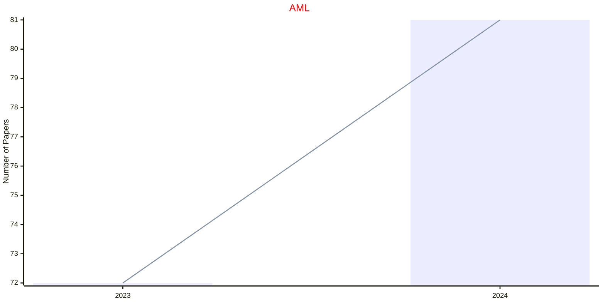
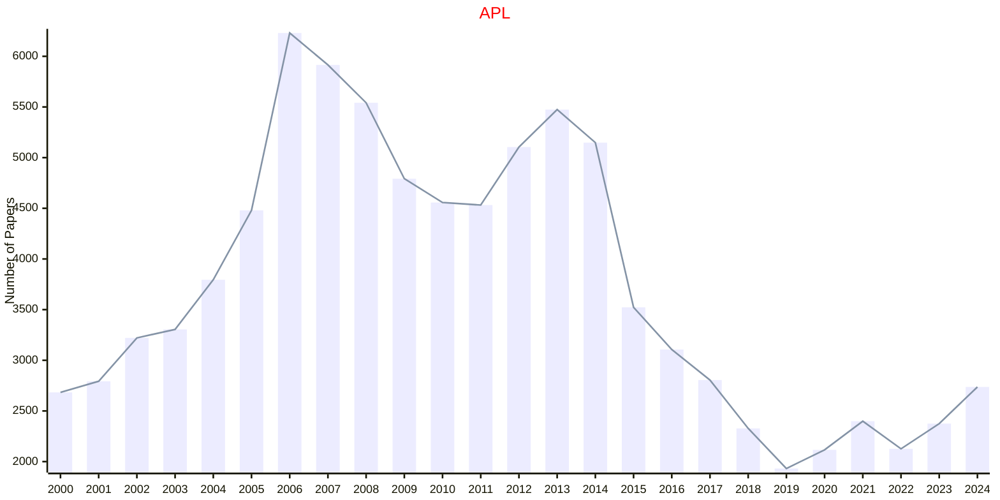
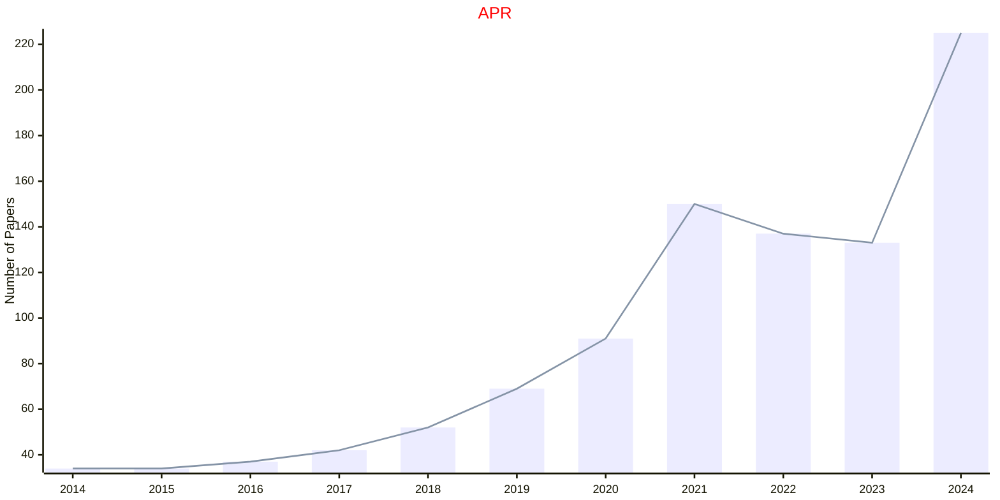
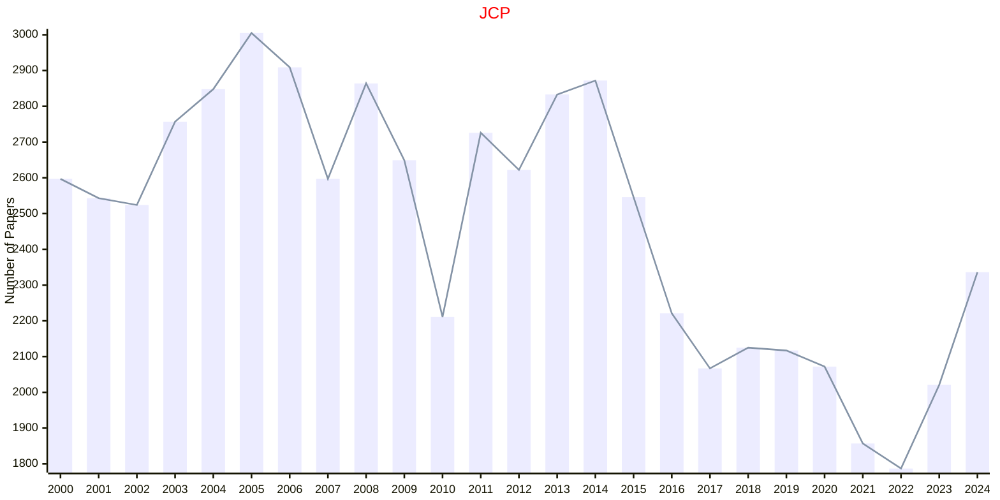
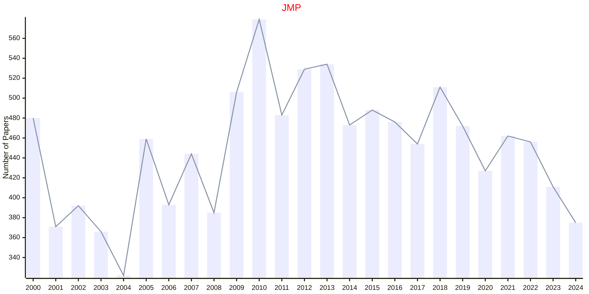
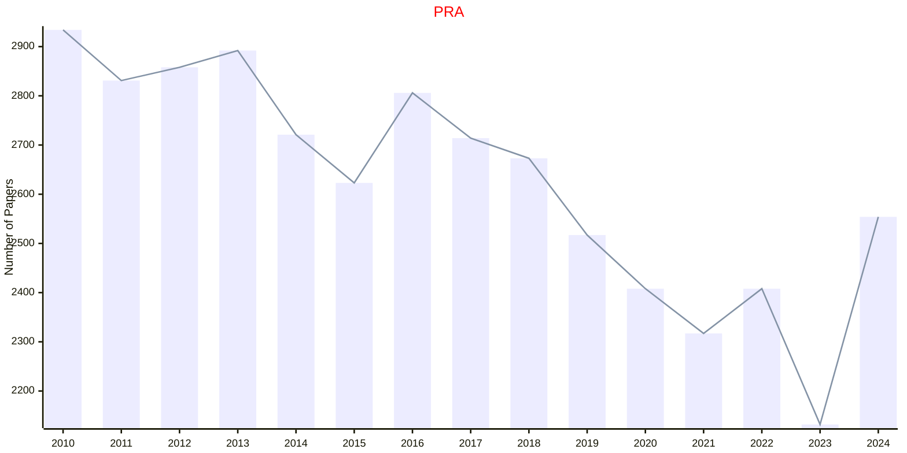
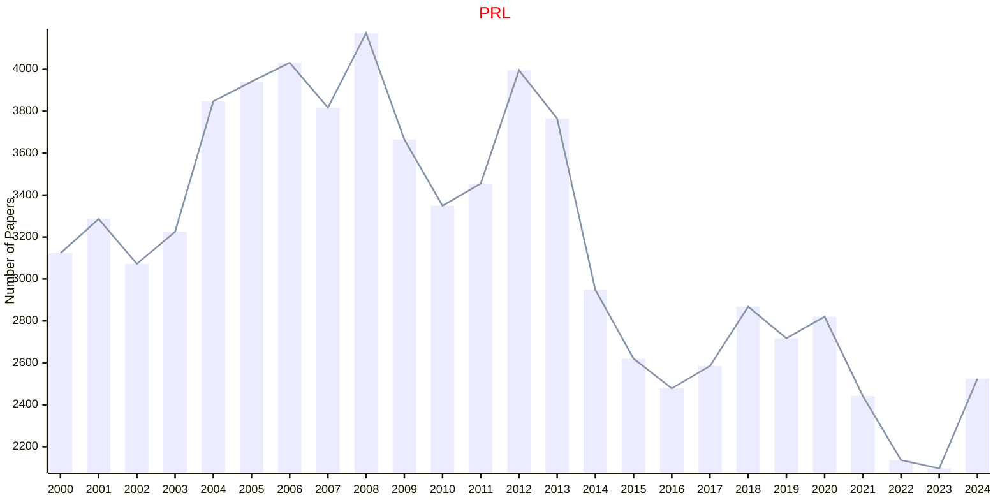
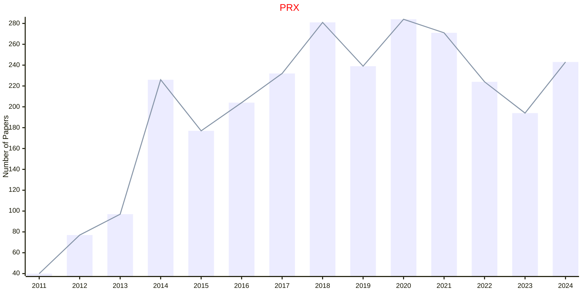
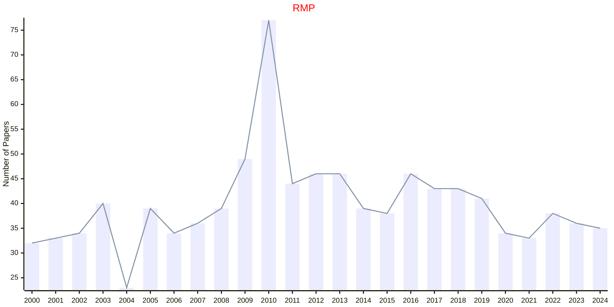
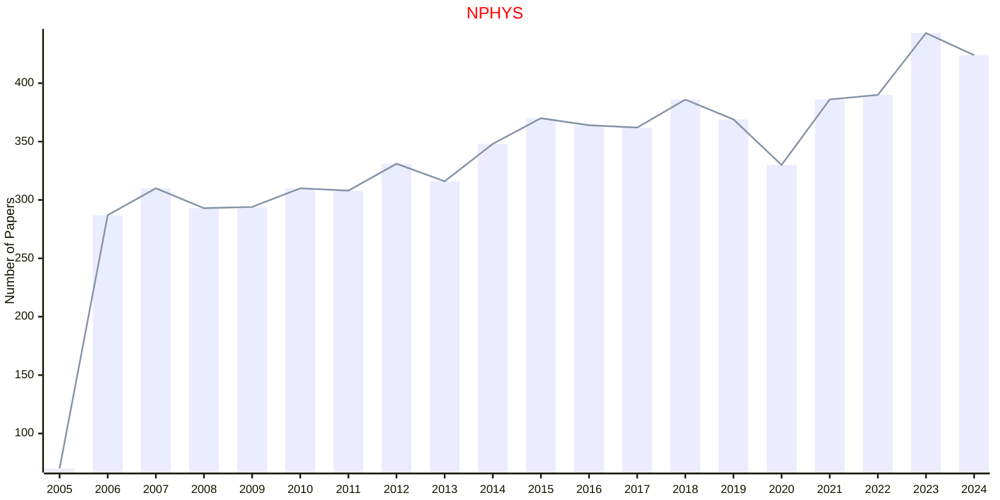

# Physics

## AML

|Publishers|Full/Homepage|Abbr/About|Acronym/Issues|Period/DBLP|Top/Early|CCF|CAS|JCR|IF|Keywords/Google|
|-         |-            |-         |-             |-          |-        |-  |-  |-  |- |-              |
|[AIP](https://pubs.aip.org/)|[APL Machine Learning](https://pubs.aip.org/aip/aml)|[APL Mach. Learn.](https://pubs.aip.org/aip/aml/pages/about)|[AML](https://pubs.aip.org/aip/aml/issue)|2023 -|False|||||[Machine Learning](https://www.google.com/search?q=Machine+Learning)|

## APL

|Publishers|Full/Homepage|Abbr/About|Acronym/Issues|Period/DBLP|Top/Early|CCF|CAS|JCR|IF|Keywords/Google|
|-         |-            |-         |-             |-          |-        |-  |-  |-  |- |-              |
|[AIP](https://pubs.aip.org/)|[Applied Physics Letters](https://pubs.aip.org/aip/apl)|[Appl. Phys. Lett.](https://pubs.aip.org/aip/apl/pages/about)|[APL](https://pubs.aip.org/aip/apl/issue)|1962 -|False||2|Q2|3.6|[Applied Physics](https://www.google.com/search?q=Applied+Physics)|

## APR

|Publishers|Full/Homepage|Abbr/About|Acronym/Issues|Period/DBLP|Top/Early|CCF|CAS|JCR|IF|Keywords/Google|
|-         |-            |-         |-             |-          |-        |-  |-  |-  |- |-              |
|[AIP](https://pubs.aip.org/)|[Applied Physics Reviews](https://pubs.aip.org/aip/apr)|[Appl. Phys. Rev.](https://pubs.aip.org/aip/apr/pages/about)|[APR](https://pubs.aip.org/aip/apr/issue)|2014 -|True||2|Q1|15.2|[Applied Physics](https://www.google.com/search?q=Applied+Physics)|

## JCP

|Publishers|Full/Homepage|Abbr/About|Acronym/Issues|Period/DBLP|Top/Early|CCF|CAS|JCR|IF|Keywords/Google|
|-         |-            |-         |-             |-          |-        |-  |-  |-  |- |-              |
|[AIP](https://pubs.aip.org/)|[Journal of Chemical Physics](https://aip.scitation.org/journal/jcp)|[J. Chem. Phys.](https://pubs.aip.org/aip/jcp/pages/about)|[JCP](https://pubs.aip.org/aip/jcp/issue)|1933 -|False||2|Q2|3.8|[Chemical Physics](https://www.google.com/search?q=Chemical+Physics)|

## JMP

|Publishers|Full/Homepage|Abbr/About|Acronym/Issues|Period/DBLP|Top/Early|CCF|CAS|JCR|IF|Keywords/Google|
|-         |-            |-         |-             |-          |-        |-  |-  |-  |- |-              |
|[AIP](https://pubs.aip.org/)|[Journal of Mathematical Physics](https://pubs.aip.org/aip/jmp)|[J. Math. Phys.](https://pubs.aip.org/aip/jmp/pages/about)|[JMP](https://pubs.aip.org/aip/jmp/issue)|1960 -|False||3|Q3|1.4|[Mathematical Physics](https://www.google.com/search?q=Mathematical+Physics)|

## PRA

|Publishers|Full/Homepage|Abbr/About|Acronym/Issues|Period/DBLP|Top/Early|CCF|CAS|JCR|IF|Keywords/Google|
|-         |-            |-         |-             |-          |-        |-  |-  |-  |- |-              |
|[APS](https://journals.aps.org)|[Physical Review A](https://journals.aps.org/pra)|[Phys. Rev. A](https://journals.aps.org/pra/about)|[PRA](https://journals.aps.org/pra/issues)|1970 -|False||2|Q2|3.0|[Physical Review](https://www.google.com/search?q=Physical+Review); [Physics](https://www.google.com/search?q=Physics)|

## PRL

|Publishers|Full/Homepage|Abbr/About|Acronym/Issues|Period/DBLP|Top/Early|CCF|CAS|JCR|IF|Keywords/Google|
|-         |-            |-         |-             |-          |-        |-  |-  |-  |- |-              |
|[APS](https://journals.aps.org)|[Physical Review Letters](https://journals.aps.org/prl)|[Phys. Rev. Lett.](https://journals.aps.org/prl/about)|[PRL](https://journals.aps.org/prl/issues)|1958 -|True||1|Q1|9.1|[Physical Review](https://www.google.com/search?q=Physical+Review); [Physics](https://www.google.com/search?q=Physics)|

## PRX

|Publishers|Full/Homepage|Abbr/About|Acronym/Issues|Period/DBLP|Top/Early|CCF|CAS|JCR|IF|Keywords/Google|
|-         |-            |-         |-             |-          |-        |-  |-  |-  |- |-              |
|[APS](https://journals.aps.org)|[Physical Review X](https://journals.aps.org/prx)|[Phys. Rev. X](https://journals.aps.org/prx/about)|[PRX](https://journals.aps.org/prx/issues)|2011 -|True||1|Q1|15.4|[Physical Review](https://www.google.com/search?q=Physical+Review); [Physics](https://www.google.com/search?q=Physics)|

## RMP

|Publishers|Full/Homepage|Abbr/About|Acronym/Issues|Period/DBLP|Top/Early|CCF|CAS|JCR|IF|Keywords/Google|
|-         |-            |-         |-             |-          |-        |-  |-  |-  |- |-              |
|[APS](https://journals.aps.org)|[Review Modern Physics](https://journals.aps.org/rmp)|[Rev. Mod. Phys.](https://journals.aps.org/rmp/about)|[RMP](https://journals.aps.org/rmp/issues)|1929 -|False|||||[Physical Review](https://www.google.com/search?q=Physical+Review); [Physics](https://www.google.com/search?q=Physics)|

## NPHYS

|Publishers|Full/Homepage|Abbr/About|Acronym/Issues|Period/DBLP|Top/Early|CCF|CAS|JCR|IF|Keywords/Google|
|-         |-            |-         |-             |-          |-        |-  |-  |-  |- |-              |
|[NATURE](https://www.nature.com/)|[Nature Physics](https://www.nature.com/nphys)|[Nat. Phys.](https://www.nature.com/nphys/aims)|[NPHYS](https://www.nature.com/nphys/volumes)|2005 -|True||1|Q1|21.2|[Physics](https://www.google.com/search?q=Physics)|

